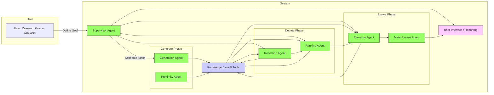
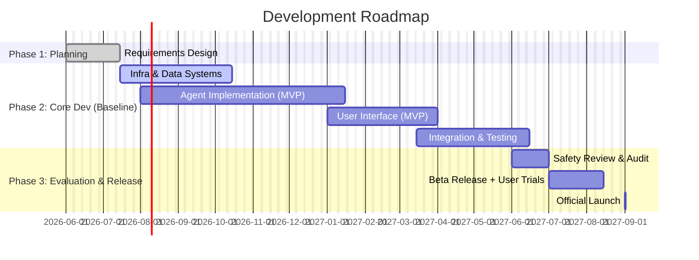

# Executive Summary  
This brief synthesizes insights from existing analyses and recent research to define an **autonomous research assistant** (“AI Co-Scientist”) capable of generating and refining scientific hypotheses. The proposed system adopts a **multi-agent architecture** (inspired by Google DeepMind’s Co-Scientist and Google Research’s AI co-scientist) where specialized agents (e.g. *Generation, Reflection, Ranking, Evolution, Proximity, Meta-review*) collaborate under a Supervisor agent. Integrated with literature retrieval tools and knowledge graphs, this system will iteratively propose novel, evidence-backed hypotheses. The **baseline MVP** will support open-ended research goals (especially in life sciences) by producing ranked hypotheses with citations. **Extensions** may include integration of advanced models (e.g. AlphaFold for protein structures), interactive visualizations, and support for additional domains.  

We resolve overlaps and contradictions among prior reports by unifying features and removing duplicates. Key decisions and trade-offs are noted explicitly. For example, using cloud-based LLMs (Gemini/Claude) is chosen for development speed, with the option of on-premise if data sensitivity requires. Open questions – such as exact performance targets, data sources, and UX details – are documented for stakeholder review. 

The final sections present **user personas and use cases**, **technical architecture** (see Figure below), **development roadmap** (mermaid timeline), and a **prioritized backlog** with effort estimates. We recommend *iterative evaluation* with domain experts (along the lines of DeepMind’s lab validations) and robust safety guardrails (e.g. factuality checks and expert-in-the-loop oversight). Metrics for success include hypothesis novelty and validity, researcher productivity gains, and adoption rates. We also highlight legal/ethical considerations (data licensing, IP, misuse prevention). 

## Product Scope and Users  
**Target Users:** Academic and industry researchers (e.g. life scientists, materials scientists, R&D teams) and lab leaders who need to **accelerate hypothesis generation and literature review**. Personas include bench scientists with domain expertise but limited time, scientific consultants seeking cross-domain insights, and research managers who set broad goals.  

**Core Use Cases:** Given a research goal or topic, the system will:  
- **Generate hypotheses:** Propose novel, testable hypotheses grounded in literature.  
- **Critique and refine:** Iteratively evaluate and improve hypotheses (the “tournament of ideas” approach).  
- **Evidence gathering:** Retrieve and cite relevant papers, databases (PubMed, arXiv, domain-specific DBs like ChEMBL/UniProt), and data to support or refute claims.  
- **Collaborative exploration:** Allow scientists to input seed ideas or feedback, guiding the agents (as noted by DeepMind: users can “directly provide seed ideas or feedback”).  
- **Reporting:** Produce summaries of findings, ranked hypotheses, and suggested next steps.  

**Success Metrics:** Measures include hypothesis *novelty* and *correctness* (assessed by experts), number of validated leads generated, user satisfaction, and reduction in research cycle time. For example, DeepMind reports that Co-Scientist identified lab-validated drug repurposing candidates. Internally, automated metrics like Elo-rating of hypotheses (used by Google’s AI co-scientist) correlate with answer quality and can be used to benchmark iterative improvement.  

**Scope Delineation – Baseline vs Extensions:** The **baseline mode** (MVP) focuses on text-based hypothesis generation with core agents and a simple web interface. Optional **extensions** enhance capabilities without blocking the MVP: specialized data sources or tools (protein structure models, chemical simulators), richer UI (interactive graphs, visual explanations), multilingual support, and advanced collaboration features. Table 1 compares key features.

| **Feature / Component**              | **Baseline (MVP)**                              | **Extensions (Optional)**                                          |
|--------------------------------------|-------------------------------------------------|--------------------------------------------------------------------|
| Hypothesis generation agents         | Generation, Reflection, Ranking, Evolution, Proximity, Meta-review as defined | Additional agents (e.g. for domain-specific planning or creativity) |
| Knowledge retrieval                  | Web search, PubMed, arXiv, and core scientific DBs (ChEMBL, UniProt) | Add specialized APIs (AlphaFold predictions, proprietary databases) |
| Memory / Context                     | Stateless per-session with caching of fetched data; limited long-term memory | Stateful memory to retain ongoing project context    |
| User interface                       | Web app with query input, hypothesis list, evidence links, feedback form | Interactive visualizations (knowledge graphs, idea maps), collaborative mode |
| Output                                | Ranked list of hypotheses with evidence citations (per); summary report | Export formats (JSON, PDFs), API access, integration with lab tools  |
| Evaluation & feedback                | Elo-based auto-ranking; manual expert review panels (like Google’s GPQA eval) | Full user study, continuous learning from feedback, benchmark suite |
| Safety & guardrails                  | Filters for known false/unsafe claims; disclaimers; usage monitoring  | Advanced fact-checking agents; malicious-use detector; offline vetting |
| Scale & compute                      | Prototype on available LLMs (e.g. Gemini 1.x or open models); target small cluster | Scale to larger models (Gemini 2.0+ or multi-LLMs); optional on-prem deployment |

## Competitive Landscape and Precedents  
Several recent systems inform this design. Most directly, **Google DeepMind’s Co-Scientist** (and Google’s AI co-scientist) provide a blueprint: a Gemini-based multi-agent system that generated hypotheses validated in lab tests. Their *“tournament of ideas”* paradigm (inspired by AlphaGo) uses multi-turn debates among agent-generated hypotheses to ensure novelty and correctness. The Nature and blog articles emphasize combining generation with systematic critique and refinement. 

**Anthropic’s Research feature** also uses multiple Claude agents in an orchestrator-worker pattern. Their engineering insights highlight that *open-ended research tasks benefit from parallel agents* that explore different subproblems, matching our multi-agent approach. Notably, they address memory limits (saving plans to “Memory” if context grows too large) and use a final “CitationAgent” to attribute sources. We should similarly design for **stateful memory** and explicit citation mechanisms. 

Other examples include a demonstration (Agents4Science 2025) where an autonomous multi-agent system completed 361 materials-science projects at scale, achieving full physical constraint compliance and accumulating thousands of evidence entries. This shows that large-scale agentic research is feasible and can **maintain scientific rigor**. We adapt such ideas (hierarchical agents, constraint checking) and note that no competitor offers exactly this feature set on a general scientific co-creation platform, so our “Co-Scientist clone” will have strong differentiation if executed well.

## Technical Architecture  

**System Overview:** The core architecture is a **modular, agentic pipeline** (Figure 1). A *Supervisor* (orchestrator) agent receives the user’s research goal and spawns tasks across specialized agents. In each cycle: the *Generation* agent proposes new hypotheses; the *Proximity* agent ensures diversity by mapping ideas in the concept space; *Reflection* (peer-review) and *Ranking* agents critique and tournament-rank them; the *Evolution* agent refines top ideas; and *Meta-review* synthesizes final outputs. All agents interact with a **Knowledge Base & Toolset** – a combination of **retrieval services**, **databases** and **AI tools** (see below) – to ground reasoning in factual literature. Finally, results are aggregated into a human-readable report via the *User Interface* module.

**Figure 1.** System architecture: user input is handled by a *Supervisor* that coordinates specialized agents. All agents read/write to a shared knowledge layer (documents, memory) and the final output is rendered via the UI. (Agent boxes color-coded by role.)

**Data & Retrieval Layer:** A robust scientific retrieval layer is vital. We will integrate a **semantic search engine** over a curated corpus (e.g. PubMed, arXiv, domain repos) to fetch relevant literature. As in DeepMind’s implementation, we will also connect to specialized databases (e.g. ChEMBL, UniProt) and pre-trained tools (e.g. AlphaFold for protein structure hypotheses). Retrieved snippets are fed to agents for context. We will also build a **Knowledge Graph/Evidence Graph** that records claims, sources, and connections (as advocated in [*Knowledge and Evidence Graph Layer Architecture*](user_files/Knowledge%20and%20Evidence%20Graph%20Layer%20Architecture.md)). This enables tracking provenance and helps the Meta-review agent synthesize a coherent proposal.

**Agent Contracts:** Each agent has a defined input-output contract. For example, the Generation agent takes the current research goal and recent evidence as input, and outputs a set of hypothesis statements. The Reflection agent takes hypotheses plus sources and outputs evaluations. These contracts (detailed in *Agent Contracts* spec) ensure modularity. All agents will use prompt engineering templates (see [*Linguistic and Prompting Architecture*](user_files/Linguistic%20and%20Prompting%20Architecture%20for%20Agent%20Discovery.md)) to interact with the LLM or external tools. The Supervisor uses a task queue (via e.g. Celery or Kubernetes jobs) to manage parallel agent execution (per [*Stateful Agentic Runtime Blueprint*](user_files/Stateful%20Agentic%20Runtime%20and%20Orchestration%20Blueprint.md)).

**Memory and State:** While agents operate asynchronously, maintaining state across cycles is important. We will implement a context memory store: the Supervisor logs all queries, agent outputs, and user feedback in a project-specific database. This can take the form of a vector database or a simple document store. For very long projects, a summarization or “plan” memory (as used by Anthropic) can persist key intermediate results when context limits are reached.

## Implementation Roadmap and Milestones  

An agile, phased development is recommended. Figure 2 sketches a tentative timeline (quarters are illustrative; adjust per actual start date and resources). Key milestones include system design, core infrastructure, agent development, integration/testing, and launch (beta and full release). Dependencies and buffers are noted (e.g. retrieval engine must be operational before heavy agent testing).

**Figure 2.** High-level development timeline.  Tasks are overlapping (e.g. agent dev overlaps UI dev). Milestones: Requirements sign-off (M1) and Official Launch (M2). 

**Backlog & Effort Estimates:** Table 2 (below) outlines major work items, priority and estimated effort (in person-weeks or T-shirt sizes) for baseline vs extension features. Core development (agents, retrieval, interface) is ~70% of effort. We assume a small cross-functional team (5–8 engineers including ML, backend, frontend) for a 9–12 month MVP. Risks include *model costs* (mitigated by usage control) and *data licensing* (plan to use open corpora first).

| **Task / Feature**                    | **Priority** | **Effort**  | **Notes**                          |
|---------------------------------------|-------------|------------|------------------------------------|
| **Core Architecture & Planning**      | High        | 4–6 wk     | Design multi-agent framework, APIs |
| **Retrieval & Data Layer**            | High        | 8–10 wk    | Integrate search, DBs, KGs         |
| **Agent Development (MVP set)**       | High        | 10–12 wk   | Generation, Reflection, Ranking, Evolution, Proximity, Meta-review (prototype prompts) |
| **Supervisor & Orchestration**        | High        | 6–8 wk     | Task queue, memory store           |
| **User Interface (MVP)**              | Medium      | 6–8 wk     | Web app for input/output           |
| **Evaluation Suite**                  | Medium      | 4–6 wk     | Automated metrics, integration of GPQA or custom tasks |
| **Safety & Guardrails**               | Medium      | 4–6 wk     | Content filters, misuse detectors  |
| **Extensions: Specialized Tools**     | Low         | 6–8 wk     | e.g. AlphaFold integration         |
| **Extensions: Advanced UI**          | Low         | 6–8 wk     | Visualization, collaboration       |
| **Buffer & Overhead**                 | Medium      | 4–6 wk     | Contingency for unexpected work    |

*Table 2. Prioritized backlog of work items.* Effort estimates are rough (person-weeks) and should be refined during planning. 

## Evaluation Protocols and Metrics  
We will evaluate hypothesis quality and system utility at multiple levels: 

- **Automated Benchmarks:** Adapt metrics like Google’s *GPQA* (grade school science questions) to assess if hypotheses are logically sound. DeepMind found their system’s Elo-based rankings correlated well with answer accuracy. We will log Elo scores and compare to baseline LLM performance.  
- **Expert Review:** Assemble domain experts to rate hypothesis novelty and validity (as in). For a small set of pilot topics, have scientists blind-review outputs from the system vs conventional literature review.  
- **Live Trials:** Beta release to selected research teams (pharma, academia) to use the tool on real problems. Collect feedback on usefulness, errors, and decision impact. This mimics DeepMind’s lab case studies. Key success is discovering *actionable insights* (e.g. new drug leads) that experts deem high-quality.  
- **A/B Experiments:** If integrated into platforms (e.g. Google Labs), measure usage metrics and time-to-insight with/without the tool.  

Success criteria include a statistically significant improvement in expert-validated hypothesis scores, positive user feedback, and demonstrable time savings in literature synthesis. 

## Safety, Ethics and Governance  
**Accuracy & Misuse:** We will implement multi-layer fact-checking (agents cross-validate claims against literature) and clearly label all outputs as suggestions requiring verification. As DeepMind notes, *“Co-Scientist is intended to be a partner… not a replacement for scientific expertise”*. The product will include disclaimers and require user acknowledgement before acting on suggestions. We will also test the system against disallowed content scenarios (e.g. generation of illegal drug designs) and enforce filters. 

**Data Privacy & IP:** If the platform allows user data or unpublished manuscripts, strict access controls and encryption are needed. We will use only licensed or public-domain sources for training and retrieval unless users explicitly upload proprietary data. Outputs will reference sources to respect copyright (similarly to Anthropic’s CitationAgent). IP of user ideas vs system-generated content should be clarified in terms of ownership; we recommend a user-facing license that grants the user rights to system outputs.

**Bias & Ethical Use:** We will audit training data and retrieval queries for biases (e.g. underrepresented voices) and provide the ability to filter or flag contentious topics. We will also consult domain ethics boards for guidelines (especially in biomedical use-cases). Continuous monitoring for harmful suggestions is mandatory.

**Monitoring & Feedback Loop:** The system will log decisions and flag low-confidence outputs. A feedback loop will allow scientists to rate or correct hypotheses, which will be used to iteratively improve agent prompts and filters. Regular reviews (e.g. quarterly) of system performance and failure modes will be part of the maintenance plan.

## Open Questions & Trade-offs  
- **Model Choice:** We assumed using a high-quality LLM (e.g. Gemini 2.0 / Claude) for core reasoning. If those are unavailable or too costly, a smaller or open model (e.g. GPT-4o or LLaMA-based) could be baseline. Trade-off: cheaper but possibly less capable. We will design the architecture to be model-agnostic.  
- **Compute Infrastructure:** Cloud deployment (GCP/AWS) allows rapid scaling, but on-prem (for a large organization) might be required for data control. We will initially prototype in cloud with container orchestration (Kubernetes).  
- **Team & Budget:** The analysis assumes a team of ~6 engineers/data scientists over ~12 months. If resources are tighter, we may need to cut or defer extension features. A small team could still deliver core function in ~6–8 months with narrower scope (e.g. focusing only on PubMed and text-only outputs).  
- **Domain Scope:** We focus on life sciences (biomedical hypotheses) initially, as Co-Scientist did. Other domains (materials science, climate, etc.) are potential expansions but require curating domain corpora and possibly new agent prompts.  
- **Latency vs Thoroughness:** Iterative tournaments improve quality but cost time. We can tune the number of iterations based on user need. For quick idea generation, offer a “fast mode” (fewer cycles) vs “deep mode” (full debate). 

Each trade-off is documented so that stakeholders can adjust priorities. 

## Conclusion  
Building an AI Co-Scientist involves combining agentic LLM pipelines with robust data handling, UX design, and safety oversight. By consolidating the multiple prior reports and leveraging recent breakthroughs, this plan lays out a cohesive path from MVP to full-featured product. With clearly defined personas, use cases, and metrics, and a phased roadmap, the team can proceed methodically. Ongoing monitoring, user feedback, and expert involvement will ensure the system remains a **collaborative aid** (not a black box), helping scientists spark novel discoveries faster. This brief serves as a master outline to guide implementation and align all stakeholders on goals, assumptions, and risks.