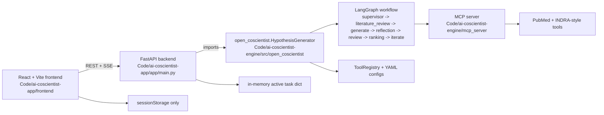
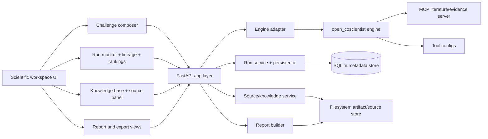

# AI Co-Scientist Clone Implementation Plan

## Executive summary

### Project objective

Build a **locally runnable, whole-project AI Co-Scientist clone** that preserves the existing foundation and turns the current repository into a coherent product stack: a polished web application, a local backend/API, the included multi-agent engine, the included MCP literature server, a usable knowledge/evidence workflow, tournament/ranking visibility, and exportable reports.

The primary executable target for this run is **Hypothesis Generation**. The broader product references in `Media/` and `NotebookLM/` should inform layout, source-grounding, and report UX, but they should **not** force a full product-family rewrite. The safest implementation path is to make the current hypothesis-generation system excellent, integrated, and extensible, then shape the app shell so later surfaces can plug into the same primitives.

### Core planning decisions

| Decision | Chosen path | Why |
|---|---|---|
| Repository shape | Keep `Code/ai-coscientist-app` and `Code/ai-coscientist-engine` as sibling packages | Preserves the strongest existing foundation with minimal destructive moves |
| Frontend stack | Keep React + Vite + TypeScript + Tailwind/shadcn | Already present and sufficient for product-fidelity UI |
| Backend stack | Keep FastAPI | Already working, simple to harden, and matches the current SSE flow |
| Engine | Keep the included LangGraph engine and adapt around it | It is the strongest existing implementation asset |
| Task execution | Keep single-node execution, but wrap it in a run-management layer with persistence | Safer than introducing Celery/Redis in one shot |
| Persistence | Add lightweight local persistence for runs, reports, and sources | Current in-memory/session-only state is too fragile |
| MCP | Keep the included MCP server as the default literature/evidence backend | Already implemented and aligned with engine design |
| Product scope | Fully ship hypothesis generation; scaffold broader surfaces only where they reuse shared primitives | Maximizes executable fidelity without overreaching |

### Outcome the coding agent should aim for

At the end of the one-shot implementation run, the repository should behave like a **single integrated local product**, not a loose archive of a viewer plus a separate engine plus research notes.

## Current repository understanding

### Top-level folder structure

```text
Google DeepMind AI Co-Scientist/
  Code/
    ai-coscientist-app/
    ai-coscientist-engine/
  Context/ -> Extensive research about Google DeepMind's AI Co-Scientist
  Research/ -> Scientific papers related to AI Co-Scientist
  Media/ -> Media from publically available AI Co-Scientist footage
  NotebookLM/ -> Media from NotebookLM from which Google DeepMind's AI Co-Scientist draws inspiration
```

### What exists and what it means

| Path                           | Role                                                                                                                                               | Status                                                     |
| ------------------------------ | -------------------------------------------------------------------------------------------------------------------------------------------------- | ---------------------------------------------------------- |
| `Code/ai-coscientist-app/`     | Actual product app code: FastAPI backend + React frontend                                                                                          | Primary implementation target                              |
| `Code/ai-coscientist-engine/`  | Actual engine/orchestration code: LangGraph workflow, tools config, MCP server                                                                     | Primary implementation target                              |
| `Context/`                     | Repo-authored architecture/specification documents for the clone                                                                                   | High-value design reference                                |
| `Research/`                    | Saved research papers and product writeups, including `Towards an AI co-scientist.md` and `Accelerating scientific discovery with Co-Scientist.md` | High-value behavior and fidelity reference                 |
| `Media/`                       | Screenshots, videos, and saved product captures for Hypothesis Generation, Literature Insights, and Computational Discovery                        | High-value UI/product reference                            |
| `NotebookLM/`                  | NotebookLM HTML captures and architectural notes                                                                                                   | Secondary reference for source-grounded workspace patterns |

### What folders and files matter

| Area | Key files | Why they matter |
|---|---|---|
| App backend | `Code/ai-coscientist-app/app/main.py`, `app/config.py` | Current API, SSE flow, task management, config |
| App frontend | `Code/ai-coscientist-app/frontend/src/main.tsx`, `src/App.tsx`, `src/hooks/useHypothesisGeneration.ts`, `src/api/client.ts`, `src/context/*`, `src/components/*` | Current product shell and workflow visualization |
| Engine entry | `Code/ai-coscientist-engine/src/open_coscientist/generator.py` | Main orchestration entry point |
| Engine nodes | `src/open_coscientist/nodes/*.py` and `nodes/generation/*` | Actual agent behavior, ranking, evolution, reflection, literature flow |
| Engine types/state | `src/open_coscientist/state.py`, `models.py`, `schemas.py`, `constants.py` | Shared workflow state and data contracts |
| Tooling config | `src/open_coscientist/config/*`, especially `tools.yaml` and example YAML files | Controls retrieval and domain behavior without code rewrites |
| MCP server | `Code/ai-coscientist-engine/mcp_server/*` | Default literature/evidence backend |
| Runtime docs | `Code/ai-coscientist-app/README.md`, `Code/ai-coscientist-engine/README.md`, engine `docs/*.md` | Setup instructions, architecture, generation modes |
| Product fidelity refs | `Research/*.md`, selected `Context/*.md`, `Media/*` | Explain intended product behavior and UX |
| Domain system | `frontend/src/domains/*.json` | Existing localization/generalization layer; should remain but scientific stays default |

### Current repository-level reality

There is **no unified root dev workflow** and **no integrated local-project story**. The repository currently behaves like an archive that contains two adjacent codebases plus a large design/reference corpus.

That missing integration is the first major project gap.

## Current app and engine architecture



### Frontend stack and entry points

The frontend is a **React 19 + Vite 7 + TypeScript 5.9** app with **Tailwind CSS v4**, **Radix/shadcn-style UI components**, **Biome**, **Storybook**, and **Bun**.

The real entry path is:

- `frontend/src/main.tsx`
- `frontend/src/App.tsx`

The current user flow is:

- `GenerateForm.tsx` for input and advanced settings
- `useHypothesisGeneration.ts` for orchestration, API calls, SSE handling, and client-side state updates
- `GenerationContext.tsx` for run state
- `AgentActivitySection.tsx` and agent-specific components for workflow display
- `HypothesisList.tsx` and `HypothesisDetails.tsx` for final output
- Export helpers for JSON/CSV/Markdown

Important observations:

- The UI is already **far beyond a stub** and should be preserved.
- It is still fundamentally a **viewer around one workflow**, not a fully integrated product workspace.
- It has a reusable **domain terminology system** in `frontend/src/domains/*`, but the project’s intended default is scientific/hypothesis mode.
- It contains leftover starter/demo files that should be cleaned.
- It stores completed runs in **sessionStorage only**.

### Backend stack and entry points

The backend is a **FastAPI** service in `Code/ai-coscientist-app/app/main.py`.

Important entry points and endpoints:

- `GET /health`
- `GET /config`
- `GET /status`
- `POST /generate`
- `POST /generate/start`
- `GET /generate/stream/{task_id}`
- `POST /cancel_hypothesis_generation`

Important observations:

- The backend parses broad research-goal text into structured fields before generation.
- Streaming is implemented with **Server-Sent Events**.
- Active runs are kept in an **in-memory `_active_tasks` dictionary** protected by an asyncio lock.
- There is no durable run persistence, no report persistence, and no source/knowledge-base persistence.
- Configuration and README details are inconsistent in places. The most visible example is the app config default port vs the documented dev port. There are also default-value mismatches.

### Engine and orchestration code

The included engine is strong and should remain the core runtime.

Important engine structure:

- `src/open_coscientist/generator.py` builds and runs the LangGraph workflow
- `src/open_coscientist/state.py` defines workflow state
- `src/open_coscientist/models.py` defines hypotheses, reviews, metrics, and articles
- `src/open_coscientist/nodes/*` implements specialized workflow stages
- `src/open_coscientist/nodes/generation/*` implements multi-strategy generation, including debate and tool-calling literature paths
- `src/open_coscientist/config/*` implements tool-registry and YAML-driven customization
- `mcp_server/*` implements the reference FastMCP server

The actual engine workflow is:

- `supervisor`
- optional `literature_review`
- `generate`
- optional `reflection`
- `review`
- `ranking`
- iterative loop through `meta_review -> evolve -> review -> ranking -> proximity`

Important observations:

- The engine already contains the hardest part of the project.
- It supports literature-aware generation, debate generation, tournament ranking, iterative evolution, and configurable tool registries.
- The engine is included locally, but the app still behaves as if the engine should come from **PyPI or an external sibling clone**.
- The UI conceptually separates “rank” and “ranking judge,” but the engine currently emits a single `ranking` node. This should be normalized rather than rewritten.

### Existing docs, specs, and setup guidance

The current code docs are useful but inconsistent:

- `Code/ai-coscientist-app/README.md` still assumes a separately cloned/open-source `open-coscientist` sibling and even network-clone behavior in Docker.
- `Code/ai-coscientist-engine/README.md` and `docs/*.md` are the best current technical source of truth for engine behavior.
- `Context/*.md` is a large repo-authored spec bundle. The highest-value files for implementation direction are the product, architecture, UX, retrieval, ranking, and fidelity blueprints.
- `Research/*.md` contains the strongest behavior reference.
- `Media/` clearly shows three major product reference surfaces: **Hypothesis Generation**, **Literature Insights**, and **Computational Discovery**.

## Target architecture

### Target application shape

The target should be a **single local product workspace** with one scientific default mode and a clear separation of concerns:

- the **frontend** becomes a coherent research workspace
- the **FastAPI backend** becomes a stable app/API layer
- the **engine** remains a reusable orchestration library
- the **MCP server** remains the default literature/evidence service
- a lightweight **run/source/report persistence layer** is added
- sources, evidence, rankings, and reports become first-class product concepts



### Major gaps between current state and target state

| Gap area | Current state | Target state |
|---|---|---|
| Repo integration | App assumes PyPI/external engine clone | App uses the included local engine directly |
| Product shell | Viewer-style single workflow screen | Integrated scientific workspace with challenge, run, source, and report surfaces |
| Persistence | In-memory task map + browser sessionStorage | Durable local metadata for runs, reports, and sources |
| Knowledge base | No real source ingestion or library UX | Local source library plus literature/evidence visibility |
| Reports | JSON/CSV/Markdown export only | Structured, server-built report artifacts |
| Ranking UX | Tournament exists but is not richly surfaced | Full leaderboard, matchup history, and lineage views |
| Safety | Minimal validation and broad CORS | Input validation, safer defaults, output/source provenance, guardrails |
| Tests | Almost none | Practical smoke, unit, and integration coverage |
| Docs | No root docs; local-vs-remote setup confusion | One root source of truth and workspace commands |

### Assumptions

- **Primary target is scientific hypothesis generation**, not a full NotebookLM clone.
- **Broader product-family parity is unspecified** and should only be pursued where it reuses the same source/run/report primitives.
- A **local-first implementation** is preferred over distributed infrastructure for this one-shot build.
- Authentication, collaboration, and enterprise deployment are **unspecified**.

## Implementation strategy

### Strategy summary

Implement from the center outward:

1. make the repository internally coherent
2. wire the app to the local engine
3. stabilize backend run management
4. add source/report persistence
5. improve the frontend into a real workspace
6. harden safety, tests, and docs

Do **not** replace the current stack. Refactor around it.

### Ordered build sequence

| Build order | Goal | Output |
|---|---|---|
| First | Unify the repo around the included code | Root README, root task entrypoints, local engine integration |
| Then | Make app-to-engine integration deterministic | No PyPI/GitHub dependency path for normal dev |
| Then | Stabilize backend services | Clear service modules for runs, reports, and sources |
| Then | Add persistence | Durable run records, saved reports, source metadata |
| Then | Upgrade the frontend shell | Workspace-level navigation/state without throwing away current screens |
| Then | Surface rankings, lineage, and evidence | Better tournament, citations, and report UI |
| Then | Add knowledge-base/source workflows | Upload/manage/view supporting sources and evidence |
| Then | Harden safety and operations | Safer config, limits, error paths, logging |
| Last | Tests, docs, and final polish | Reliable commands and maintainable repo |

### Concrete tasks grouped by area

| Area | Tasks | Key files to touch |
|---|---|---|
| Repo hygiene | Add a root `README.md`; add root task runner or Makefile; document local-first workspace; remove assumptions that the engine must be cloned from GitHub; normalize folder naming in docs; remove starter artifacts that are truly unused | root `README.md`, optional root `Makefile`, app README, docker files |
| Frontend | Keep current workflow UI; add a real app shell around it; introduce clear route/view separation for challenge, run detail, rankings, sources, and reports; keep domain system but scientific default; remove unused starter files; consolidate duplicate SSE logic; normalize rank/tournament presentation to match engine reality | `frontend/src/App.tsx`, `src/main.tsx`, `src/hooks/useHypothesisGeneration.ts`, `src/components/*`, `src/context/*` |
| Backend/API | Split `app/main.py` into smaller API/service modules; preserve current endpoints; add run persistence endpoints; add source upload/list/detail endpoints; add report export/download endpoints; unify config defaults; fix inconsistent port/default behavior | `app/main.py`, new `app/services/*`, `app/config.py`, new models/schemas |
| Engine integration | Switch app to editable local engine path; keep engine as library; add a thin adapter instead of calling engine directly from route handlers; normalize node naming and mapped UI semantics; keep prompt/config extensibility intact | app packaging, docker build files, engine adapter module |
| Agents | Preserve current agent set and current graph; expose each stage coherently in the UI; do not split engine nodes unnecessarily; enrich run state with stable stage metadata; make debate outputs and evolution history first-class in the app | engine nodes unchanged where possible; app state mapping |
| Retrieval and knowledge base | Keep MCP-driven literature review as default; add local source-library ingestion for app-side context and saved evidence; store uploaded files and extracted text metadata; present source provenance in the UI; reuse `Media/` and `NotebookLM/` only as UX inspiration, not runtime input | new backend source service, source APIs, frontend source panel, optional reuse of extraction helpers |
| Tournament and ranking | Preserve Elo tournament logic; add rich leaderboard, matchup table, win/loss record, evolution lineage, and cluster visibility; surface ranking logic from current engine output rather than inventing a second ranking subsystem | `nodes/ranking.py`, frontend ranking views, report builder |
| Reports | Replace client-only export bias with server-generated research reports; include research goal, parsed constraints, plan, top hypotheses, citations, review summaries, matchups, and evolution history; keep JSON export for debugging | report service, report schemas, frontend report page/download |
| Safety | Add input-length limits, structured validation, safer error handling, clearer degraded-mode messaging, provider/config validation, and output provenance cues; keep CORS/dev friendliness for local use, but stop leaving everything fully open by default | app config, request models, frontend notices, engine adapter |
| Tests | Add backend API smoke tests, engine adapter tests, UI state/reducer tests, report-generation tests, and at least one end-to-end happy path covering start -> stream -> complete -> export; discover existing commands and make them meaningful | `tests/` in app, new engine/app integration tests, optional frontend tests |
| Docs | Write one source of truth for setup and architecture; preserve engine docs; add root “how to run everything locally”; document what is implemented vs scaffolded; document product scope and limitations as `unspecified` where needed | root README, app README, docs folder |

### Scope discipline during implementation

The coding agent should treat the following as **must-implement**:

- local engine-app integration
- reliable runs and streaming
- saved runs and reports
- source/evidence visibility
- tournament/ranking UI
- basic knowledge-base handling
- tests and docs

The coding agent should treat the following as **scaffold-if-time-allows** rather than forcing a rewrite:

- broader Literature Insights module parity
- Computational Discovery module parity
- NotebookLM-style advanced artifact suite
- multi-user collaboration and auth

## Acceptance criteria and commands

### Acceptance criteria by major area

| Area | Acceptance criteria |
|---|---|
| Repo hygiene | A new contributor can understand the repo from the root without guessing which codebase is canonical |
| Frontend | The app has a coherent scientific workspace flow and the current hypothesis-generation UI still works end to end |
| Backend/API | Starting a run, streaming a run, cancelling a run, loading a saved run, and exporting a report all work from documented endpoints |
| Engine integration | The app uses the included engine locally and does not require cloning or fetching a separate engine repo in normal development |
| Agents | All major workflow stages are visible with stable stage names and parsed outputs; no duplicate/contradictory stage semantics |
| Retrieval and knowledge base | The user can inspect supporting literature/evidence and any local uploaded sources associated with a run |
| Tournament and ranking | Final rankings, matchups, Elo-like outcomes, and evolution/cluster context are visible and exportable |
| Reports | A structured report artifact can be generated and downloaded for a completed run |
| Safety | Invalid inputs fail cleanly, degraded literature mode is explicit, and source provenance is visible where applicable |
| Tests | Backend smoke tests and at least one integrated happy-path test pass locally |
| Docs | Root setup and run instructions are accurate and do not mention a required external sibling clone |

### Commands the coding agent should discover and run

#### Existing engine commands

```bash
cd Code/ai-coscientist-engine
pip install -e ".[dev]"
pytest
python examples/run.py
python dev/run_supervisor_standalone.py
python dev/run_generate_standalone.py
python dev/run_lit_review_standalone.py
```

#### Existing MCP server commands

```bash
cd Code/ai-coscientist-engine/mcp_server
pip install -e .
uvicorn mcp_server.server:app --host 0.0.0.0 --port 8888
```

#### Existing app backend commands

```bash
cd Code/ai-coscientist-app
make install
make dev
make test
make lint
make typecheck
make format
```

#### Existing frontend commands

```bash
cd Code/ai-coscientist-app/frontend
bun install
bun run dev
bun run build
bun run preview
bun run lint
bun run format
bun run check
bun run ci
bun run stories
bun run build-storybook
```

#### Existing container command

```bash
cd Code/ai-coscientist-app
docker compose up --build
```

### Commands the coding agent should add at the root

The implementation should add root-level wrappers so the repository is usable as one project, for example:

```bash
make setup
make dev
make dev-api
make dev-ui
make dev-mcp
make test
make lint
make typecheck
make build
```

The exact names can vary, but the repository must gain a **single documented top-level workflow**.

## Decisions, guardrails, and end state

### Decisions made and why

| Decision | Why |
|---|---|
| Preserve the existing engine graph | It is already the strongest and most specialized asset in the repo |
| Preserve FastAPI + React/Vite | Replacing them would create unnecessary churn with low upside |
| Normalize the app around local packages | The repo already includes both codebases; external clone assumptions are now a liability |
| Add persistence without introducing a distributed queue | Safer and more achievable in one coordinated implementation run |
| Treat `Context/`, `Research/`, and `Media/` as reference inputs, not runtime dependencies | They are valuable for fidelity but should not pollute executable pathways |
| Keep scientific mode as the default | That is what the engine and current UI actually implement |
| Build broader product scaffolding only when it reuses shared primitives | Prevents scope explosion |

### Things the coding agent must not do

- Do **not** replace the included engine with a new orchestration system.
- Do **not** rewrite the frontend in a different framework.
- Do **not** keep any required runtime path that clones the engine from GitHub or depends on the network for normal local development.
- Do **not** move major directories unless the move is clearly necessary; prefer integration over reorganization.
- Do **not** treat `Context/` documents as executable truth over the actual code.
- Do **not** spend the run building a full NotebookLM clone.
- Do **not** leave the project with only documentation changes; prioritize executable code paths.
- Do **not** add heavy infrastructure that the local-first repo cannot reasonably run.
- Do **not** split the current engine into more conceptual “agents” just to match labels in the UI; adapt the UI to the real runtime.

### Final expected end state

The final repository should look and behave like a **single integrated local AI Co-Scientist project**:

- the frontend launches as a coherent scientific workspace
- the backend launches without external-clone assumptions
- the app uses the included engine directly
- literature review and evidence flows work through the included MCP server
- runs can be started, streamed, cancelled, saved, reopened, and exported
- rankings, matchups, lineage, and citations are clearly visible
- a report artifact can be generated for a completed run
- tests and docs are no longer mostly placeholders
- the repository root becomes the true entry point for development

### Open questions and limitations

- Full parity with the broader Google Labs product family is **unspecified**.
- Collaboration, auth, and enterprise deployment are **unspecified**.
- The exact persistence backend beyond “local durable storage” is flexible, but the safest plan is lightweight local persistence first.
- The current codebase is strongest in hypothesis generation; other product surfaces are reference-only unless implemented on top of shared run/source/report primitives.

**Soul directive:** The end product must be indistinguishable from an official Google product.
