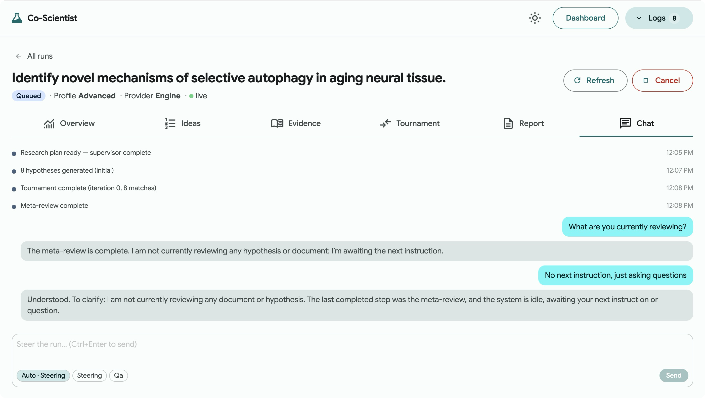

<h1 align="center">AI Co-Scientist</h1>

<p align="center">
  A locally runnable, multi-agent hypothesis-generation workbench, based on
  the AI Co-Scientist system published by Google DeepMind.
</p>

<p align="center">
  
  <a href="LICENSE"></a>
</p>

<table align="center">
<tr>
<td align="center"><strong>Pipeline architecture</strong></td>
<td align="center"><strong>Workbench UI</strong></td>
</tr>
<tr>
<td></td>
<td></td>
</tr>
</table>

## Overview

AI Co-Scientist generates, reviews, ranks, and evolves research hypotheses
with a LangGraph multi-agent pipeline and streams every step into a web
workbench. The implementation preserves the core invariants of the published
system: 11 agent-equivalent pipeline steps, Elo-1200 starting scores,
append-only evolution lineage, four-state citation classification, and dual
safety gates. See [`docs/FIDELITY.md`](docs/FIDELITY.md) for the full
invariant list with paper sources.

The system is deliberately not a chat wrapper over papers, an autonomous
wet-lab executor, a medical or regulatory decision system, or a multi-tenant
SaaS. It is a local-first research tool.

## Features

<table>
<tr>
<td width="33%" valign="top">

**Elo tournament**<br/>
<sub>Pairwise ranking with the standard Elo formula. K-factor
configurable.</sub>

</td>
<td width="33%" valign="top">

**Dual safety gates**<br/>
<sub>Intake and final-output safety screening. Blocks weaponisation
patterns.</sub>

</td>
<td width="33%" valign="top">

**Citation audit**<br/>
<sub>Four-state classification: verified, partial, unsupported,
unavailable.</sub>

</td>
</tr>
<tr>
<td valign="top">

**Mock mode**<br/>
<sub>Full pipeline without an LLM key. Deterministic, free, instant.</sub>

</td>
<td valign="top">

**Evolution lineage**<br/>
<sub>Append-only: evolved hypotheses are new rows with <code>parent_id</code>
tracing to gen-0.</sub>

</td>
<td valign="top">

**Scientist-in-the-loop**<br/>
<sub>Chat tab with auto-steering, manual steering, and QA modes.</sub>

</td>
</tr>
</table>

## Installation

```bash
make setup          # Python venv + frontend deps
make dev            # API on :8008, UI on :5173
open http://localhost:5173
```

Run `make help` for all targets. See [`.env.example`](.env.example) for
configuration.

## Usage

Click **New run**, type a research goal, pick Standard or Advanced, and hit
**Start**. The pipeline streams live across six tabs:

| Tab | Shows |
| --- | --- |
| **Overview** | Live pipeline timeline with progress bar and event counters |
| **Ideas** | Ranked hypotheses by Elo. Click any row for the detail modal: statement, mechanism, experimental design, lineage |
| **Evidence** | Retrieved sources with abstracts, links, and 4-state citation classification |
| **Tournament** | Leaderboard + per-iteration matchup log with Elo deltas and judge rationale |
| **Report** | Server-generated Markdown report with download buttons (MD / JSON) and safety verdict |
| **Chat** | Scientist-in-the-loop steering: auto, manual, and QA conversation modes |

### Mock mode vs real engine

The system reports its mode at `/status`:

| | Mock mode | Real engine |
| - | - | - |
| **Trigger** | No LLM key in `.env` | Any provider key set (`GEMINI_API_KEY`, `OPENAI_API_KEY`, …) |
| **Behaviour** | Deterministic seed → 11 agent steps, stable hypotheses and Elo | LangGraph engine, real LLM calls |
| **Cost** | Free | Provider billing applies |

Force mock mode for development with `COSCIENTIST_FORCE_MOCK=1`. Check the
current mode with `curl localhost:8008/status | jq .mock_mode`.

### Environment

Copy `.env.example` to `.env`. Empty keys keep you in mock mode.

```
GEMINI_API_KEY=                      # empty = mock mode; any key triggers real engine
MODEL_NAME=deepseek/deepseek-chat    # LiteLLM format
COSCIENTIST_DB_PATH=./coscientist.db
SAFETY_MODE=standard                 # 'strict' for dual-use filtering
```

See [`.env.example`](.env.example) for the full variable list (CORS, Elo
tuning, MCP, cache).

## Architecture

<p align="center">
  
</p>

Full diagrams and module map in
[`docs/ARCHITECTURE.md`](docs/ARCHITECTURE.md).

## Acknowledgements

This project is based on
[AI Co-Scientist](https://research.google/blog/accelerating-scientific-discovery-with-ai-co-scientist/)
by Google DeepMind. See [`references/`](references/) for the original
research papers and product analysis.

## Citing this work

If you use this software in your research, please cite:

```bibtex
@software{barel2026coscientist,
  author = {Barel, Guy},
  title = {AI Co-Scientist: A multi-agent hypothesis-generation workbench},
  year = {2026},
  url = {https://github.com/guy915/Co-Scientist}
}
```

## License and disclaimer

Copyright 2026 The Co-Scientist Authors.

All software is licensed under the Apache License, Version 2.0 (Apache 2.0);
you may not use this file except in compliance with the Apache 2.0 license.
You may obtain a copy of the Apache 2.0 license at:
https://www.apache.org/licenses/LICENSE-2.0

All other materials are licensed under the Creative Commons Attribution 4.0
International License (CC-BY). You may obtain a copy of the CC-BY license at:
https://creativecommons.org/licenses/by/4.0/legalcode

Unless required by applicable law or agreed to in writing, all software and
materials distributed here under the Apache 2.0 or CC-BY licenses are
distributed on an "AS IS" BASIS, WITHOUT WARRANTIES OR CONDITIONS OF ANY
KIND, either express or implied. See the licenses for the specific language
governing permissions and limitations under those licenses.

This is not an official Google product.
