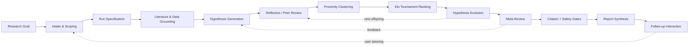
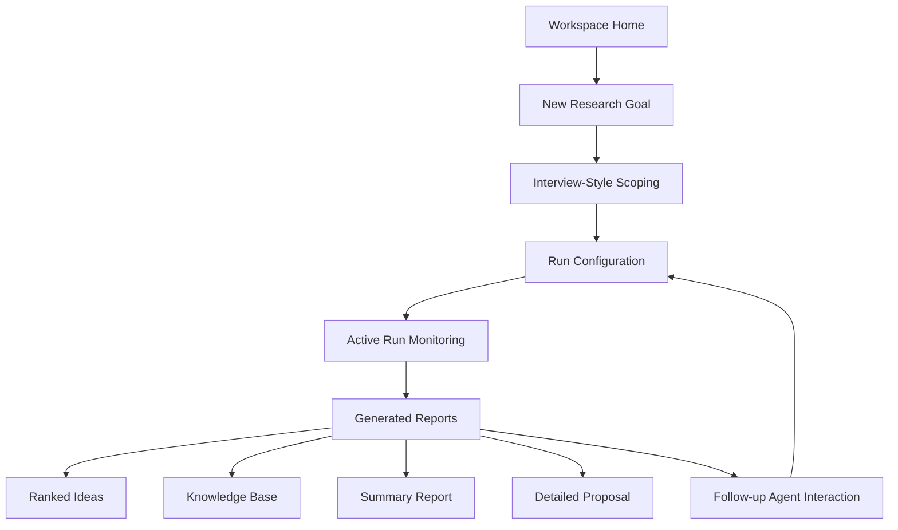
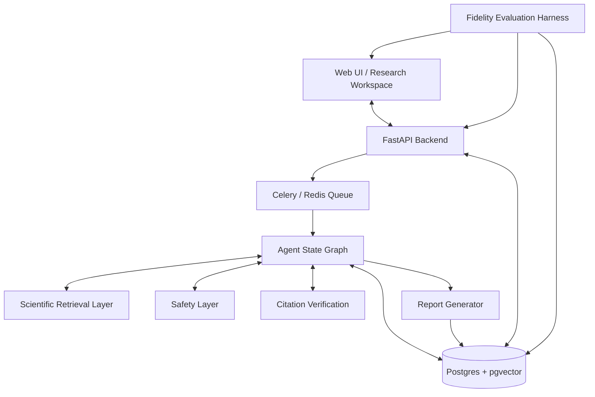
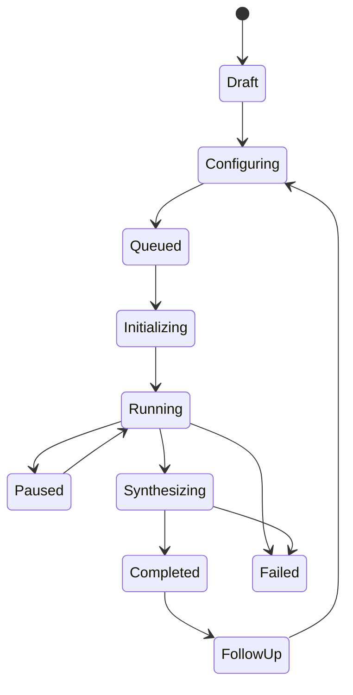
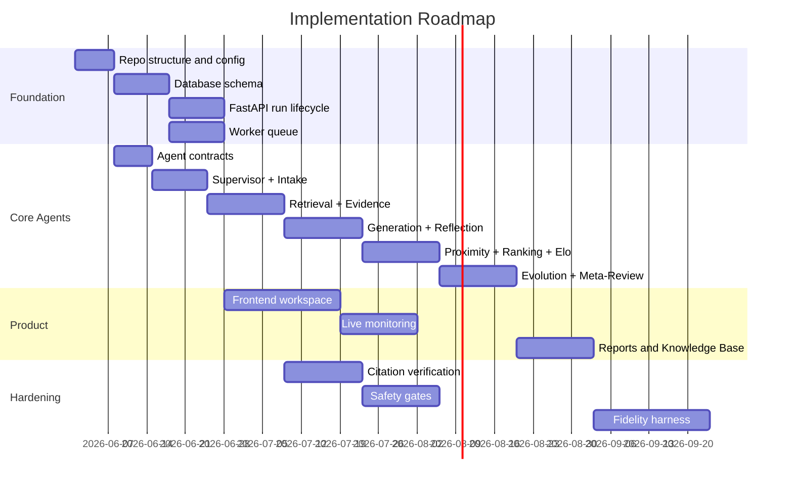

# Google DeepMind AI Co-Scientist Clone

A high-fidelity open-source clone of Google DeepMind’s AI Co-Scientist / Hypothesis Generation workflow: a scientist-in-the-loop, multi-agent research system that turns a natural-language research goal into ranked, critiqued, evolved, literature-grounded scientific hypotheses and final research proposals.

This is not a generic chatbot, not a simple literature-review tool, and not an autonomous paper generator. The target system is an upstream scientific discovery workbench: it scopes a research challenge, grounds itself in literature and scientific databases, generates candidate hypotheses, critiques them, ranks them through pairwise tournaments, evolves the strongest ideas, verifies citations, applies safety gates, and produces a structured proposal that a human researcher can inspect, refine, and use for downstream validation.

> Project status: early implementation / architecture-first build. This README describes the intended product and engineering target for contributors and coding agents.

---

## Core idea

The system implements the following discovery loop:



The defining behavior is **generate → debate → evolve** under a persistent supervisor. The system spends its compute budget on verification, critique, ranking, and refinement rather than on fluent one-shot output.

---

## Product workflow

The visible product should feel like a research workspace, not a chat-only app.



The expected user journey is:

1. The user enters a research challenge in natural language.
2. The Intake/Interview Agent asks targeted clarifying questions.
3. The system creates a structured Run Specification.
4. The user selects a Standard or Advanced run.
5. The backend launches a long-running agent workflow.
6. The dashboard streams progress, active agents, literature growth, tournament state, and intermediate logs.
7. The final workspace shows ranked hypotheses, evidence, debate traces, citations, and a proposal.
8. The user can ask follow-up questions, add constraints, or trigger targeted refinement.

---

## What this project should become

The target product surface includes:

| Area           | Target behavior                                                                                                                  |
| -------------- | -------------------------------------------------------------------------------------------------------------------------------- |
| Research setup | Natural-language goal input, seed ideas, file upload, constraints, preferences                                                   |
| Interview      | Structured scoping dialogue that produces a machine-readable Run Specification                                                   |
| Run modes      | Standard and Advanced execution profiles                                                                                         |
| Monitoring     | Live progress, active agents, task states, cost/time budget, literature count, Elo standings                                     |
| Ideas          | Ranked hypotheses with scores, novelty, confidence, feasibility, and evidence                                                    |
| Knowledge Base | Retrieved papers, structured evidence, citation graph, semantic search                                                           |
| Tournament     | Pairwise debate logs, Elo updates, matchup history, clustering/proximity view                                                    |
| Reports        | Summary report, Ideas Report, Detailed Proposal, exportable Markdown/PDF/JSON                                                    |
| Follow-up      | Conversational steering over completed runs and selected hypotheses                                                              |
| Safety         | Input and output gates for hazardous or dual-use scientific content                                                              |
| Fidelity       | Automated tests for product flow, terminology, agent behavior, tournament behavior, citation grounding, and final output quality |

---

## Standard vs Advanced runs

| Dimension    | Standard Run                         | Advanced Run                                                             |
| ------------ | ------------------------------------ | ------------------------------------------------------------------------ |
| Purpose      | Fast scoping and concept mapping     | Deep discovery and proposal generation                                   |
| Literature   | Abstracts, metadata, core sources    | Deeper citation tracing, full-text where available, specialist databases |
| Hypotheses   | Small candidate pool                 | Larger candidate pool                                                    |
| Reflection   | Initial and focused reviews          | Multi-tier review, deep verification, simulation-style critique          |
| Tournament   | Limited pairwise comparisons         | Extended Elo tournaments with deeper debates                             |
| Evolution    | Light mutation and combination       | Multi-round hypothesis evolution                                         |
| Output       | Structured overview and ranked ideas | Grant-style proposal with stronger evidence mapping                      |
| Expected use | Early exploration                    | Serious research planning                                                |

---

## Agent roster

The system is built around a supervised coalition of specialized agents. Each agent should have narrow responsibilities, typed inputs, typed outputs, trace logging, and restricted tool permissions.

| Agent                  | Responsibility                                                                   | Primary output                                  |
| ---------------------- | -------------------------------------------------------------------------------- | ----------------------------------------------- |
| Supervisor             | Adaptive planner; schedules tasks; manages state, budgets, and stopping criteria | Task DAG, routing decisions, run status         |
| Intake / Interview     | Clarifies vague user goals into structured research specs                        | Run Specification JSON                          |
| Literature Retrieval   | Searches and normalizes scientific sources                                       | Retrieved documents, metadata, evidence records |
| Generation             | Produces candidate hypotheses grounded in retrieved context                      | Hypothesis objects                              |
| Reflection             | Critiques hypotheses for plausibility, novelty, feasibility, and testability     | Review logs, defect lists, scores               |
| Proximity / Clustering | Embeds and clusters hypotheses to remove redundancy and guide pairings           | Clusters, similarity matrix                     |
| Ranking                | Runs pairwise debates and updates Elo ratings                                    | Match verdicts, debate transcripts, leaderboard |
| Evolution              | Generates new offspring hypotheses from strong candidates and critiques          | New hypothesis objects with lineage             |
| Meta-Review            | Synthesizes tournament-wide lessons and updates future agent guidance            | Meta-critique, supervisor guidance              |
| Citation Verification  | Checks whether claims are supported by source documents                          | Citation manifest, unsupported-claim flags      |
| Safety                 | Screens inputs, outputs, and proposed protocols for dangerous misuse             | Allow/redact/block decisions                    |
| Report Synthesis       | Produces final reports and exportable proposal artifacts                         | Markdown/PDF/JSON reports                       |

Important invariant: the Evolution Agent creates **new hypotheses**. It must not silently overwrite or mutate existing hypothesis records in place. Parent hypotheses remain auditable.

---

## Fidelity-critical invariants

A coding agent should treat these as product laws, not suggestions.

1. This is a **multi-agent co-scientist**, not a single prompt chain.
2. The Supervisor is an adaptive planner, not a fixed linear script.
3. Hypotheses must be persistent, versioned, and auditable.
4. Initial tournament Elo should default to `1200`.
5. Ranking uses pairwise debate/comparison, not only absolute scalar scoring.
6. Top hypotheses receive deeper review than weak or low-ranked hypotheses.
7. Proximity clustering guides deduplication and tournament pairing.
8. Evolution generates new offspring hypotheses with lineage.
9. Meta-Review feedback is appended back into later agent prompts or routing state.
10. Final reports must distinguish verified claims, weakly supported claims, speculative claims, and unsupported claims.
11. Citation verification is a gate, not a decorative bibliography pass.
12. Safety screening happens before and after generation.
13. Standard and Advanced runs must produce observably different compute depth.
14. The UI must expose process state: agents, queue, progress, evidence, tournament, and reports.
15. Fidelity tests should verify behavior, not just snapshot text.

---

## Architecture

Preferred high-level stack:

| Layer                | Preferred implementation                                                                 |
| -------------------- | ---------------------------------------------------------------------------------------- |
| Frontend             | React + Vite + Tailwind, with AG-UI/SSE/WebSocket-style streaming                        |
| Backend API          | FastAPI                                                                                  |
| Long-running jobs    | Celery + Redis, or equivalent queue abstraction                                          |
| Agent orchestration  | LangGraph-style state graph with checkpointing                                           |
| Primary database     | PostgreSQL                                                                               |
| Vector search        | pgvector plus keyword search / hybrid retrieval                                          |
| Scientific retrieval | PubMed, Europe PMC, arXiv, Crossref, Semantic Scholar, ChEMBL, UniProt; MCP where useful |
| Reports              | Markdown first; PDF/LaTeX/JSON as export layers                                          |
| Observability        | Structured logs, traces, token/cost metrics, run events                                  |
| Safety               | Pre-generation and post-generation safety gates                                          |
| Testing              | Unit, integration, end-to-end, and fidelity tests                                        |

Architecture sketch:



---

## Expected repository structure

The exact structure can evolve, but the codebase should stay modular and bottom-up. Avoid upward imports from low-level packages into apps.

```text
ai-coscientist/
├── README.md
├── pyproject.toml
├── package.json
├── docker-compose.yml
├── .env.example
│
├── apps/
│   ├── api/                  # FastAPI app
│   ├── worker/               # Celery workers / long-running jobs
│   └── frontend/             # React workspace UI
│
├── packages/
│   ├── coscientist_core/      # agent state graph, run state, core agent contracts
│   ├── coscientist_llm/       # model adapters, token budgeting, retries
│   ├── coscientist_retrieval/ # scientific search, MCP clients, source normalization
│   ├── coscientist_safety/    # safety classifiers, gates, audit logging
│   └── coscientist_eval/      # fidelity harness and benchmark runners
│
├── db/
│   ├── migrations/
│   └── seeds/
│
├── docs/
│   ├── ARCHITECTURE.md
│   ├── AGENT_CONTRACTS.md
│   ├── FIDELITY.md
│   ├── SAFETY.md
│   └── PRODUCT.md
│
├── tests/
│   ├── unit/
│   ├── integration/
│   ├── e2e/
│   └── fidelity/
│
└── scripts/
    ├── dev_up.sh
    ├── seed_demo_data.py
    └── run_fidelity_eval.py
```

---

## Core data model

At minimum, the system needs durable records for:

| Entity               | Purpose                                          |
| -------------------- | ------------------------------------------------ |
| `users`              | User identity and ownership                      |
| `projects`           | Grouping of related research goals               |
| `research_goals`     | User-entered problem statements and constraints  |
| `runs`               | Standard/Advanced execution sessions             |
| `run_specs`          | Structured scoping output and configuration      |
| `tasks`              | Queueable agent jobs and dependencies            |
| `agent_trace_logs`   | Inputs, outputs, status, model, latency, cost    |
| `documents`          | Retrieved papers and uploaded files              |
| `evidence_records`   | Extracted claims, snippets, metadata, source IDs |
| `hypotheses`         | Candidate hypotheses, lineage, status, scores    |
| `reviews`            | Reflection outputs and critique logs             |
| `clusters`           | Proximity groupings and similarity metadata      |
| `matches`            | Pairwise tournament records                      |
| `elo_history`        | Rating changes over time                         |
| `citations`          | Claim-to-source verification records             |
| `safety_decisions`   | Allow/redact/block decisions                     |
| `reports`            | Final Markdown/PDF/JSON outputs                  |
| `scientist_feedback` | User steering after or during a run              |

Hypotheses should be append-only where possible. Do not erase failed ideas; failed or non-viable directions are valuable for Meta-Review and reproducibility.

---

## API surface

Initial API routes should support the full product loop:

| Method | Route                                  | Purpose                                    |
| ------ | -------------------------------------- | ------------------------------------------ |
| `POST` | `/api/v1/runs`                         | Create a run from an initial research goal |
| `GET`  | `/api/v1/runs`                         | List runs                                  |
| `GET`  | `/api/v1/runs/{run_id}`                | Get run metadata and status                |
| `POST` | `/api/v1/runs/{run_id}/interview`      | Submit/continue scoping dialogue           |
| `POST` | `/api/v1/runs/{run_id}/start`          | Start Standard or Advanced execution       |
| `POST` | `/api/v1/runs/{run_id}/pause`          | Pause a run                                |
| `POST` | `/api/v1/runs/{run_id}/resume`         | Resume a run                               |
| `POST` | `/api/v1/runs/{run_id}/feedback`       | Add user steering                          |
| `GET`  | `/api/v1/runs/{run_id}/events`         | Stream run events over SSE                 |
| `GET`  | `/api/v1/runs/{run_id}/hypotheses`     | List ranked hypotheses                     |
| `GET`  | `/api/v1/runs/{run_id}/tournament`     | Get tournament state                       |
| `GET`  | `/api/v1/runs/{run_id}/knowledge-base` | Browse retrieved evidence                  |
| `GET`  | `/api/v1/runs/{run_id}/reports`        | List reports                               |
| `GET`  | `/api/v1/reports/{report_id}`          | Render report                              |

---

## Hypothesis object

A hypothesis should be structured enough for ranking, critique, citation verification, and report synthesis.

```json
{
  "id": "uuid",
  "run_id": "uuid",
  "title": "Short descriptive title",
  "statement": "A clear, testable hypothesis",
  "mechanism": "Mechanistic explanation",
  "expected_effect": "Predicted measurable outcome",
  "experimental_context": "Model system, assay, population, or constraints",
  "evidence_ids": ["evidence_uuid"],
  "parent_ids": ["uuid"],
  "generation": 0,
  "status": "active | reviewed | ranked | evolved | non_viable | report_candidate",
  "elo_rating": 1200,
  "novelty_score": null,
  "plausibility_score": null,
  "testability_score": null,
  "grounding_confidence": null,
  "safety_status": "pending | allowed | redacted | blocked",
  "created_by_agent": "generation",
  "created_at": "timestamp"
}
```

---

## Run states

The run lifecycle should be explicit and testable.



Required states:

| State          | Meaning                                   |
| -------------- | ----------------------------------------- |
| `draft`        | Goal exists, not fully configured         |
| `configuring`  | Interview/scoping in progress             |
| `queued`       | Run confirmed and waiting for resources   |
| `initializing` | Agents, retrieval, and state setup        |
| `running`      | Main agent loop active                    |
| `paused`       | User or system intervention required      |
| `synthesizing` | Final report, citations, and safety audit |
| `completed`    | Results available                         |
| `failed`       | Terminal error with diagnostic logs       |

---

## Retrieval and evidence grounding

The retrieval layer is the source of truth for scientific claims. It should combine:

* PubMed / MEDLINE for biomedical literature
* Europe PMC for open full text and structured XML where available
* Crossref for DOI resolution
* Semantic Scholar / OpenAlex for citation graph and metadata enrichment
* arXiv for preprints where relevant
* ChEMBL for bioactive molecules and drug-target evidence
* UniProt for protein identity, function, and sequence metadata
* AlphaFold or equivalent structure tools as optional Advanced-run integrations

Every generated report should preserve claim provenance. The UI should make it obvious whether a claim is:

| Label               | Meaning                                                                   |
| ------------------- | ------------------------------------------------------------------------- |
| Verified            | Supported by source text or structured database evidence                  |
| Partially supported | Related source exists, but the exact claim is broader than the evidence   |
| Unverified          | No supporting source found                                                |
| Contradicted        | Retrieved evidence conflicts with the claim                               |
| Speculative         | Explicitly proposed as a testable idea, not presented as established fact |

---

## Citation verification

Citation verification is a two-pass gate:

1. **Assertion extraction:** parse the draft report into atomic technical claims.
2. **Source mapping:** map each assertion to retrieved snippets, PMIDs, DOIs, database records, or structured evidence.

Unsupported claims must not be silently included as verified statements. They should either be rewritten as speculation, removed, or flagged for human review.

---

## Safety and use boundaries

This project is intended for legitimate scientific ideation, literature-grounded hypothesis generation, and research planning. It must not provide operational assistance for harmful biological, chemical, radiological, nuclear, or other dangerous misuse.

Safety requirements:

* Run input screening during scoping.
* Run output screening during generation, evolution, and report synthesis.
* Log every safety decision.
* Stop or redact unsafe runs.
* Keep the Safety Agent independent from the generation agents.
* Prefer fail-closed behavior in ambiguous high-risk domains.
* Keep dangerous protocol detail out of generated reports.

The system may support biomedical research planning, but outputs are not medical advice, clinical recommendations, or lab-ready instructions without expert review.

---

## Fidelity evaluation

The clone should be evaluated across nine dimensions:

| Dimension            | What to test                                                                |
| -------------------- | --------------------------------------------------------------------------- |
| Product flow         | Goal → interview → run config → monitoring → reports → follow-up            |
| Terminology          | Correct use of Co-Scientist concepts and UI labels                          |
| Report structure     | Summary, Run Specification, Knowledge Base, ranked ideas, detailed proposal |
| Agent behavior       | Each agent performs only its intended role                                  |
| Tournament behavior  | Pairwise debates, Elo updates, stable leaderboard                           |
| Evidence grounding   | Claims map to valid citations or are flagged                                |
| Safety behavior      | Hazardous requests are blocked or redacted                                  |
| Progress and latency | Runs stream status, recover from failures, avoid deadlocks                  |
| Final output quality | Mechanistic specificity, novelty, plausibility, decomposition, usefulness   |

A coding agent should not consider the system “working” just because it returns a polished report. It must pass behavioral and structural tests.

---

## Development principles

1. Build from typed contracts outward.
2. Keep agent outputs structured before rendering prose.
3. Prefer append-only state for hypotheses, citations, reviews, and tournament logs.
4. Do not hide errors behind synthetic placeholder data.
5. Keep retrieval, verification, ranking, safety, and report rendering separable.
6. Make Standard runs useful before making Advanced runs impressive.
7. Keep every expensive or underspecified parameter configurable.
8. Surface uncertainty honestly in the UI.
9. Optimize for traceability before novelty.
10. Treat the README, `docs/AGENT_CONTRACTS.md`, and `docs/FIDELITY.md` as implementation law.

---

## Local development

Planned local workflow:

```bash
cp .env.example .env
make dev-up
make migrate
make seed
make test
```

Suggested commands:

```bash
make dev-up          # start db, redis, api, worker, frontend
make dev-down        # stop local services
make migrate         # run database migrations
make seed            # load demo/gold data
make api             # run backend only
make worker          # run worker only
make frontend        # run frontend only
make test            # run all tests
make test-fidelity   # run fidelity harness
make lint            # lint and format
```

Expected environment variables:

```dotenv
DATABASE_URL=
REDIS_URL=
ANTHROPIC_API_KEY=
OPENAI_API_KEY=
GEMINI_API_KEY=
NCBI_API_KEY=
EUROPE_PMC_EMAIL=
SEMANTIC_SCHOLAR_API_KEY=
DEFAULT_MODEL_ALIAS=
RUN_BUDGET_USD_DEFAULT=
RUN_WALL_CLOCK_S_DEFAULT=
SAFETY_MODE=strict
```

---

## MVP acceptance criteria

The first credible MVP should demonstrate:

* Create a research goal.
* Complete interview-style scoping.
* Generate a Run Specification.
* Start a Standard run.
* Retrieve at least one real literature source.
* Generate multiple candidate hypotheses.
* Run Reflection reviews.
* Cluster or deduplicate hypotheses.
* Run at least one pairwise Ranking match.
* Update Elo ratings.
* Produce at least one evolved hypothesis as a new record.
* Verify citations or flag unsupported claims.
* Render a final Markdown report.
* Stream progress to the frontend.
* Log agent traces and run state.
* Block at least basic unsafe inputs.
* Pass a small fidelity test suite.

---

## Near-term roadmap



---

## Glossary

| Term              | Meaning                                                         |
| ----------------- | --------------------------------------------------------------- |
| Research Goal     | User’s initial scientific challenge                             |
| Run Specification | Structured configuration created after scoping                  |
| Standard Run      | Lower-cost, faster exploration mode                             |
| Advanced Run      | Higher-compute, deeper verification and tournament mode         |
| Hypothesis        | A testable candidate scientific claim                           |
| Reflection        | Peer-review-style critique of a hypothesis                      |
| Proximity         | Semantic clustering and deduplication of hypotheses             |
| Tournament        | Pairwise comparison system for ranking hypotheses               |
| Elo               | Rating system used to update hypothesis rankings after matches  |
| Evolution         | Creation of new hypotheses from strong candidates and critiques |
| Meta-Review       | Cross-run synthesis that updates agent guidance                 |
| Knowledge Base    | Retrieved documents, evidence, entities, claims, and citations  |
| Citation Manifest | Structured proof that claims map to sources                     |
| Fidelity Harness  | Tests that the clone behaves like the target system             |

---

## Non-goals

This project should not become:

* A generic chat wrapper over research papers.
* A one-shot “write me a proposal” tool.
* A paper generator that fabricates experiments.
* A fully autonomous wet-lab executor.
* A medical, clinical, or regulatory decision system.
* A system that presents unsupported claims as fact.
* A system that hides unsafe or failed reasoning paths.
