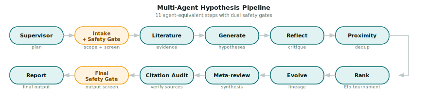
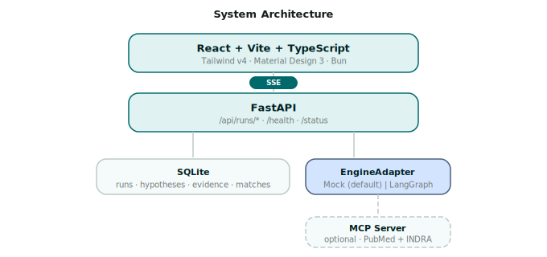

<h1 align="center">Co-Scientist</h1>

<p align="center">
  A multi-agent hypothesis-generation system for scientific discovery.
</p>

<table align="center">
<tr>
<td align="center"><strong>Pipeline architecture</strong></td>
<td align="center"><strong>Workbench</strong></td>
</tr>
<tr>
<td></td>
<td></td>
</tr>
</table>

## Overview

Co-Scientist generates, reviews, ranks, and evolves research hypotheses
with a LangGraph multi-agent pipeline and streams every step into a web
workbench. The implementation preserves the core invariants of the published
system: a supervised multi-agent workflow, Elo-1200 starting scores,
append-only evolution lineage, four-state citation classification, and dual
safety gates. See [`fidelity.md`](docs/fidelity.md) for the full
invariant list with paper sources.

The system is deliberately not a chat wrapper over papers, an autonomous
wet-lab executor, a medical or regulatory decision system, or a multi-tenant
SaaS. It is a local-first implementation workspace for replicating the
published AI Co-Scientist hypothesis-generation workflow.

## Features

<table>
<tr>
<td width="33%" valign="top">

**Elo tournament**<br/>
<sub>Pairwise ranking with the standard Elo formula. K-factor
configurable.</sub>

</td>
<td width="33%" valign="top">

**Dual safety gates**<br/>
<sub>Intake and final-output safety screening. Blocks weaponisation
patterns.</sub>

</td>
<td width="33%" valign="top">

**Citation audit**<br/>
<sub>Four-state classification: verified, partial, unsupported,
unavailable.</sub>

</td>
</tr>
<tr>
<td valign="top">

**Mock mode**<br/>
<sub>Full pipeline without an LLM key. Deterministic, free, instant.</sub>

</td>
<td valign="top">

**Evolution lineage**<br/>
<sub>Append-only: evolved hypotheses are new rows with <code>parent_id</code>
tracing to gen-0.</sub>

</td>
<td valign="top">

**Scientist-in-the-loop**<br/>
<sub>Chat tab with auto-steering, manual steering, and QA modes.</sub>

</td>
</tr>
</table>

## Installation

```bash
make setup          # Python venv + frontend deps
make dev            # API on :8008, UI on :5173
open http://localhost:5173
```

Run `make help` for all targets. See [`.env.example`](.env.example) for
configuration.

## Repository map

| Path | Purpose |
| --- | --- |
| `app/` | FastAPI API, SQLite run store, mock workflow, and React workbench |
| `app/frontend/` | Vite + React + TypeScript UI |
| `engine/` | LangGraph hypothesis-generation engine and reference MCP server |
| `docs/` | Live architecture, fidelity notes, screenshots, and diagrams |
| `references/` | Source research, product captures, and comparison material |

## Development checks

```bash
make test          # viewer backend pytest suite
make test-engine   # engine pytest suite
make test-all      # backend pytest suites for engine + app
make build         # frontend typecheck + production build

cd app/frontend
bun run test       # frontend unit tests
bun run lint       # gts lint
```

## Usage

Open the workspace, describe a research goal in chat, review the inferred run
setup, and hit **Start**. The chat timeline keeps progress, steering messages,
leading hypotheses, and report status in chronological order. The structured
dashboard remains available for deeper inspection:

| Tab | Shows |
| --- | --- |
| **Ideas** | Ranked hypotheses by Elo. Click any row for the detail modal: statement, mechanism, experimental design, lineage |
| **Knowledge Base** | Retrieved sources with abstracts, links, and 4-state citation classification |
| **Summary** | Server-generated Markdown report with download buttons (MD / JSON) and safety verdict |
| **Run Specifications** | Provider, configuration, artifact counts, and recorded safety gates |
| **Progress** | Live pipeline timeline with progress bar and event counters |
| **Tournament** | Leaderboard + per-iteration matchup log with Elo deltas and judge rationale |
| **Chat** | Scientist-in-the-loop steering: auto, manual, and QA conversation modes |

### Mock mode vs real engine

The system reports its mode at `/status`:

| | Mock mode | Real engine |
| - | - | - |
| **Trigger** | No LLM key in `.env` | Any provider key set (`DEEPSEEK_API_KEY`, `OPENAI_API_KEY`, …) |
| **Behaviour** | Deterministic seed → 11 agent steps, stable hypotheses and Elo | LangGraph engine, real LLM calls |
| **Cost** | Free | Provider billing applies |

Force mock mode for development with `COSCIENTIST_FORCE_MOCK=1`. Check the
current mode with `curl localhost:8008/status | jq .mock_mode`.

### Environment

Copy `.env.example` to `.env`. Empty keys keep you in mock mode.

```
DEEPSEEK_API_KEY=                    # empty = mock mode; any provider key triggers real engine
MODEL_NAME=deepseek/deepseek-chat    # LiteLLM format
COSCIENTIST_DB_PATH=./coscientist.db
SAFETY_MODE=standard                 # 'strict' for dual-use filtering
```

See [`.env.example`](.env.example) for the full variable list (CORS, Elo
tuning, MCP, cache).

## Architecture

<p align="center">
  
</p>

Full diagrams and module map in
[`architecture.md`](docs/architecture.md).

## Acknowledgements

- [Towards an AI Co-Scientist](https://arxiv.org/abs/2502.18864)
- [Accelerating scientific discovery with Co-Scientist](https://doi.org/10.1038/s41586-026-10644-y)
- [Science Skills for Antigravity](https://github.com/google-deepmind/science-skills)
- [Jataware Open Co-Scientist](https://github.com/jataware/open-coscientist)
- [Sakana AI Scientist](https://github.com/SakanaAI/AI-Scientist)
- [Claude Code (leaked source)](https://github.com/codeaashu/claude-code)
- [Pi Agent](https://github.com/Dicklesworthstone/pi_agent_rust)
