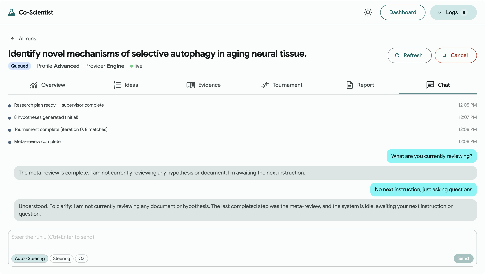

<h1 align="center">Co-Scientist</h1>

<p align="center">
  A multi-agent hypothesis-generation system for scientific discovery.
</p>

<p align="center">
  <a href="https://deepwiki.com/guy915/Co-Scientist"></a>
</p>

<table align="center">
<tr>
<td align="center"><strong>Pipeline architecture</strong></td>
<td align="center"><strong>Workbench</strong></td>
</tr>
<tr>
<td></td>
<td></td>
</tr>
</table>

## Overview

Co-Scientist generates, reviews, ranks, and evolves research hypotheses
with a LangGraph multi-agent pipeline and streams every step into a web
workbench. The implementation preserves the core invariants of the published
system: a supervised multi-agent workflow, Elo-1200 starting scores,
append-only evolution lineage, four-state citation classification, and dual
safety gates. See [`FIDELITY.md`](docs/FIDELITY.md) for the full
invariant list with paper sources.

The system is deliberately not a chat wrapper over papers, an autonomous
wet-lab executor, a medical or regulatory decision system, or a multi-tenant
SaaS. It is a local-first implementation workspace for replicating the
published AI Co-Scientist hypothesis-generation workflow.

## Features

<table>
<tr>
<td width="33%" valign="top">

**Elo tournament**<br/>
<sub>Pairwise ranking with the standard Elo formula. K-factor
configurable.</sub>

</td>
<td width="33%" valign="top">

**Dual safety gates**<br/>
<sub>Intake and final-output safety screening against literal
weaponisation patterns. The deterministic layer is measurably porous to
paraphrase and over-blocks legitimate near-boundary research — see
[`FIDELITY.md`](docs/FIDELITY.md).</sub>

</td>
<td width="33%" valign="top">

**Citation audit**<br/>
<sub>Four-state classification: verified, partial, unsupported,
unavailable.</sub>

</td>
</tr>
<tr>
<td valign="top">

**Offline mode**<br/>
<sub>Full pipeline without an LLM key. Deterministic, free, instant.</sub>

</td>
<td valign="top">

**Evolution lineage**<br/>
<sub>Append-only: evolved hypotheses are new rows with <code>parent_id</code>
tracing to gen-0.</sub>

</td>
<td valign="top">

**Scientist-in-the-loop**<br/>
<sub>Chat workspace timeline with steering messages and Q&amp;A during a run.</sub>

</td>
</tr>
</table>

## Installation

```bash
make setup          # Python venv + frontend deps
make start          # API on :8008, UI on :5173
open http://localhost:5173
```

Run `make help` for all targets. See [`.env.example`](.env.example) for
configuration.

## Repository map

| Path | Purpose |
| --- | --- |
| `app/` | FastAPI API, SQLite run store, and React workbench (UI in `app/frontend/`) |
| `engine/` | LangGraph hypothesis-generation engine and reference MCP server |
| `evaluations/` | Parity ledger checker, safety/citation evals, and release gate |
| `e2e/` | Playwright browser end-to-end suite |
| `corpus/` | Domain paper corpus baked into the API and MCP images |
| `docs/` | Live architecture, fidelity notes, screenshots, and diagrams (see [`docs/README.md`](docs/README.md) for the index) |
| `.github/` | CI and nightly workflows |
| `references/` | Source research, product captures, and comparison material (~39 MB) |

## Documentation

| Doc | Covers |
| --- | --- |
| [`ARCHITECTURE.md`](docs/ARCHITECTURE.md) | Runtime layers and module map |
| [`EXPLAINER.md`](docs/EXPLAINER.md) | Visual walkthrough of the product and the multi-agent engine |
| [`FIDELITY.md`](docs/FIDELITY.md) | How this implementation compares to the published system |
| [`PARITY.md`](docs/PARITY.md) | Machine-checked requirement ledger (gated in CI) |
| [`RUNNING-LOCALLY.md`](docs/RUNNING-LOCALLY.md) | Local setup, ports, and common gotchas |
| [`CI.md`](docs/CI.md) | Presubmit/postsubmit pipeline and how to reproduce it locally |
| [`decisions/`](docs/decisions/) | Architecture decision records |

## Development checks

```bash
make test          # viewer backend pytest suite
make test-engine   # engine pytest suite
make test-all      # engine + app + MCP server pytest suites, plus the docs/PARITY.md evidence gate and its tests
make lint          # ruff format --check + ruff check (app, engine, evaluations) + gts lint (frontend)
make typecheck     # mypy (app, engine, evaluations)
make build         # frontend typecheck + production build
make e2e           # Playwright browser suite (headless, isolated stack)

cd app/frontend
bun run test       # frontend unit tests
bun run lint       # gts lint
```

## Usage

Open the workspace, describe a research goal in chat, review the inferred run
setup, and hit **Start**. The chat timeline keeps progress, steering messages,
leading hypotheses, and report status in chronological order. Each run's detail
surface has four views:

| Tab | Route | Shows |
| --- | --- | --- |
| **Details** | `details` | Provider, configuration, artifact counts, and recorded safety gates |
| **Learning** | `learning` | Retrieved sources with abstracts, links, and 4-state citation classification |
| **Overview** | `overview` | Server-generated Markdown report with download buttons (MD / JSON) and safety verdict |
| **Ideas** | `ideas` | Ranked hypotheses by Elo. Click any row for the detail pane: statement, mechanism, experimental design, lineage |

Steering (auto, manual, and QA conversation modes) and live pipeline progress
live in the chat workspace at `/`, not in a run-detail tab.

### Offline mode vs real engine

Every run goes through the same LangGraph engine; only the LLM backend
underneath changes. The system reports which one at `/status`:

| | Offline mode | Real engine |
| - | - | - |
| **Trigger** | No LLM key in `.env` | Any provider key set (`DEEPSEEK_API_KEY`, `OPENAI_API_KEY`, …) |
| **Behaviour** | Same LangGraph engine, deterministic seeded content in place of real LLM calls | LangGraph engine, real LLM calls |
| **Cost** | Free | Provider billing applies |

Force offline mode for development with `COSCIENTIST_FORCE_OFFLINE=1` (the
deprecated alias `COSCIENTIST_FORCE_MOCK=1` is still honored). Check the
current backend with `curl localhost:8008/status | jq .llm_backend`
(`offline` or `real`).

### Environment

Copy `.env.example` to `.env`. Empty keys keep you in offline mode.

```
OPENROUTER_API_KEY=                  # empty = offline mode; any provider key triggers the real LLM backend
MODEL_NAME=openrouter/z-ai/glm-5.3-flash   # LiteLLM format
COSCIENTIST_DB_PATH=./coscientist.db
SAFETY_MODE=standard                 # 'strict' for dual-use filtering
```

See [`.env.example`](.env.example) for the full variable list (CORS, Elo
tuning, MCP, cache).

## Architecture

<p align="center">
  
</p>

Full diagrams and module map in
[`ARCHITECTURE.md`](docs/ARCHITECTURE.md).

## Acknowledgements

- [Towards an AI Co-Scientist](https://arxiv.org/abs/2502.18864)
- [Accelerating scientific discovery with Co-Scientist](https://doi.org/10.1038/s41586-026-10644-y)
- [Gemini Enterprise — Idea Generation agent](https://docs.cloud.google.com/gemini/enterprise/docs/idea-generation)
- [Science Skills for Antigravity](https://github.com/google-deepmind/science-skills)
- [Jataware Open Co-Scientist](https://github.com/jataware/open-coscientist)
- [Sakana AI Scientist](https://github.com/SakanaAI/AI-Scientist)
- [Pi Agent](https://github.com/Dicklesworthstone/pi_agent_rust)
