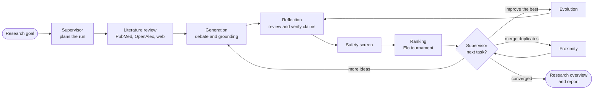

<h1 align="center">Open Co-Scientist</h1>

<p align="center">
  <strong>An open multi-agent research partner that turns a research goal into ranked, literature-grounded hypotheses.</strong>
</p>

<p align="center">
  <a href="https://open-coscientist.com"><strong>Try it at open-coscientist.com</strong></a>
  ·
  <a href="#quick-start">Run it locally</a>
  ·
  <a href="CONTRIBUTING.md">Contribute</a>
</p>

<p align="center">
  
</p>

Describe what you want to understand, such as a mechanism, a drug-repurposing
question or an unexplained observation. Open Co-Scientist searches the
literature, drafts competing hypotheses, critiques and fact-checks them, runs
an Elo tournament of scientific debates, and evolves the strongest ideas. You
get a report with ranked hypotheses, the mechanism behind each, a proposed
experiment, and the sources every claim rests on. You can steer the run while
it works.

It is an open, independent implementation of the agent design in Google's
[AI co-scientist](https://arxiv.org/abs/2502.18864). It is not affiliated with
or endorsed by Google.

## How a run works


```mermaid
flowchart LR
    goal([Research goal]) --> plan[Supervisor<br/>plans the run]
    plan --> lit[Literature review<br/>PubMed, OpenAlex, web]
    lit --> gen[Generation<br/>debate and grounding]
    gen --> review[Reflection<br/>review and verify claims]
    review --> safety[Safety screen]
    safety --> rank[Ranking<br/>Elo tournament]
    rank --> sup{Supervisor<br/>next task?}
    sup -->|more ideas| gen
    sup -->|improve the best| evolve[Evolution]
    evolve --> review
    sup -->|merge duplicates| prox[Proximity]
    prox --> sup
    sup -->|converged| report([Research overview<br/>and report])
```

The supervisor model advises on each next step, and a deterministic policy
enforces budgets, forced transitions and convergence from live statistics such
as pool growth, Elo stability and match coverage. Every step is a durable task,
so a run survives restarts and resumes where it stopped.

## Features

- **Six cooperating agents under a supervisor**: generation, reflection,
  ranking, evolution, proximity and meta-review, following the published
  design.
- **Evidence you can check.** Hypotheses cite retrieved sources with `[C*]`
  keys, each claim is checked against its passages for support or
  contradiction, and retracted papers are flagged.
- **Literature and database tools** through a bundled MCP server: PubMed and
  PMC full text, OpenAlex, Europe PMC, arXiv and preprints, ChEMBL, UniProt,
  STRING, Reactome, Open Targets, Ensembl, gnomAD, the GWAS Catalog,
  ClinicalTrials.gov, and web search when a search key is configured.
- **Steering and questions**: add constraints or ask about the evidence while a
  run works, and attach your own documents.
- **Safety screening** of the goal, each hypothesis and the final report.
- **Bring your own key** for your preferred provider and larger run sizes;
  keys are encrypted at rest.
- **Offline mode** with a deterministic backend, so you can develop and test
  the whole pipeline without an API key.

## Honest limits

- **Free model routes.** The hosted service runs on free OpenRouter routes:
  Ling 3.1 Flash, with free Nemotron fallbacks. They are slower and weaker
  than frontier models, their zero price is the provider's decision and can
  end, and results depend heavily on the model.
- **Capacity.** Without your own key, each browser gets three Express runs a
  day by default, behind per-network and global daily caps. The free routes
  are rate-limited for the whole deployment, so a busy day can park runs until
  the daily reset. Larger run sizes need your own key. Runs take from tens of
  minutes to several hours, depending on size and provider speed.
- **One server.** The API is a single process on SQLite. It favors durability
  and simplicity over scale.
- **Hypotheses, not findings.** Passing tests shows the software works, not
  that its hypotheses are right. Treat every output as a starting point for
  expert review and experiment. The [evaluations](evaluations/README.md) say
  what has and has not been measured.
- **Private by obscurity.** Runs belong to a per-browser ID, not a verified
  account.

## Quick start

You need Python 3.12, Node.js 22.13+ and Bun 1.3.14 on macOS or Linux (on
Windows, use WSL2).

```bash
git clone https://github.com/guy915/Open-Co-Scientist.git
cd Open-Co-Scientist
make setup    # Python virtual environment and locked frontend dependencies
make start    # API on :8008, workbench on :5173, MCP server on :8888
```

`make start` opens [localhost:5173](http://localhost:5173) when it is ready,
and stops anything already listening on those three ports. With no API key,
every stage runs on the deterministic offline backend. To use a real model,
set `OPENROUTER_API_KEY` in the root `.env` that `make setup` created; see
[`.env.example`](.env.example) and the
[full API configuration](app/.env.example). The MCP server reads its own
`engine/mcp_server/.env` ([template](engine/mcp_server/.env.example)).

`make check` runs the CI checks apart from the image builds: lint, types,
every test suite, the evaluation smoke test, the production build and the
browser tests. `make help` lists
every target, and [local setup](docs/RUNNING-LOCALLY.md) covers details and
troubleshooting.

## Architecture

Open Co-Scientist is one Python package, `co_scientist`
(`engine/src/co_scientist/`), served by FastAPI. It is layered from the
composition root through the API, orchestration, the scientific agents and
domain logic down to the platform (models, retrieval, sandbox and the SQLite
store) and core, and import contracts enforce that layering in CI. A React
workbench (`app/frontend/`) streams progress over server-sent events, and a
reference MCP server (`engine/mcp_server/`) provides the literature and
database tools. Read the [architecture](docs/ARCHITECTURE.md), the
[engine architecture](engine/docs/ARCHITECTURE.md) and the
[documentation index](docs/README.md).

## Contributing

Scientists and developers are both welcome. You can report a bug, propose a
research question or an evaluation dataset, reproduce a result, or send code.
Start with [CONTRIBUTING.md](CONTRIBUTING.md), and ask questions in
[Discussions](https://github.com/guy915/Open-Co-Scientist/discussions).
Everyone follows the [Code of Conduct](CODE_OF_CONDUCT.md). Report
vulnerabilities privately as described in [SECURITY.md](SECURITY.md).

## License and credit

First-party software is licensed under [Apache 2.0](LICENSE).
[NOTICE](NOTICE) records third-party software and data; vendored material,
cited papers and scientific data keep their own terms.

This project builds on Google's AI co-scientist research:

- Gottweis et al., [Towards an AI co-scientist](https://arxiv.org/abs/2502.18864), 2025.
- [Accelerating scientific discovery with Co-Scientist](https://doi.org/10.1038/s41586-026-10644-y), *Nature*, 2026.

It also draws on [Science Skills](https://github.com/google-deepmind/science-skills)
(vendored under `vendor/`), [Jataware's open-coscientist](https://github.com/jataware/open-coscientist),
[Sakana AI's AI Scientist](https://github.com/SakanaAI/AI-Scientist) and
[Pi Agent](https://github.com/Dicklesworthstone/pi_agent_rust).
