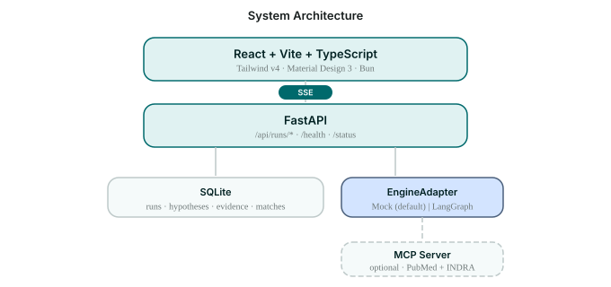
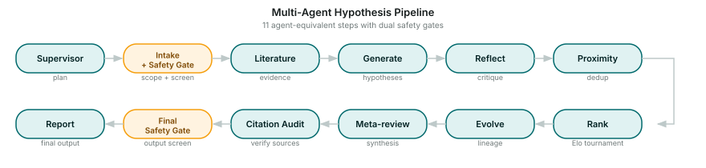
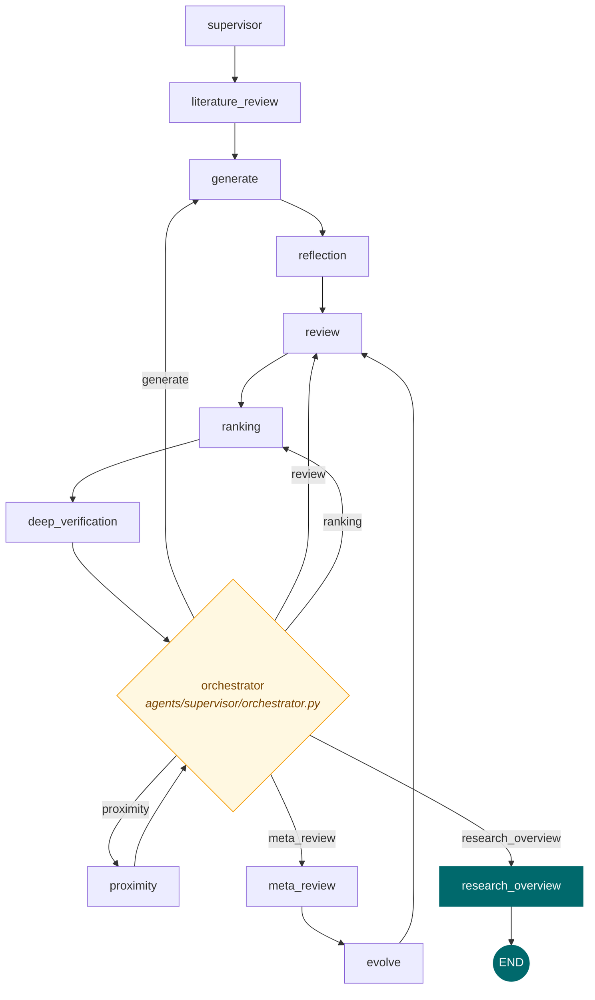
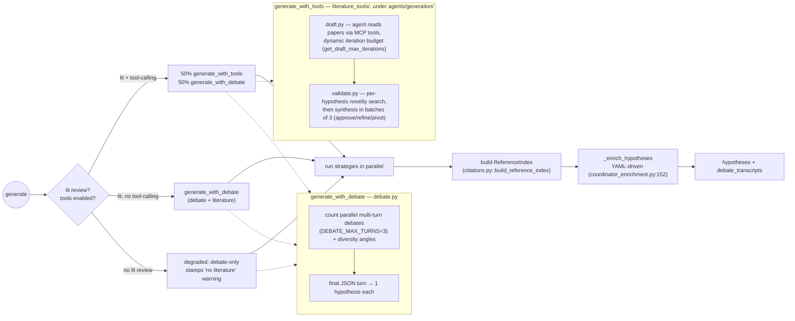
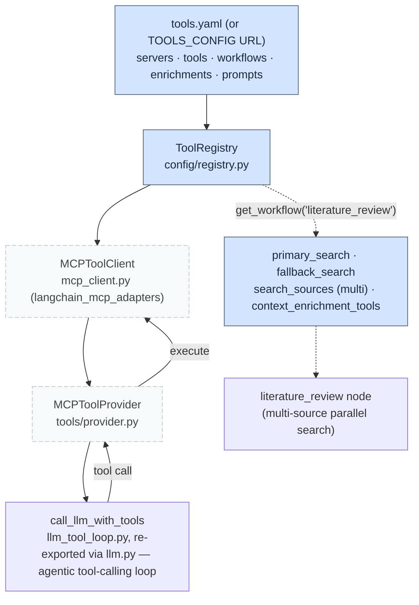
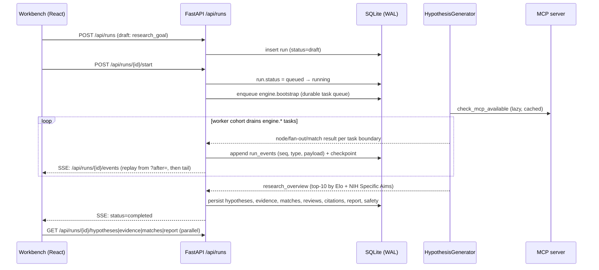

# Co-Scientist — A Visual Explainer

A walk through the whole product, focused on the multi-agent engine. For engineers. Every diagram is hand-authored SVG in `docs/assets/`; the inline graphs are Mermaid (renders on GitHub and in VS Code). `file:line` references point at the code that backs each claim.

> Scope: the workbench UI, the FastAPI/SSE layer, the LangGraph engine, and the MCP tool server. For the original DeepMind system analysis see `references/core/google-co-scientist/`; for fidelity tradeoffs see [`docs/FIDELITY.md`](FIDELITY.md).

---

## 1. What this is

Co-Scientist is a multi-agent system that takes a research goal and returns a ranked set of literature-grounded hypotheses plus a research overview. The engine is a single compiled LangGraph `StateGraph` whose nodes are async functions over a shared `WorkflowState` typed dict. Around it sit a FastAPI app that streams node events over SSE, a React workbench that renders them, and an optional MCP server that supplies PubMed/INDRA tools.

The public entry point is `HypothesisGenerator` (`engine/src/co_scientist/generator/core.py:54`).

---

## 2. Product at a glance

The layered stack: React workbench talks to FastAPI over HTTP + SSE; FastAPI persists everything to SQLite and delegates to the real LangGraph engine, running either its deterministic offline LLM backend or a real provider; the engine optionally calls an MCP server for literature tools.

<p align="center">
  
</p>

| Layer | Lives in | Role |
| --- | --- | --- |
| Workbench UI | `app/frontend/src/workbench/` | React 19 + Vite 7 + Tailwind v4 + MD3. Renders run tabs (overview, ideas, evidence, tournament, report, chat). Holds no durable state — rebuilds from API + SSE on mount. |
| FastAPI | `app/app/` | `/api/runs/*` lifecycle, SSE event stream, SQLite persistence, provider selection. Single `HypothesisGenerator` instance built in `lifespan`. |
| Engine | `engine/src/co_scientist/` | LangGraph `StateGraph` of 9–11 nodes. Selected by `engine_adapter.select_provider()`. |
| MCP server | `engine/mcp_server/` | FastMCP + Biopython. PubMed search/fulltext + INDRA CoGex. Python 3.12 only. |

Provider selection (`app/app/engine_adapter/provider.py`): `select_provider()` always returns `"engine"` — the engine is a hard runtime dependency now. What varies is the LLM backend: `offline_mode()` returns `True` when `COSCIENTIST_FORCE_OFFLINE=1` (or the deprecated `COSCIENTIST_FORCE_MOCK=1`) is set, or no provider key is present, in which case `co_scientist.offline_llm.install_offline_router()` answers `offline/`-prefixed model calls deterministically instead of calling a real provider — the same graph emits the identical event sequence either way, so the UI and tests work with zero external dependencies.

---

## 3. The engine loop

This is the core of the system. A linear **first pass** feeds a conditional **iteration loop** that runs `max_iterations` times, then funnels everything through a terminal synthesis node.

<p align="center">
  
</p>

> The diagram above is the linear pipeline overview. The prose below describes the full loop-aware flow: the iteration cycle, the MCP-gated branch, and the loop-point routing.

### First pass (always runs)

```
supervisor → literature_review → generate → reflection → review → ranking → deep_verification
```

- **Supervisor** builds a research plan and strategy (`agents/supervisor/supervisor.py`).
- **Literature Review** + **Reflection** are MCP-gated (dashed in the diagram). When MCP is unavailable the graph is built *without* those two nodes and the first pass collapses to `supervisor → generate → review` (the dashed bypass arrow in the SVG).
- **Deep Verification** runs *after* Ranking, probing the top-3 by Elo (`agents/reflection/deep_verification.py`). It is not a separate tournament round.

### Iteration cycle (runs up to `max_iterations` times)

```
meta_review → evolve → review → ranking → deep_verification → orchestrator → (next task | research_overview)
```

- **Meta-Review** synthesizes all reviews into strategic insights; uses `supervisor_model_name` (`agents/meta_review/meta_review.py`).
- **Evolve** refines the top-`evolution_max_count` hypotheses in parallel, then **discards the lower-ranked pool** — the hypothesis set shrinks to the evolved subset (`agents/evolution/evolve.py`). Flow then loops back up to **Review** (the teal `re-review → re-rank` arrow) so evolved hypotheses are re-reviewed and re-ranked.
- **Proximity** is the dedup gate for the cycle (`agents/proximity/proximity.py`). `current_iteration` is incremented by the orchestrator when it schedules a work task (generate/evolve) — see §4.
- **Research Overview** is the single terminal node, synthesizing the top-10 by Elo into an overview + NIH Specific Aims (`agents/meta_review/research_overview.py`).

Note the AGENTS.md ordering lists "Ranking → Tournament → Meta-Review", but **Tournament is inside the Ranking node** (Elo pairwise, `agents/ranking/ranking.py`), not a separate node, and **Deep Verification runs after Ranking**, before the routing decision.

---

## 4. Control flow & routing

Loop continuation is decided by a dedicated **orchestrator node** (`agents/supervisor/orchestrator.py`) — the single adaptive loop point the graph re-enters after each work phase. It computes observable statistics from state (pool growth, Elo stability, match coverage, proximity backlog), consults the deterministic scheduling policy (`scheduling/policy.py::decide_next_task`, gated by `validate_decision`), records the decision and its reason in the task-history ledger, and sets `next_task` for the conditional edge (`generator/graph.py::_route_next_task`) to route on.



Key facts:

- Wiring lives in `generator/graph.py`: every work phase converges on `ranking → deep_verification → orchestrator`, and `proximity` returns to the orchestrator too. The orchestrator's decision routes to `generate`, `review`, `ranking`, `meta_review` (the head of the `meta_review → evolve → review` re-review branch), `proximity`, or the terminal `research_overview`.
- The policy is a pure function of `SchedulerStats` and a `Budget` (`scheduling/policy.py`). An LLM supervisor may only *recommend* a next task; `validate_decision` enforces the allowed transitions and budget — the code decides, the model only advises.
- `current_iteration` is incremented by the orchestrator when it schedules a work task (generate/evolve); maintenance tasks (proximity/rank/reflect) and termination do not advance it (`agents/supervisor/orchestrator.py`).
- `max_iterations` defaults to `1` (`constants.py::DEFAULT_MAX_ITERATIONS`) and acts as the budget's satisfied-completion cap; runs can also terminate early on convergence (top Elo stable across cycles) or an exhausted budget (`scheduling/policy.py`).
- A checkpoint-restored run re-enters at the orchestrator loop point via the START router (`generator/graph.py::_resume_router`); a fresh run starts at the supervisor.
- The graph is built once per `HypothesisGenerator` instance (`generator/core.py::_build_graph`, edges in `generator/graph.py`) and invoked with `recursion_limit=100` (`_GRAPH_RECURSION_LIMIT` in `generator/run_execution.py`).

---

## 5. WorkflowState & data flow

State is a `TypedDict` (`state.py:214`) flowing through every node. Each node returns a *delta* dict; LangGraph applies it. Two fields carry custom reducers that run on **every** write — the rest overwrite. The table below is authoritative.

| Field(s) | Reducer | Why |
| --- | --- | --- |
| `hypotheses` | `deduplicate_hypotheses` (`state.py:129`) | Seven nodes write here. The reducer compares incoming vs existing by lowercased text: >50% overlap ⇒ treat as replacement; else merge; then dedup by text key. This is the auto-dedup "anti-duplicate" strategy — it prevents near-duplicate hypotheses from propagating across iterations. |
| `metrics` | `merge_metrics` (`models_metrics.py:81`) | Every node emits only deltas via `create_metrics_update()` (`models_metrics.py:142`, re-exported from `models.py`). The reducer builds a fresh `ExecutionMetrics` (never mutates inputs): `hypothesis_count = max`, count deltas additively merged, `phase_times` dict-merged, `total_time = max(a,b)`. |
| all others | (overwrite) | `supervisor_guidance`, `articles_with_reasoning`, `meta_review`, `research_overview`, `removed_duplicates`, `tournament_matchups`, `evolution_details`, `current_iteration`, etc. |

Streaming caveat: `astream` yields only per-node deltas, so the streaming wrapper in `generator/streaming.py` manually accumulates a cumulative state dict and merges metrics via `merge_metrics` (`generator/streaming.py:69`, imported from `models_metrics.py`).

---

## 6. Node reference

All nodes are `async (state) -> dict[str, Any]`, implemented in the agent packages under `engine/src/co_scientist/agents/` (the old `nodes/` shim layer has been removed; each node is imported directly from its agent package).

| Node | File:line | Consumes | Produces | Flows to |
| --- | --- | --- | --- | --- |
| `supervisor` | `supervisor.py:33` | `research_goal`, user inputs, `tool_registry`, `mcp_available` | `supervisor_guidance` | literature_review (or generate) |
| `literature_review` | `literature_review/node.py:332` | `research_goal`, `tool_registry`, `literature_review_papers_count` | `articles_with_reasoning`, `articles`, `context_enrichment_sources`, `literature_review_queries` | generate |
| `generate` | `generate.py:17` | `supervisor_guidance`, `articles_with_reasoning`, `enable_tool_calling_generation` | `hypotheses`, `debate_transcripts` | reflection (or review) |
| `reflection` | `reflection.py:210` | `articles_with_reasoning`, `hypotheses` | `hypotheses` (+ `reflection_notes`, INDRA `enrichments`) | review |
| `review` | `review.py:314` | `hypotheses`, `research_goal`, `supervisor_guidance` | `hypotheses` (+ `reviews`, `score`) | ranking |
| `ranking` | `ranking.py:392` | `hypotheses`, `tournament_pairs`, `current_iteration` | `hypotheses` (sorted by Elo, + `win/loss_count`), `tournament_matchups` | deep_verification |
| `deep_verification` | `deep_verification.py:353` | `hypotheses` (top-3 by Elo) | `hypotheses` (+ `deep_verification_probes`, `deep_verification_verdict`) | orchestrator |
| `meta_review` | `meta_review.py:32` | `hypotheses` (reviews, Elo, verdicts) | `meta_review` | evolve |
| `evolve` | `evolve.py:347` | `hypotheses`, `evolution_max_count`, `meta_review` | `hypotheses` (evolved subset), `evolution_details` | review (re-review) |
| `proximity` | `proximity.py:328` | `hypotheses`, `current_iteration` | `hypotheses` (deduped), `removed_duplicates`, `similarity_clusters` | orchestrator |
| `research_overview` | `research_overview.py:37` | `hypotheses` (top-10 by Elo), `meta_review` | `research_overview` ({overview, nih_specific_aims}) | END |

Helper-only files (not graph nodes): the `agents/generation/literature_review/` subpackage's support modules (e.g. `helpers.py` — `node.py` in the same subpackage is the actual graph node), `agents/reflection/reflection_helpers.py`, and the rest of the `agents/generation/` subpackage.

---

## 7. Generation in depth

`generate` is a thin wrapper (`generate.py:17`) delegating to `agents/generation/coordinator.py::generate_hypotheses` (line 407). The coordinator picks a generation strategy based on MCP and tool-calling availability (`coordinator_strategy.py::_classify_generation_strategy`, lines 53-89):



- **Debate** (`debate.py::generate_with_debate`, line 421) runs `count` parallel multi-turn debates, each yielding one hypothesis. Diversity angles (`_DEBATE_DIVERSITY_ANGLES`, defined in the sibling `debate_support.py:23` and re-exported into `debate.py`) seed each parallel debate. Generation calls use `use_cache=False` (`debate.py:91,229`) to preserve diversity.
- **Tool-based** (`agents/generation/literature_tools/`) is two-phase: **draft** (`draft.py::draft_hypotheses`, line 347) — an agent reads pre-curated papers via MCP tools and drafts hypotheses using `call_llm_with_tools` with a dynamic iteration budget (`constants.py::get_draft_max_iterations`, `min(5+count*2,30)`); **validate** (`validate.py::_run_validate_novelty_stage`, line 353) — per-hypothesis novelty analysis searches papers, then a synthesis agent in batches of `VALIDATION_SYNTHESIS_BATCH_SIZE=3` decides approve/refine/pivot. Failed batches retry individually with accumulated context (`validate.py::_run_synthesis_stage_batches`, line 276).
- **Citations** are domain-agnostic: `ReferenceIndex` (`citations.py:24`) is built from papers (`used_in_analysis=True`) **then** knowledge-graph enrichment sources, assigning sequential `[C1]`, `[C2]`, … keys in one namespace (`citations.py::build_reference_index`). The LLM emits `[Cn]` in `literature_grounding`; `resolve_citation_keys` (`citations.py:213`) maps them back to source metadata.
- **Degraded mode** (`coordinator_results.py::_apply_degraded_mode_fallback`) stamps `literature_grounding` with an explicit "No literature review available" warning to prevent hallucinated citations; the MCP/lit-review availability check that decides degraded mode is `coordinator_strategy.py::_check_literature_availability`.
- **Parallelism** is bounded by `MAX_CONCURRENT_LLM_CALLS=5` (`constants.py:145`). Review, reflection, ranking, and evolve all parallelize.

---

## 8. MCP & tools

External tools (PubMed, INDRA, arXiv, Google Scholar, NVD) are pulled from MCP servers via a YAML-driven `ToolRegistry`. The graph auto-detects MCP availability — without a server, literature review and reflection fall back to LLM-only mode (and are omitted from the graph entirely).



- **Detection** is lazy and cached per instance: `McpAvailabilityMixin._check_cached_availability` calls `check_mcp_available()` / `check_literature_source_available()` (`generator/availability.py:54`) and stores the result in state as `mcp_available`/`pubmed_available` (`generator/initial_state.py`).
- **Conditional graph**: if MCP is unavailable, the graph is built *without* `literature_review`/`reflection` (`generator/graph.py`, `enable_literature_review_node`).
- **Tool-calling generation** requires MCP + lit review. When `enable_tool_calling_generation=True`, the generate node's `generate_with_tools` path gives the LLM direct MCP tool access via `MCPToolProvider` for the draft + validate phases.
- **Fallbacks**: query generation falls back MCP → LLM → research-goal (`literature_review/queries.py::_phase1_generate_queries`). If no papers/fulltext, the node returns a `LITERATURE_REVIEW_FAILED` marker; `generate` detects it (`coordinator_strategy.py::_check_literature_availability`) and switches to degraded debate-only mode. Individual tool-call failures are caught and logged without aborting.
- **Context enrichment (KG)**: `literature_review/enrichment.py` calls `context_enrichment_tools` (e.g. INDRA CoGex) per extracted entity in parallel, appends results to the synthesis with `[C*]` keys aligned to the reference index.
- **Domain configs** in `config/examples/` override `prompts`, `tools`, `workflows`, `servers`, and `enrichments` — making the engine domain-agnostic: `indra_cancer.yaml`, `indra_alzheimers.yaml`, `cybersecurity_hydra.yaml` (arXiv + Google Scholar + NVD CVE enrichment), multi-source academic configs, etc.

The reference MCP server (`engine/mcp_server/`) is a separately installable FastMCP package. Run with `uvicorn mcp_server.server:app --host 0.0.0.0 --port 8888`. **Requires Python 3.12** (the engine itself is 3.10+) — install into a 3.12 venv or hit cryptic solver errors.

---

## 9. From request to report

How a click in the workbench becomes a streamed set of hypotheses. Every run executes on the engine, which emits events into the **same** append-only `run_events` table regardless of which LLM backend (offline or real) is behind it; a standard run guarantees the full sequence below.



Canonical event timeline (`docs/ARCHITECTURE.md:56`):

```
 1. lifecycle (created)        2. lifecycle (queued)      3. safety.intake
 4. status (running)           5. supervisor.plan          6. literature_review (N evidence)
 7. generate (initial rows)    8. reflection               9. proximity (cluster summary)
10. ranking (iter 1)          11. evolve (children+parent) 12. meta_review
13. ranking (iter 2, …)       14. deep_verification (top-k)  15. citation_audit
16. research_overview         17. safety.final             18. report (json + markdown)
19. status (completed)
```

**Restart safety**: the SSE endpoint at `GET /api/runs/{id}/events?after=<seq>` always replays history from the requested sequence then tails live, so a hard refresh, backend restart, or new browser session all produce the same view — the client never depends on in-memory event state.

---

## 10. App layer

Persistence is SQLite in WAL mode. The critical decoupling is `hypothesis_state`: it holds the values that *must* change as the run progresses (Elo, win/loss, scores, status, cluster_id) without violating the rule that an original `hypotheses` row is an immutable historical record.

| Table | Append-only? | Notes |
| --- | --- | --- |
| `runs` | mutable status/error/timestamps | one row per run; `llm_backend` column remembers offline vs real (`provider` is always `engine`) |
| `run_events` | append-only | canonical event log; `(run_id, seq)` |
| `hypotheses` | append-only | original rows never mutated; `parent_id` for lineage |
| `hypothesis_state` | mutable | Elo, win/loss, scores, status, cluster_id — separated to preserve the append-only invariant |
| `evidence` · `citations` · `reviews` · `matches` · `safety_decisions` · `reports` · `messages` | append-only | full audit trail |

Key endpoints (full list in `AGENTS.md`): `POST /api/runs` (create draft), `POST /api/runs/{id}/start`, `GET /api/runs/{id}/events` (SSE), `GET /api/runs/{id}/hypotheses|evidence|matches|reviews|citations|safety|report`, `POST /api/runs/{id}/messages` (steering), `POST /api/runs/{id}/messages/ask` (streaming Q&A with `chat_model_name`).

---

## 11. Fidelity & constants

The implementation-defined values (see [`docs/FIDELITY.md`](FIDELITY.md) for the full invariant catalogue). Most live in `engine/src/co_scientist/constants.py`; the Elo/tournament values below live in the sibling `constants_tournament.py` and are re-exported from `constants.py`.

Cited by file rather than by line: a line number is a promise this table has repeatedly failed to keep as the module evolved.

| Constant | Value | Where |
| --- | --- | --- |
| `INITIAL_ELO_RATING` | `1200` | `constants_tournament.py` |
| `ELO_K_FACTOR` | `24` | `constants_tournament.py` |
| `COMPARATIVE_BATCH_THRESHOLD` | `5` (≤5 → comparative batch; >5 → parallel individual) | `constants.py` |
| `MAX_CONCURRENT_LLM_CALLS` | `5` | `constants.py` |
| `DEFAULT_MAX_ITERATIONS` | `1` | `constants.py` |
| `DEFAULT_INITIAL_HYPOTHESES_COUNT` | `5` | `constants.py` |
| `DEFAULT_EVOLUTION_MAX_COUNT` | `3` | `constants.py` |
| `DEBATE_MAX_TURNS` | `3` (ceiling; a converged panel stops sooner) | `constants.py` |
| `DEEP_VERIFICATION_TOP_K` | `3` | `constants.py` |
| `RESEARCH_OVERVIEW_TOP_K` | `10` | `constants.py` |
| `DUPLICATE_SIMILARITY_THRESHOLD` | `0.95` (evolve anti-dup guard) | `constants.py` |
| `LITERATURE_REVIEW_PAPERS_COUNT` | `10` (`_DEV=4`, `RECENCY_YEARS=7`) | `constants.py` |
| `get_draft_max_iterations` | `min(5 + count*2, 30)` | `constants.py` |
| `get_validate_max_iterations` | `min(count*10, 50)` | `constants.py` |

Temperatures: `LOW=0.3`, `MEDIUM=0.5`, `HIGH=0.7` (`constants.py`). Token budgets: `DEFAULT_MAX_TOKENS=4000`, `EXTENDED=8000`, `LONG=10000`, `THINKING=18000` (`constants.py`).

---

## 12. Where to look next

| To understand | Read |
| --- | --- |
| Graph assembly, edges, routers | `engine/src/co_scientist/generator/graph.py` (built via `generator/core.py::_build_graph`) |
| State definition + both reducers | `engine/src/co_scientist/state.py` (`deduplicate_hypotheses` here; `merge_metrics` in the sibling `models_metrics.py`) |
| Data models (`Hypothesis`, `ExecutionMetrics`, `Article`) | `engine/src/co_scientist/models.py` |
| LLM dispatch, JSON repair, tool-calling loop | `engine/src/co_scientist/llm.py` |
| Generation coordinator (3-condition strategy) | `engine/src/co_scientist/agents/generation/coordinator_strategy.py` |
| Tool-based draft → validate | `engine/src/co_scientist/agents/generation/literature_tools/` |
| Citation index + key resolution | `engine/src/co_scientist/agents/generation/citations.py` |
| YAML tool/domain config | `engine/src/co_scientist/config/` + `config/examples/` |
| Engine docs (ASCII graph, modes, MCP) | `engine/docs/ARCHITECTURE.md`, `GENERATION_MODES.md`, `MCP_INTEGRATION.md` |
| Runtime architecture (events, persistence) | [`docs/ARCHITECTURE.md`](ARCHITECTURE.md) |
| Fidelity tradeoffs | [`docs/FIDELITY.md`](FIDELITY.md) |
| Original DeepMind system analysis | `references/core/google-co-scientist/` |

Diagrams in this explainer: [`assets/pipeline.svg`](assets/pipeline.svg) (linear overview) and [`assets/architecture.svg`](assets/architecture.svg).
