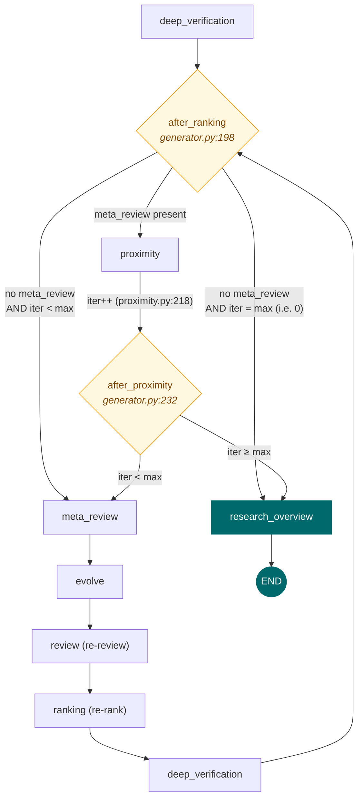
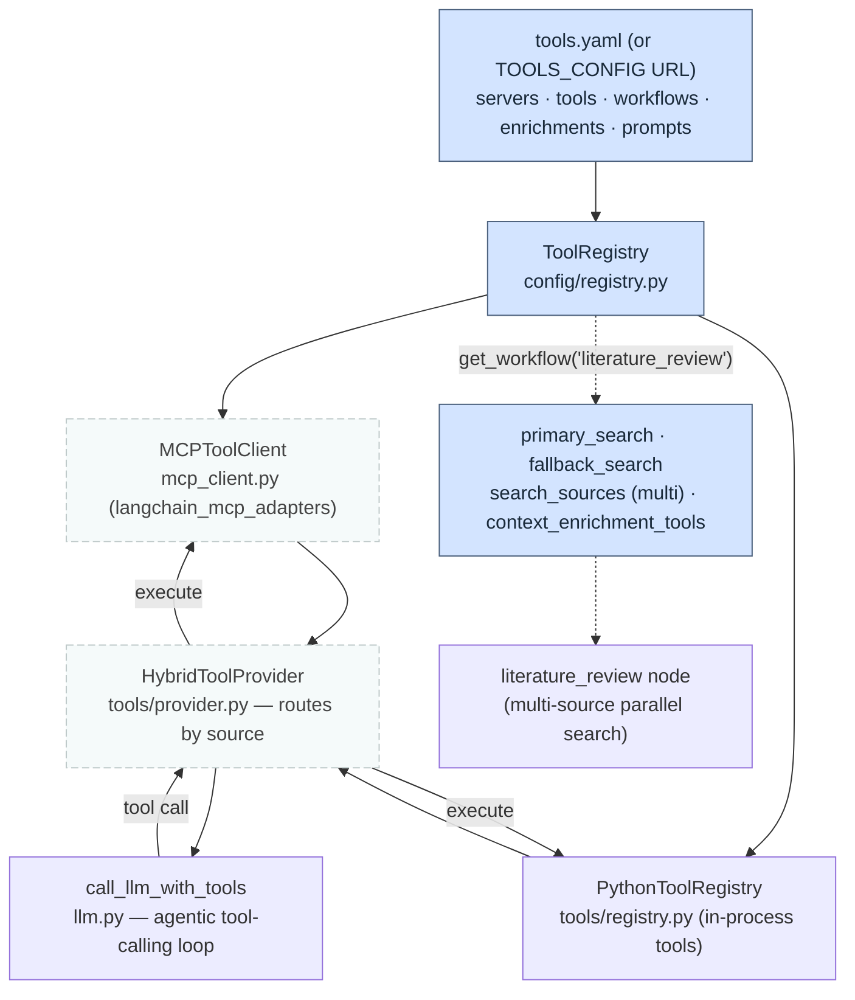
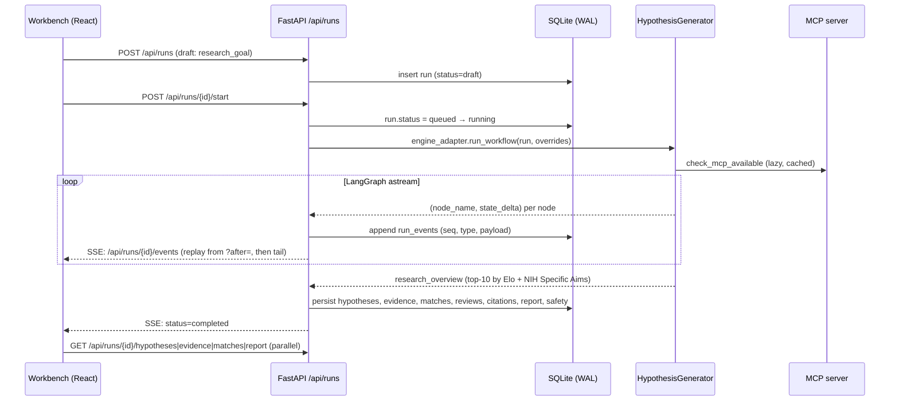

# Co-Scientist — A Visual Explainer

A walk through the whole product, focused on the multi-agent engine. For
engineers. Every diagram is hand-authored SVG in `docs/assets/`; the inline
graphs are Mermaid (renders on GitHub and in VS Code). `file:line` references
point at the code that backs each claim.

> Scope: the workbench UI, the FastAPI/SSE layer, the LangGraph engine, and the
> MCP tool server. For the original DeepMind system analysis see
> `references/core/google-co-scientist/`; for fidelity tradeoffs see
> [`docs/fidelity.md`](fidelity.md).

---

## 1. What this is

Co-Scientist is a multi-agent system that takes a research goal and returns a
ranked set of literature-grounded hypotheses plus a research overview. The
engine is a single compiled LangGraph `StateGraph` whose nodes are async
functions over a shared `WorkflowState` typed dict. Around it sit a FastAPI app
that streams node events over SSE, a React workbench that renders them, and an
optional MCP server that supplies PubMed/INDRA tools.

The public entry point is `HypothesisGenerator` (`engine/src/co_scientist/generator.py:43`).

---

## 2. Product at a glance

The layered stack: React workbench talks to FastAPI over HTTP + SSE; FastAPI
persists everything to SQLite and delegates to either a deterministic mock
workflow or the real LangGraph engine; the engine optionally calls an MCP
server for literature tools.

<p align="center">
  
</p>

| Layer | Lives in | Role |
| --- | --- | --- |
| Workbench UI | `app/frontend/src/workbench/` | React 19 + Vite 7 + Tailwind v4 + MD3. Renders run tabs (overview, ideas, evidence, tournament, report, chat). Holds no durable state — rebuilds from API + SSE on mount. |
| FastAPI | `app/app/` | `/api/runs/*` lifecycle, SSE event stream, SQLite persistence, provider selection. Single `HypothesisGenerator` instance built in `lifespan`. |
| Engine | `engine/src/co_scientist/` | LangGraph `StateGraph` of 9–11 nodes. Selected by `engine_adapter.select_provider()`. |
| MCP server | `mcp_server/` | FastMCP + Biopython. PubMed search/fulltext + INDRA CoGex. Python 3.12 only. |

Provider selection (`app/app/engine_adapter.py`): returns `"engine"` iff
`COSCIENTIST_FORCE_MOCK` is unset, a provider key is present, and
`co_scientist` imports. Otherwise `"mock"`. The mock emits the identical event
sequence so the UI and tests work with zero external dependencies.

---

## 3. The engine loop

This is the core of the system. A linear **first pass** feeds a conditional
**iteration loop** that runs `max_iterations` times, then funnels everything
through a terminal synthesis node.

<p align="center">
  
</p>

> The active diagram above is the linear pipeline overview. A loop-aware
> variant (showing the iteration cycle, the MCP-gated branch, and the two
> routers) is drafted at [`assets/pipeline_loop_tofix.svg`](assets/pipeline_loop_tofix.svg)
> but is **pending a visual fix** and not referenced yet. The prose below
> describes the true loop-aware flow.

### First pass (always runs)

```
supervisor → literature_review → generate → reflection → review → ranking → deep_verification
```

- **Supervisor** builds a research plan and strategy (`nodes/supervisor.py:21`).
- **Literature Review** + **Reflection** are MCP-gated (dashed in the diagram).
  When MCP is unavailable the graph is built *without* those two nodes and the
  first pass collapses to `supervisor → generate → review` (the dashed bypass
  arrow in the SVG).
- **Deep Verification** runs *after* Ranking, probing the top-3 by Elo
  (`nodes/deep_verification.py:60`). It is not a separate tournament round.

### Iteration cycle (runs up to `max_iterations` times)

```
meta_review → evolve → review → ranking → deep_verification → proximity → (meta_review | research_overview)
```

- **Meta-Review** synthesizes all reviews into strategic insights; uses
  `supervisor_model_name` (`nodes/meta_review.py:22`).
- **Evolve** refines the top-`evolution_max_count` hypotheses in parallel,
  then **discards the lower-ranked pool** — the hypothesis set shrinks to the
  evolved subset (`nodes/evolve.py:371`). Flow then loops back up to **Review**
  (the teal `re-review → re-rank` arrow) so evolved hypotheses are re-reviewed
  and re-ranked.
- **Proximity** is where `current_iteration` is incremented
  (`nodes/proximity.py:40,218`), and it is the dedup gate for the cycle.
- **Research Overview** is the single terminal node, synthesizing the top-10 by
  Elo into an overview + NIH Specific Aims (`nodes/research_overview.py:19`).

Note the AGENTS.md ordering lists "Ranking → Tournament → Meta-Review", but
**Tournament is inside the Ranking node** (Elo pairwise, `nodes/ranking.py`),
not a separate node, and **Deep Verification runs after Ranking**, before the
routing decision.

---

## 4. Control flow & routing

Two conditional routers decide loop continuation. Both are functions passed to
`add_conditional_edges` in `generator.py:198-249`.



Key facts:

- `after_ranking` has **three** outcomes. The `meta_review present` branch is
  what makes the cycle a cycle: after the first Meta-Review, every subsequent
  `deep_verification` routes to `proximity` (not back to `meta_review`).
- `current_iteration` is incremented **only in `proximity`**, so the
  `after_ranking` check reads the pre-increment value.
- `max_iterations` defaults to `1` (`constants.py:63`). Setting it to `0`
  skips the loop entirely — `after_ranking` goes straight to
  `research_overview`.
- The graph is built once per `HypothesisGenerator` instance
  (`generator.py:129-255`) and invoked with `recursion_limit=100`
  (`generator.py:580`).

---

## 5. WorkflowState & data flow

State is a `TypedDict` (`state.py:118`) flowing through every node. Each node
returns a *delta* dict; LangGraph applies it. Two fields carry custom reducers
that run on **every** write — the rest overwrite.

<p align="center">
  <em>State-flow diagram pending a visual fix — see
  <code>assets/state_flow_tofix.svg</code>. The table below is authoritative
  in the meantime.</em>
</p>

| Field(s) | Reducer | Why |
| --- | --- | --- |
| `hypotheses` | `deduplicate_hypotheses` (`state.py:18-75`) | Seven nodes write here. The reducer compares incoming vs existing by lowercased text: >50% overlap ⇒ treat as replacement; else merge; then dedup by text key. This is the auto-dedup "anti-duplicate" strategy — it prevents near-duplicate hypotheses from propagating across iterations. |
| `metrics` | `merge_metrics` (`state.py:78-115`) | Every node emits only deltas via `create_metrics_update()` (`models.py:151`). The reducer builds a fresh `ExecutionMetrics` (never mutates inputs): `hypothesis_count = max`, count deltas additively merged, `phase_times` dict-merged, `total_time = max(a,b)`. |
| all others | (overwrite) | `supervisor_guidance`, `articles_with_reasoning`, `meta_review`, `research_overview`, `removed_duplicates`, `tournament_matchups`, `evolution_details`, `current_iteration`, etc. |

Streaming caveat: `astream` yields only per-node deltas, so the streaming
wrapper in `generator.py:649-820` manually accumulates a cumulative state dict
and merges metrics via `merge_metrics` (`generator.py:731-734`).

---

## 6. Node reference

All nodes are `async (state) -> dict[str, Any]` in `engine/src/co_scientist/nodes/`.

| Node | File:line | Consumes | Produces | Flows to |
| --- | --- | --- | --- | --- |
| `supervisor` | `supervisor.py:21` | `research_goal`, user inputs, `tool_registry`, `mcp_available` | `supervisor_guidance` | literature_review (or generate) |
| `literature_review` | `literature_review.py:990` | `research_goal`, `tool_registry`, `literature_review_papers_count` | `articles_with_reasoning`, `articles`, `context_enrichment_sources`, `literature_review_queries` | generate |
| `generate` | `generate.py:18` | `supervisor_guidance`, `articles_with_reasoning`, `enable_tool_calling_generation` | `hypotheses`, `debate_transcripts` | reflection (or review) |
| `reflection` | `reflection.py:109` | `articles_with_reasoning`, `hypotheses` | `hypotheses` (+ `reflection_notes`, INDRA `enrichments`) | review |
| `review` | `review.py:305` | `hypotheses`, `research_goal`, `supervisor_guidance` | `hypotheses` (+ `reviews`, `score`) | ranking |
| `ranking` | `ranking.py:203` | `hypotheses`, `tournament_pairs`, `current_iteration` | `hypotheses` (sorted by Elo, + `win/loss_count`), `tournament_matchups` | deep_verification |
| `deep_verification` | `deep_verification.py:60` | `hypotheses` (top-3 by Elo) | `hypotheses` (+ `deep_verification_probes`, `deep_verification_verdict`) | after_ranking router |
| `meta_review` | `meta_review.py:22` | `hypotheses` (reviews, Elo, verdicts) | `meta_review` | evolve |
| `evolve` | `evolve.py:371` | `hypotheses`, `evolution_max_count`, `meta_review` | `hypotheses` (evolved subset), `evolution_details` | review (re-review) |
| `proximity` | `proximity.py:21` | `hypotheses`, `current_iteration` | `hypotheses` (deduped), `removed_duplicates`, `similarity_clusters`, `current_iteration++` | after_proximity router |
| `research_overview` | `research_overview.py:19` | `hypotheses` (top-10 by Elo), `meta_review` | `research_overview` ({overview, nih_specific_aims}) | END |

Helper-only files (not graph nodes): `literature_review_helpers.py`,
`reflection_helpers.py`, and the `generation/` subpackage.

---

## 7. Generation in depth

`generate` is a thin wrapper (`generate.py:18`) delegating to
`generation/coordinator.py:397`. The coordinator picks one of three strategies
based on MCP and tool-calling availability (`coordinator.py:68-109`):

```mermaid
flowchart LR
  START((generate))
  START --> COND{"lit review?<br/>tools enabled?"}
  COND -->|"lit + tool-calling"| MIX["50% generate_with_tools<br/>50% generate_with_debate"]
  COND -->|"lit, no tool-calling"| DEB["generate_with_debate<br/>(debate + literature)"]
  COND -->|"no lit review"| DEG["degraded: debate-only<br/>stamps 'no literature' warning"]

  MIX --> PAR["run strategies in parallel"]
  DEB --> PAR
  DEG --> PAR
  PAR --> RI["build ReferenceIndex<br/>(coordinator.py:429)"]
  RI --> ENR["_enrich_hypotheses<br/>YAML-driven (coordinator.py:342)"]
  ENR --> OUT["hypotheses + debate_transcripts"]

  subgraph Tools [generate_with_tools — literature_tools/]
    D["draft.py — agent reads papers via MCP tools,<br/>dynamic iteration budget (get_draft_max_iterations)"]
    V["validate.py — per-hypothesis novelty search,<br/>then synthesis in batches of 3 (approve/refine/pivot)"]
    D --> V
  end
  MIX -.-> Tools

  subgraph Debate [generate_with_debate — debate.py]
    T["count parallel multi-turn debates<br/>(DEBATE_MAX_TURNS=5) + diversity angles"]
    F["final JSON turn → 1 hypothesis each"]
    T --> F
  end
  MIX -.-> Debate
  DEB -.-> Debate
  DEG -.-> Debate
```



- **Debate** (`debate.py:210`) runs `count` parallel multi-turn debates, each
  yielding one hypothesis. Diversity angles (`_DEBATE_DIVERSITY_ANGLES`,
  `debate.py:32-41`) seed each parallel debate. Generation calls use
  `use_cache=False` (`debate.py:164,202`) to preserve diversity.
- **Tool-based** (`literature_tools/`) is two-phase: **draft**
  (`draft.py:29`) — an agent reads pre-curated papers via MCP tools and drafts
  hypotheses using `call_llm_with_tools` with a dynamic iteration budget
  (`constants.py:137`, `min(5+count*2,30)`); **validate** (`validate.py:159`)
  — per-hypothesis novelty analysis searches papers, then a synthesis agent in
  batches of `VALIDATION_SYNTHESIS_BATCH_SIZE=3` decides
  approve/refine/pivot. Failed batches retry individually with accumulated
  context (`validate.py:503-527`).
- **Citations** are domain-agnostic: `ReferenceIndex` (`citations.py:20`) is
  built from papers (`used_in_analysis=True`) **then** knowledge-graph
  enrichment sources, assigning sequential `[C1]`, `[C2]`, … keys in one
  namespace. The LLM emits `[Cn]` in `literature_grounding`;
  `resolve_citation_keys` (`citations.py:98`) maps them back to source
  metadata.
- **Degraded mode** (`coordinator.py:256-267`) stamps `literature_grounding`
  with an explicit "no literature review available" warning to prevent
  hallucinated citations.
- **Parallelism** is bounded by `MAX_CONCURRENT_LLM_CALLS=5`
  (`constants.py:59`). Review, reflection, ranking, and evolve all parallelize.

---

## 8. MCP & tools

External tools (PubMed, INDRA, arXiv, Google Scholar, NVD) are pulled from MCP
servers via a YAML-driven `ToolRegistry`. The graph auto-detects MCP
availability — without a server, literature review and reflection fall back to
LLM-only mode (and are omitted from the graph entirely).



- **Detection** is lazy and cached per instance: `_prepare_generation` calls
  `check_mcp_available()` / `check_pubmed_available_via_mcp()`
  (`generator.py:301-306`) and stores the result in state as
  `mcp_available`/`pubmed_available`.
- **Conditional graph**: if MCP is unavailable, the graph is built *without*
  `literature_review`/`reflection` (`generator.py:170-188`).
- **Tool-calling generation** requires MCP + lit review. When
  `enable_tool_calling_generation=True`, the generate node's
  `generate_with_tools` path gives the LLM direct MCP tool access via
  `HybridToolProvider` for the draft + validate phases.
- **Fallbacks**: query generation falls back MCP → LLM → research-goal
  (`literature_review.py:191-233`). If no papers/fulltext, the node returns a
  `LITERATURE_REVIEW_FAILED` marker; `generate` detects it
  (`coordinator.py:60-65`) and switches to degraded debate-only mode.
  Individual tool-call failures are caught and logged without aborting.
- **Context enrichment (KG)**: `literature_review.py:727-811` calls
  `context_enrichment_tools` (e.g. INDRA CoGex) per extracted entity in
  parallel, appends results to the synthesis with `[C*]` keys aligned to the
  reference index.
- **Domain configs** in `config/examples/` override `prompts`, `tools`,
  `workflows`, `servers`, and `enrichments` — making the engine
  domain-agnostic: `indra_cancer.yaml`, `indra_alzheimers.yaml`,
  `cybersecurity_hydra.yaml` (arXiv + Google Scholar + NVD CVE enrichment),
  multi-source academic configs, etc.

The reference MCP server (`mcp_server/`) is a separately installable FastMCP
package. Run with
`uvicorn mcp_server.server:app --host 0.0.0.0 --port 8888`. **Requires Python
3.12** (the engine itself is 3.10+) — install into a 3.12 venv or hit cryptic
solver errors.

---

## 9. From request to report

How a click in the workbench becomes a streamed set of hypotheses. The mock
workflow and the engine adapter emit events into the **same** append-only
`run_events` table; the mock guarantees the full sequence.



Canonical event timeline (`docs/architecture.md:56`):

```
 1. lifecycle (created)        2. lifecycle (queued)      3. safety.intake
 4. status (running)           5. supervisor.plan          6. literature_review (N evidence)
 7. generate (initial rows)    8. reflection               9. proximity (cluster summary)
10. ranking (iter 1)          11. evolve (children+parent) 12. meta_review
13. ranking (iter 2, …)       14. deep_verification (top-k)  15. citation_audit
16. research_overview         17. safety.final             18. report (json + markdown)
19. status (completed)
```

**Restart safety**: the SSE endpoint at
`GET /api/runs/{id}/events?after=<seq>` always replays history from the
requested sequence then tails live, so a hard refresh, backend restart, or new
browser session all produce the same view — the client never depends on
in-memory event state.

---

## 10. App layer

Persistence is SQLite in WAL mode. The critical decoupling is
`hypothesis_state`: it holds the values that *must* change as the run
progresses (Elo, win/loss, scores, status, cluster_id) without violating the
rule that an original `hypotheses` row is an immutable historical record.

| Table | Append-only? | Notes |
| --- | --- | --- |
| `runs` | mutable status/error/timestamps | one row per run; `provider` column remembers mock vs engine |
| `run_events` | append-only | canonical event log; `(run_id, seq)` |
| `hypotheses` | append-only | original rows never mutated; `parent_id` for lineage |
| `hypothesis_state` | mutable | Elo, win/loss, scores, status, cluster_id — separated to preserve the append-only invariant |
| `evidence` · `citations` · `reviews` · `matches` · `safety_decisions` · `reports` · `messages` | append-only | full audit trail |

Key endpoints (full list in `AGENTS.md`): `POST /api/runs` (create draft),
`POST /api/runs/{id}/start`, `GET /api/runs/{id}/events` (SSE),
`GET /api/runs/{id}/hypotheses|evidence|matches|reviews|citations|safety|report`,
`POST /api/runs/{id}/messages` (steering), `POST /api/runs/{id}/messages/ask`
(streaming Q&A with `chat_model_name`).

---

## 11. Fidelity & constants

The implementation-defined values (see [`docs/fidelity.md`](fidelity.md) for the
full invariant catalogue). All live in `engine/src/co_scientist/constants.py`.

| Constant | Value | Where |
| --- | --- | --- |
| `INITIAL_ELO_RATING` | `1200` | `constants.py:18` |
| `ELO_K_FACTOR` | `24` | `constants.py:21` |
| `COMPARATIVE_BATCH_THRESHOLD` | `5` (≤5 → comparative batch; >5 → parallel individual) | `constants.py:53` |
| `MAX_CONCURRENT_LLM_CALLS` | `5` | `constants.py:59` |
| `DEFAULT_MAX_ITERATIONS` | `1` | `constants.py:63` |
| `DEFAULT_INITIAL_HYPOTHESES_COUNT` | `5` | `constants.py:73` |
| `DEFAULT_EVOLUTION_MAX_COUNT` | `3` | `constants.py:76` |
| `DEBATE_MIN_TURNS` / `DEBATE_MAX_TURNS` | `3` / `5` | `constants.py:67-71` |
| `DEEP_VERIFICATION_TOP_K` | `3` | `constants.py:80` |
| `RESEARCH_OVERVIEW_TOP_K` | `10` | `constants.py:84` |
| `DUPLICATE_SIMILARITY_THRESHOLD` | `0.95` (evolve anti-dup guard) | `constants.py:88` |
| `PROXIMITY_SIMILARITY_THRESHOLD` | `0.85` (proximity clustering) | `constants.py:92` |
| `LITERATURE_REVIEW_PAPERS_COUNT` | `10` (`_DEV=4`, `RECENCY_YEARS=7`) | `constants.py:124-131` |
| `get_draft_max_iterations` | `min(5 + count*2, 30)` | `constants.py:137` |
| `get_validate_max_iterations` | `min(count*10, 50)` | `constants.py:153` |

Temperatures: `LOW=0.3`, `MEDIUM=0.5`, `HIGH=0.7` (`constants.py:41-50`).
Token budgets: `DEFAULT_MAX_TOKENS=4000`, `EXTENDED=8000`, `LONG=10000`,
`THINKING=18000`, `LITERATURE_REVIEW=8000` (`constants.py:25-38`).

---

## 12. Where to look next

| To understand | Read |
| --- | --- |
| Graph assembly, edges, routers | `engine/src/co_scientist/generator.py:129-255` |
| State definition + both reducers | `engine/src/co_scientist/state.py:18-274` |
| Data models (`Hypothesis`, `ExecutionMetrics`, `Article`) | `engine/src/co_scientist/models.py` |
| LLM dispatch, JSON repair, tool-calling loop | `engine/src/co_scientist/llm.py` |
| Generation coordinator (3-condition strategy) | `engine/src/co_scientist/nodes/generation/coordinator.py:68-109` |
| Tool-based draft → validate | `engine/src/co_scientist/nodes/generation/literature_tools/` |
| Citation index + key resolution | `engine/src/co_scientist/nodes/generation/citations.py` |
| YAML tool/domain config | `engine/src/co_scientist/config/` + `config/examples/` |
| Engine docs (ASCII graph, modes, MCP) | `engine/docs/ARCHITECTURE.md`, `GENERATION_MODES.md`, `MCP_INTEGRATION.md` |
| Runtime architecture (events, persistence) | [`docs/architecture.md`](architecture.md) |
| Fidelity tradeoffs | [`docs/fidelity.md`](fidelity.md) |
| Original DeepMind system analysis | `references/core/google-co-scientist/` |

Diagrams in this explainer: [`assets/pipeline.svg`](assets/pipeline.svg)
(linear overview, active) and [`assets/architecture.svg`](assets/architecture.svg).
Pending visual fixes: [`assets/pipeline_loop_tofix.svg`](assets/pipeline_loop_tofix.svg)
(loop-aware engine graph) and [`assets/state_flow_tofix.svg`](assets/state_flow_tofix.svg)
(WorkflowState data flow).
