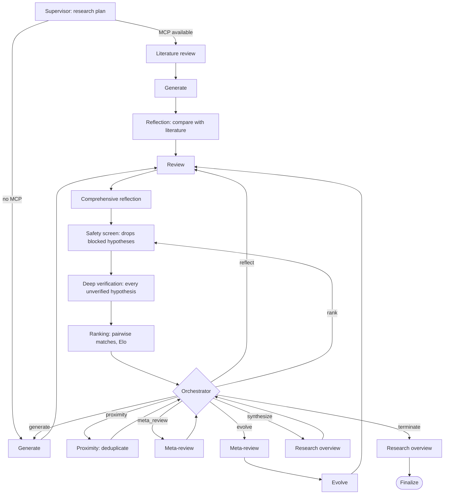

# Engine architecture

Co-Scientist mirrors Google's AI Co-Scientist: a coalition of **six specialized agents** — Generation, Reflection, Ranking, Evolution, Proximity, and Meta-review — coordinated by a **Supervisor**, with **Safety** screening as a cross-cutting concern. The app schedules durable tasks over shared state and checkpoints their results.

## The Six Agents

Each agent is a package under [`co_scientist.science`](../src/co_scientist/science/__init__.py) that holds that agent's node implementations — the canonical, Google-aligned structure of the system. Every agent's work is decomposed into one or more durable task **nodes** so the engine can checkpoint and resume at fine granularity. `co_scientist.orchestration.registry.NODE_TO_AGENT` is the source-of-truth node→agent mapping:

| Agent | Role (Google) | Durable task nodes |
|---|---|---|
| **Supervisor** | Plans the run; picks the next task each cycle | `supervisor`, `orchestrator` |
| **Generation** | Proposes novel, literature-grounded hypotheses | `generate`, `literature_review` |
| **Reflection** | Reviews, critiques, and verifies hypotheses | `review`, `reflection`, `comprehensive_reflection`, `deep_verification` |
| **Ranking** | Elo tournament of pairwise scientific debates | `ranking` |
| **Evolution** | Improves and recombines top hypotheses | `evolve` |
| **Proximity** | Clusters near-duplicate hypotheses | `proximity` |
| **Meta-review** | Synthesizes findings into the research overview | `meta_review`, `research_overview` |
| _Safety_ (cross-cutting) | Screens goal + hypotheses at intake / per-idea / final | `safety_screen` (plus the API's intake and final gates) |

**Why more than six nodes?** The agents are the conceptual unit; the nodes are the durable-execution unit. Decomposing an agent (e.g. Reflection → `review` → `comprehensive_reflection` → `deep_verification`) lets an interrupted run resume mid-agent instead of re-running expensive LLM work. Those node key strings are persisted verbatim — as `engine.node.<key>` durable tasks, in checkpoint `resume_successor`/`next_task`, and inside idempotency keys — so collapsing them to six runtime keys would orphan any in-flight run without a migration.

## Durable Workflow

The workflow consists of specialized nodes that handle different aspects of hypothesis generation and refinement, declared once in `orchestration/workflow_topology.py` and resolved by `orchestration/task_runtime.py`. Every work phase converges on the same review-through-ranking spine, and every completion path (a work phase's own end, or a maintenance task) returns to a single **orchestrator** loop point rather than following a fixed iteration count:

The orchestrator routing table is `TASK_ROUTES` in
`src/co_scientist/orchestration/workflow_topology.py`.

### Dynamic orchestration

The **orchestrator node** (`science/supervisor/orchestrator.py`) is the durable workflow's single adaptive loop point. Each time it fires it computes `SchedulerStats` from live state (pool growth, Elo stability, tournament match coverage, proximity backlog), passes them to a deterministic scheduling policy (`science/scheduling/policy.py::decide_next_task`, validated by `validate_decision`), records the decision and its reason in the run's Supervisor allocation ledger, and sets `next_task`. An LLM supervisor may *recommend* a task; the policy — not the model — decides and enforces the allowed transitions and budget. `rank` re-enters the spine at `safety_screen`, the node the main pipeline reaches after `comprehensive_reflection`; `synthesize` writes an interim research overview and returns to the loop. The scheduler can also stack companion tasks ahead of its primary decision (`supervisor_queue_actions`); each companion routes on to the next before the primary runs. Termination fires on Elo convergence (top hypothesis stable across cycles) or an exhausted iteration/task budget, never on a fixed `max_iterations` branch hard-coded after ranking. `current_iteration` only advances when the orchestrator schedules a work task (`generate`/`evolve`); scheduling a maintenance task (`reflect`/`proximity`/`rank`) does not.

One node commit can also enqueue more than one future task at once: `task_runtime.plan_portfolio` resolves however much of a node's successor chain is knowable without running it, and the app's durable executor chains that lookahead through the queue's existing dependency gate (`orchestration/engine_tasks/portfolio.py`) rather than enqueueing one task at a time and waiting on each. This changes *when* work is queued, not what the orchestrator decides — the routing above is unaffected.

## Adaptive Review Strategy

The Review node uses an adaptive strategy based on hypothesis count:

- **Small batches (≤5 hypotheses)**: Comparative batch review where the LLM sees all hypotheses together and assigns differentiated scores based on relative strengths
- **Large batches (>5 hypotheses)**: Parallel individual reviews for better scalability

This approach balances score differentiation (important for small batches) with token efficiency and speed (critical for large batches).

## State Management

Co-Scientist uses a typed state dictionary (`WorkflowState`) that flows through all nodes. Each node:

1. Receives the current state
2. Performs its operation (often with LLM calls)
3. Updates relevant state fields
4. Returns state updates to merge

Key state fields relevant to hypothesis output:

| Field | Set By | Description |
|-------|--------|-------------|
| `hypotheses` | Generate, Evolve | List of `Hypothesis` objects; each has `text`, `explanation`, `literature_grounding`, `experiment`, `citation_map`, `enrichments` |
| `articles` | Literature Review | Retrieved papers with `used_in_analysis` flag |
| `articles_with_reasoning` | Literature Review | Formatted literature summary used by Generate and Reflection nodes |
| `context_enrichment_sources` | Literature Review | Structured items from context-enrichment tools (e.g., STRING interactions); merged into citation index alongside papers |

See `domains/research_state/state/__init__.py` for the full `WorkflowState` type definition.

## Citations

When a literature review runs, each hypothesis receives structured citations. The Generate node builds a `ReferenceIndex` from papers (`used_in_analysis=True`) and any context-enrichment sources (e.g., STRING interactions), assigning sequential `[C1]`, `[C2]`, ... keys. The LLM uses these keys in `literature_grounding`, and `citation_map` resolves each key to full source metadata (title, URL, authors, year for papers; display label and structured data for knowledge graph entries).

## Generation modes

The generator options set in `orchestration/engine_adapter/opts.py` select one
of three modes; `orchestration/generator/run_setup.py` resolves and validates
them.

| Mode | Options | Flow | When |
|---|---|---|---|
| Model only | `enable_literature_review_node=False`, or no reachable MCP server | Supervisor → Generate → Review … | No retrieval; standard and debate generation from the model's own knowledge |
| Literature-informed | `enable_literature_review_node=True` (the default) | Supervisor → Literature review → Generate → Reflection → Review … | Generation and reflection read the processed literature summary |
| Tool-calling | Literature review on and `enable_tool_calling_generation=True` | As above, but Generate queries the literature tools per hypothesis | Extended and Ultra tiers only, since tool loops re-send their transcript each turn; falls back to literature-informed generation if tool calls fail |

Tool-calling generation without the literature review node is a validation
error. It is also refused for the offline backend, which never emits tool
calls. If MCP is unreachable, setup logs "Literature review node requested but
MCP server unavailable - disabling" and the run continues model-only.
`dev_test_lit_tools_isolation` forces every hypothesis through tool-calling
generation, for testing only.

### Literature review

1. The node turns the supervisor's plan into targeted queries.
2. It searches every enabled source through the MCP tools (PubMed, OpenAlex
   and web search in the default `tools.yaml`).
3. It retrieves and analyzes the selected papers.
4. It writes the summary to `state["articles_with_reasoning"]`; analyzed
   papers carry `used_in_analysis=True` in `state["articles"]`, and
   context-enrichment items (for example STRING interactions) go to
   `state["context_enrichment_sources"]`.

The reflection node, which runs only after a literature review, compares each
new hypothesis with those findings: support, novel aspects and conflicts.

MCP hosting is in [Deployment](../../docs/DEPLOYMENT.md); tool wiring is in
[`tools.yaml`](../src/co_scientist/platform/retrieval/config/tools.yaml).
