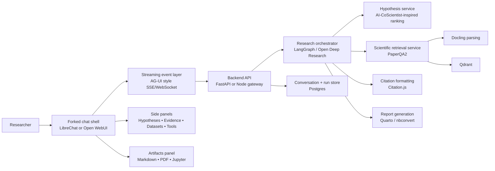
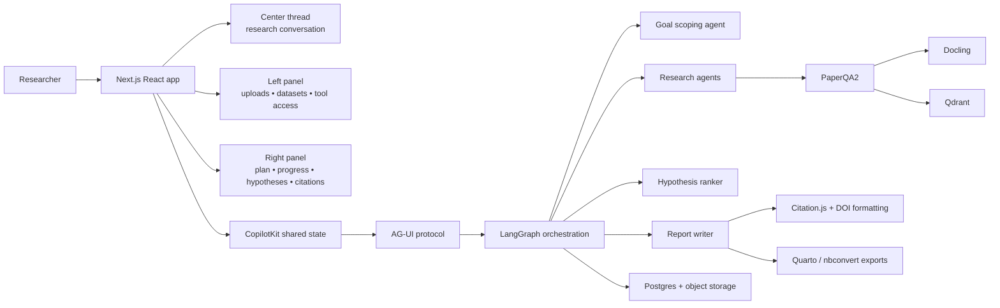
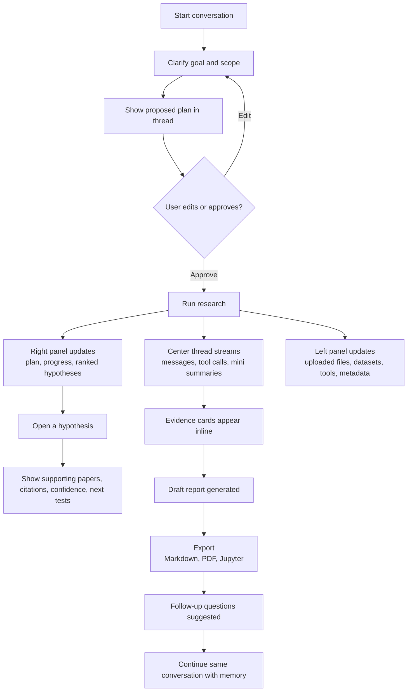

# Best Open-Source Foundations for a Chat-First AI Co-Scientist

## Executive summary

For a product that should feel like a **research conversation** rather than a workflow dashboard, the strongest open-source foundation is **not** a single repo. The best result comes from combining a **chat-native shell**, a **research-run orchestration layer**, and a **scientific-document/citation stack**. In practice, the best current building blocks are: **LibreChat** as the best chat-first shell to fork; **CopilotKit** and **AG-UI** as the cleanest way to stream visible intermediate work and structured state into the interface; **LangChain’s Open Deep Research** as the strongest open source scaffold for scope → research → write runs; **PaperQA2** plus **Docling** for scientific-document ingestion and citation-grounded retrieval; and **Qdrant**, **Citation.js**, and **Quarto/nbconvert** for indexing, references, and report export. citeturn28view0turn13view1turn31view0turn10view5turn10view7turn25view0turn25view2turn25view1turn25view3turn25view4

If you want the **fastest path to market**, fork **LibreChat** and add a custom research-run service behind it. If you want the **cleanest long-term architecture**, build a new front end with **CopilotKit + AG-UI**, then mine **LibreChat** and **Open WebUI** for UX patterns, while using **Open Deep Research** and **PaperQA2** behind the scenes. **Open WebUI** is the best alternative when strict local-first and offline usage matter, but its licensing and server-side tool execution model add product and security considerations. **AnythingLLM** is excellent for local-first document chat and now has strong export and live tool-streaming features, but its “workspace” model is a bit more knowledge-console-like than research-conversation-first. citeturn28view0turn13view1turn31view0turn28view1turn17search6turn17search12turn28view2turn18search2turn18search4

The main platforms to **de-prioritize as the end-user shell** are **Dify** and **Flowise**. Both are powerful and active, but both are optimized around **visual workflow/app building** rather than the feeling of “I am inside an ongoing research dialogue.” They are better mined for orchestration patterns, node semantics, monitoring, and knowledge-pipeline ideas than used as the primary user-facing shell for an AI co-scientist clone. citeturn32view0turn19search1turn20search1turn32view1

## What matters for a research conversation

The user experience you want is closer to **a continuous lab notebook with an active collaborator** than to a chatbot embedded in an operations console. That pushes the evaluation toward a few attributes more heavily than usual.

First, the shell must be **chat-first**. LibreChat, Open WebUI, and AnythingLLM all center the conversation as the main object, with attachments, tools, and agent capabilities living around it rather than replacing it. By contrast, Dify and Flowise center workflows, nodes, and app-building surfaces. That distinction matters because users notice immediately whether the system is inviting a conversation or asking them to configure a pipeline. citeturn15search9turn17search0turn18search3turn32view0turn20search1

Second, the system must expose **visible intermediate work**. CopilotKit is unusually strong here because its shared state, generative UI, tool rendering, and human-in-the-loop primitives are designed specifically to surface agent progress, outputs, and state into the UI in real time. AG-UI complements that by standardizing the event stream between agents and the front end, including messages, tool calls, state patches, and lifecycle signals over transports such as SSE or WebSockets. AnythingLLM has recently improved real-time tool-call streaming, and LibreChat’s latest releases emphasize a redesigned sidebar and richer tool-call UI, but CopilotKit and AG-UI are still the clearest “visible work” foundations. citeturn22search0turn22search2turn22search8turn31view0turn18search4turn33search1

Third, research runs need explicit **goal scoping and multi-step orchestration**. LangChain’s Open Deep Research is the cleanest open-source reference here because it explicitly frames research as **scope → research → write**, and it ships both single-agent and multi-agent implementations with MCP support. GPT Researcher is also strong, especially for generating long, cited research reports across web and local data, but it is more report-first than conversation-first. Dify and Flowise also handle multi-step flows well, but again through builder-first abstractions. citeturn9search9turn13view3turn10view4turn19search1turn20search1

Fourth, a true co-scientist needs **better scientific grounding** than generic RAG. PaperQA2 is the best existing open-source layer for this report because it targets scientific literature directly, supports PDFs, Office docs, text, and code, and is explicitly built for question answering and citation-grounded answers over scientific documents. Docling is the strongest parser to pair with it when you need better PDF layout, tables, formulas, figures, and structured exports. citeturn10view7turn8search10turn25view0

Finally, your requested feature set includes **ranked hypotheses and hypothesis tracking**, which most chat shells do not natively support. The most directly reusable open-source pattern is **AI-CoScientist**, which already models tournament-based hypothesis evolution with Elo-style ranking, peer review, meta-review, and diversity control. Its weakness is maturity and UI polish, but its hypothesis logic is exactly the sort of subsystem worth mining rather than reinventing. citeturn10view8turn11view8turn8search6

## Prioritized shortlist

The shortlist below is prioritized by practical usefulness for **shipping** a chat-first AI co-scientist, not by “best repo in isolation.”

| Priority | Repo | Best use in the stack | Why it makes the shortlist | Recommended reuse strategy | Integration effort |
|---|---|---|---|---|---|
| Top | **danny-avila/LibreChat** | Primary chat shell | Most natural existing chat-first OSS shell for agents, files, MCP, citations, side panels, and multi-step agent chains; latest releases improved sidebar and tool-call UI. citeturn28view0turn15search1turn15search5turn16search1turn33search1 | **Fork** | Medium |
| High | **CopilotKit/CopilotKit** | Visible intermediate work and structured side panels | Best OSS toolkit for shared agent state, generative UI, tool rendering, and HITL; ideal for turning tool calls and agent state into a research canvas without losing the chat center. citeturn10view2turn22search0turn22search2turn22search8 | **Mine patterns or embed selectively** | Medium to High |
| High | **langchain-ai/open_deep_research** | Research-run backend | Strongest open reference for scoped, iterative deep research with model-provider and MCP flexibility; explicitly matches the desired scope/research/write loop. citeturn10view5turn9search9turn13view3 | **Reuse component** | Medium |
| High | **Future-House/paper-qa** | Scientific RAG and citation layer | Best scientific-document QA/citation component in the list; critical if the system will ground hypotheses in papers and uploaded literature. citeturn10view7turn29search0turn8search10 | **Reuse component** | Low to Medium |
| High | **open-webui/open-webui** | Local-first alternative primary shell | Outstanding local/offline chat shell with built-in memory, notes, knowledge retrieval, and agentic research support; especially strong for self-hosted privacy-sensitive deployments. citeturn15search4turn17search2turn17search4turn17search8turn28view1 | **Fork or mine patterns** | Medium |
| Strong secondary | **Mintplex-Labs/anything-llm** | Local-first document/chat workspace | Very strong for file ingestion, local storage, agents, PDF/Markdown export, and tool-call streaming; slightly less conversation-native than LibreChat. citeturn28view2turn18search3turn18search4turn18search2 | **Mine patterns or reuse components** | Medium |
| Strong secondary | **assafelovic/gpt-researcher** | Report-generation service | Mature deep-research/report engine with citations across web and local research; strong backend, weaker as the main conversational shell. citeturn10view4turn13view2 | **Reuse component** | Medium |
| Pattern source | **The-Swarm-Corporation/AI-CoScientist** | Hypothesis ranking and tracking | The clearest open-source pattern for ranked hypotheses, peer review, and tournament-style evolution; too immature to be the whole product. citeturn10view8turn11view8 | **Mine patterns** | Medium |
| Lower priority shell | **langgenius/dify** | Internal orchestration console | Excellent workflow, knowledge, citations, structured outputs, and plugins, but the mental model is studio/workflow-first rather than chat-first. citeturn32view0turn19search1turn19search3 | **Mine patterns** | High |
| Lower priority shell | **FlowiseAI/Flowise** | Internal orchestration console | Strong multi-agent graphing, document stores, and monitoring, but best fit is a builder/operator console, not your primary end-user conversation layer. citeturn32view1turn20search1turn20search8turn20search0 | **Mine patterns** | High |

I would choose between two product strategies:

**Fastest route to a convincing product:** fork **LibreChat**, add a right-hand “Research Run” panel, and call into a Python backend that uses **Open Deep Research**, **PaperQA2**, and a custom hypothesis-ranking service inspired by **AI-CoScientist**. This gives you a credible product in weeks, not months. citeturn28view0turn10view5turn10view7turn10view8

**Best long-term architecture:** build a fresh **Next.js/React** front end with **CopilotKit + AG-UI**, but borrow concrete interaction patterns from **LibreChat** and **Open WebUI**. This is the cleaner choice if visible state, structured side panels, and conversationally-controlled UI matter more than immediate speed. citeturn13view1turn31view0turn28view0turn28view1

## Candidate comparison

### Attribute matrix

Legend: **◎ strong native fit**, **○ good fit**, **△ partial/custom work needed**, **— poor fit**

| Candidate | Chat-first UX | Goal scoping and multi-step runs | File upload and indexing | Visible intermediate work | Reports and export | Hypothesis tracking | Citations and references | Side panels and extensibility | Local/privacy posture | Source |
|---|---:|---:|---:|---:|---:|---:|---:|---:|---:|---|
| LibreChat | ◎ | ○ | ○ | ○ | △ | △ | ◎ | ◎ | ○ | citeturn28view0turn15search1turn15search5turn16search1turn16search2turn33search1 |
| Open WebUI | ◎ | ○ | ○ | ○ | △ | △ | ○ | ◎ | ◎ | citeturn15search4turn17search2turn17search4turn17search8turn17search9turn28view1 |
| AnythingLLM | ○ | ○ | ◎ | ○ | ○ | △ | △ | ○ | ◎ | citeturn28view2turn18search3turn18search4turn18search2turn18search8 |
| CopilotKit | ○ | ○ | △ | ◎ | △ | △ | △ | ◎ | ○ | citeturn10view2turn22search0turn22search2turn22search4turn22search8 |
| Open Deep Research | △ | ◎ | △ | ○ | ○ | △ | ○ | ○ | ○ | citeturn10view5turn9search9turn13view3 |
| GPT Researcher | △ | ◎ | ○ | △ | ◎ | △ | ○ | △ | ○ | citeturn10view4turn13view2 |
| Dify | △ | ◎ | ○ | ○ | △ | △ | ○ | ○ | ○ | citeturn32view0turn19search0turn19search1turn19search3 |
| Flowise | △ | ◎ | ○ | △ | △ | △ | ○ | ○ | ○ | citeturn32view1turn20search1turn20search4turn21search1 |
| AI-CoScientist | — | ◎ | △ | △ | △ | ◎ | △ | — | ○ | citeturn10view8turn11view8 |

### Repo-by-repo assessment

| Repo | Short description | License | Maturity and activity | Key features matching your attributes | Integration effort | Recommended reuse strategy | Risks and limitations |
|---|---|---|---|---|---|---|---|
| **LibreChat** | General-purpose multi-model chat platform with agents, MCP, artifacts, model switching, code execution, message search, and secure multi-user auth. citeturn28view0 | MIT. citeturn28view0 | 39.4k stars; 8.1k forks; active releases and UI work around sidebar/tool calls in 2026. citeturn28view0turn33search1 | Agent Builder in a side panel; file search with citations; file context; skills; subagents; actions from OpenAPI; configurable MCP servers including auth, transport, and per-user variables; real-time context/cost gauges. citeturn15search1turn15search5turn16search2turn16search5turn16search6 | **Medium** | **Fork** the shell and replace/extend the chat pipeline with research runs. | Native hypothesis management is absent; export/report pipeline is limited; some file/tool integration edges are still evolving. citeturn33search6turn33search10 |
| **Open WebUI** | Self-hosted, provider-agnostic AI platform built to run entirely offline, with knowledge, memory, notes, tools, and agentic research. citeturn15search4turn17search4 | Mixed; current codebase includes the Open WebUI License with branding-preservation requirements plus prior licensed contributions. citeturn28view1 | 142k stars; latest release Jun 1, 2026. citeturn28view1 | Built-in knowledge retrieval, memory, notes, web search, code interpreter, and native-mode agentic research; notes export to txt/md/pdf; custom tools and functions can emit real-time UI events and citations. citeturn17search2turn17search4turn17search5turn17search8turn17search11 | **Medium** | **Fork** if local-first matters most, otherwise **mine patterns** from notes/memory/tool UX. | License is less straightforward than MIT/Apache projects; tools/functions execute arbitrary Python on the server; docs recommend private/trusted-network deployment and hardening. citeturn15search12turn17search6turn28view1 |
| **AnythingLLM** | Local-first agent/workspace platform for chatting with documents and agents. citeturn28view2 | MIT. citeturn28view2 | 61.7k stars; latest release Jun 16, 2026. citeturn28view2 | Workspace-scoped embeddings; drag/drop uploads; attached-doc vs embedded-doc model; agent mode; real-time streaming tool calls; pdf/json/markdown export from chat UI; automatic document sync preview; local desktop storage paths documented. citeturn18search3turn18search4turn18search2turn18search7turn18search8 | **Medium** | **Mine patterns** for file UX and exports, or reuse selected services in a local-first SKU. | Workspace model can feel more like a knowledge workspace than a pure research conversation; supported vector DB is system-wide, so vector-DB migration is clumsy. citeturn18search12 |
| **CopilotKit** | Front-end stack for agents and generative UI across web/mobile/Slack; strong on agent-to-UI state. citeturn10view2 | MIT. citeturn13view1 | 35.3k stars; latest release Jun 17, 2026. citeturn13view1 | Shared state, generative UI, tool rendering, state rendering, frontend tools, HITL, and programmatic agent control; especially good when you want visible intermediate work inside the conversation canvas. citeturn22search0turn22search2turn22search4turn22search8 | **Medium to High** | **Mine patterns** or use selectively in a fresh front end. | Not a complete end-user product shell; you still need to build file indexing, reporting, citations, and persistence around it. Some showcase repos were consolidated into the monorepo, so examples move. citeturn22search3turn6search12 |
| **langchain-ai/open_deep_research** | Fully open-source deep research agent working across model providers, search tools, and MCP servers. citeturn10view5 | MIT. citeturn13view3 | 11.7k stars; active issue/PR traffic in 2026; no releases yet. citeturn13view3turn9search5turn9search13 | Explicit scope → research → write flow; single-agent and multi-agent implementations; supervisor-researcher architecture; parallel processing; MCP support. citeturn9search9turn13view3 | **Medium** | **Reuse component** behind a better UI. | It is a backend/template, not a polished user shell; scientific-document ingestion and hypothesis UX are not first-class. citeturn10view5turn13view3 |
| **GPT Researcher** | Open deep research agent for web and local research that outputs long, cited reports. citeturn10view4 | Apache-2.0. citeturn13view2 | 27.8k stars; latest release May 28, 2026. citeturn13view2 | Detailed factual reports with citations; web and local research; multiple LLM providers; now also installable as a Claude Skill. citeturn10view4turn9search8 | **Medium** | **Reuse component** for report generation or literature review agent. | Stronger as a batch/report engine than as an ongoing research conversation layer; visible intermediate work still needs custom UI. citeturn10view4 |
| **Dify** | Production-ready platform for agentic workflow development with knowledge base, tools, and app studio. citeturn32view0 | Dify Open Source License, based on Apache 2.0 with additional conditions. citeturn32view0 | 146k stars; latest release May 19, 2026; heavy issue activity in Jun 2026. citeturn32view0turn5search8 | Knowledge upload, metadata filtering, retrieval testing, automatic citations from knowledge retrieval, structured outputs, memory in flows, multimodal file processing, tool node, local-model support via Ollama/LocalAI/Xinference. citeturn19search0turn19search1turn19search2turn19search3 | **High** | **Mine patterns** for knowledge pipelines and app orchestration. | Product posture is studio/workflow-first; licensing is less permissive than MIT/Apache projects; conversation feel is secondary. citeturn32view0turn19search1 |
| **Flowise** | Visual AI-agent builder with chatflow/agentflow, document stores, monitoring, and deployment options. citeturn32view1 | Apache-2.0. citeturn32view1 | 53.7k stars; latest release Apr 14, 2026; active issues in Jun 2026. citeturn32view1turn5search5 | AgentFlow V2, multi-agent graphs, flow state, HITL patterns, streaming prediction API, document stores, monitoring with Prometheus/Grafana/OpenTelemetry, source-document return in RAG nodes. citeturn20search1turn20search4turn20search8turn20search0turn21search1 | **High** | **Mine patterns** for orchestration, monitoring, and node semantics. | Great builder, weak end-user research conversation shell; visible work is stronger for operators than for end users. citeturn20search0turn20search1 |
| **AI-CoScientist** | Multi-agent scientific-research framework modeled on the AI Co-Scientist paper. citeturn10view8 | MIT. citeturn10view8 | 113 stars; no releases; some PR and issue activity in 2026. citeturn11view8turn8search6turn8search9 | Specialized agents for hypothesis generation, peer review, ranking, evolution, and meta-analysis; Elo-style hypothesis ranking; testability/novelty/impact review dimensions; diversity control. citeturn10view8 | **Medium** | **Mine patterns** for the hypothesis subsystem only. | Too immature to anchor the product; README explicitly lists future work like state persistence, export, validation, and literature integration. citeturn10view8 |

## Supporting components worth mining

These are the repos I would treat as **core infrastructure components** rather than the app shell.

| Repo | Role in your product | Why it matters | Reuse strategy | Activity and license | Main risk |
|---|---|---|---|---|---|
| **Future-House/paper-qa** | Scientific QA and citations | Best open-source layer here for evidence-grounded scientific answers over PDFs, Office files, text, and code, with a literature-centric bias. citeturn10view7turn29search0 | Reuse component | 8.7k stars; latest release Mar 18, 2026; Apache-2.0. citeturn29search0turn10view7 | Not a front end; you must wrap it with a run manager and UI. |
| **docling-project/docling** | Parsing and structured extraction | Excellent for difficult PDFs and rich exports, including tables, formulas, reading order, Markdown, and JSON; supports local execution for sensitive data. citeturn25view0 | Reuse component | 61.8k stars; latest release Jun 17, 2026; MIT. citeturn26view0 | Adds another Python-heavy document pipeline to operate. |
| **qdrant/qdrant** | Vector store and hybrid retrieval | Strong self-hosted vector DB with payload filtering, hybrid retrieval, and good ecosystem fit for AI stacks. citeturn25view2turn23search5 | Reuse component | 32.4k stars; latest release Jun 4, 2026; Apache-2.0. citeturn27search3turn26view2 | Self-hosted OSS deployments are not secure by default; production hardening is your responsibility. citeturn23search9 |
| **ag-ui-protocol/ag-ui** | Event stream protocol | Best protocol piece for messages, tool calls, state patches, and generative UI over SSE/WebSockets; ideal for “visible work.” citeturn31view0 | Reuse component | 14.3k stars; latest release Jun 17, 2026; MIT. citeturn31view0 | Still protocol-level, so you need adapters and your own conventions. |
| **citation-js/citation-js** | Reference formatting | Converts BibTeX, DOI, RIS, Wikidata JSON, and CSL-JSON into formatted references such as APA and Vancouver; includes DOI, PubMed, ORCID, and Zotero-related plugins. citeturn25view1turn23search15 | Reuse component | 205 stars; MIT. citeturn26view1 | Smaller community and lower velocity than the app frameworks. |
| **quarto-dev/quarto-cli** | Long-form report generation | Best option for producing polished technical reports with Markdown, citations, code, and notebook sources; can render Jupyter notebooks to PDF and more. citeturn25view3turn24search8 | Reuse component | 5.8k stars; latest release May 25, 2026; MIT. citeturn25view3 | Better for document generation than interactive conversations. |
| **jupyter/nbconvert** | Jupyter export path | Reliable notebook conversion to HTML, PDF, Markdown, scripts, and more; use as a raw notebook-export fallback next to Quarto. citeturn25view4turn24search12 | Reuse component | 1.9k stars; active issue activity in 2026; BSD-3-Clause. citeturn27search1turn24search9 | Narrower than Quarto for finished long-form publishing. |
| **K-Dense-AI/scientific-agent-skills** | Scientific tools and databases | Large skills library for scientific workflows and databases; useful when the co-scientist should call domain-specific tools rather than only search the web. citeturn34view0 | Mine selectively | 28.5k stars; latest release Jun 12, 2026; MIT repo, but individual skills may carry different licenses. citeturn34view0turn34view1 | License review is needed per skill; broader than your initial MVP. |

My strongest infrastructure recommendation is:

**Docling → PaperQA2 → Qdrant → Citation.js → Quarto**, with **AG-UI** as the event spine between orchestration and UI. That gives you a clean ingestion, retrieval, citation, and export backbone without locking you into any single full-stack app. citeturn25view0turn10view7turn25view2turn25view1turn25view3turn31view0

## Architecture options

The two architectures below are the most practical.

### Fast fork architecture

This is the route I would take if the goal is to ship a convincing product quickly: fork a chat shell, keep the conversation central, and push the research-system complexity behind a dedicated service layer. LibreChat is the strongest fit here, with Open WebUI as the local-first alternative. Open Deep Research, PaperQA2, Docling, Qdrant, Citation.js, and Quarto fit naturally behind that front end. citeturn28view0turn28view1turn10view5turn10view7turn25view0turn25view2turn25view1turn25view3

### Clean-sheet architecture

This is the better long-term design if you want the **interface itself** to become an active participant in the research process. CopilotKit and AG-UI are especially strong here because agent state, tool calls, and user approvals can be rendered as native UI, not just as text pasted into the chat. citeturn13view1turn31view0turn22search0turn22search8

### Sample UI wireframe flow

The key design principle is that the **thread owns the product**, while structured panels progressively reveal plan, evidence, hypotheses, and artifacts.

## Implementation roadmap

A realistic 12-week MVP assumes roughly **3–4 engineers** working in parallel: about **1.5–2 frontend**, **1.5–2 backend/ML**, plus part-time design and infra/security. A good planning number is **42–56 engineering-weeks** total.

### Suggested tech stack

| Layer | Recommendation | Why |
|---|---|---|
| Front end | **Fork LibreChat** for speed, or **Next.js + React + TypeScript** with CopilotKit/AG-UI for a clean-sheet build | Best balance between chat-native UX and visible work |
| Styling/UI | Tailwind CSS + lightweight component primitives | Fast iteration on conversation-first layouts |
| Agent orchestration | LangGraph + patterns from Open Deep Research | Best fit for scoped multi-step research |
| Scientific retrieval | PaperQA2 + Docling | Better scientific grounding and citation quality |
| Vector DB | Qdrant | Strong self-hosted fit with filtering and hybrid retrieval |
| Primary DB | Postgres | Run state, memory, citations, hypothesis registry |
| File/blob storage | S3-compatible store or local object storage | Uploaded PDFs, parsed assets, exported reports |
| Citation formatting | Citation.js | Formatted references and DOI-centric transformation |
| Report export | Quarto first, nbconvert second | PDF/Markdown/Jupyter coverage |
| Security/privacy | Self-hosted deployment, RBAC, isolated tool runners, network hardening | Required for local models and uploaded literature |

### Delivery plan

| Phase | Milestone | Main outputs | Estimated effort |
|---|---|---|---|
| Weeks one to two | Product skeleton | Pick fast fork vs clean-sheet path; wire chat shell; define event model for messages, tool calls, state, citations, and report artifacts; design side-panel information architecture. | 6–8 eng-weeks |
| Weeks three to four | Research-run backend | Implement scope → research → write flow; add run IDs, resumability, and streaming state; basic evidence cards; initial memory model; first uploaded-file ingestion pipeline. | 8–10 eng-weeks |
| Weeks five to six | Scientific retrieval and citation spine | Integrate Docling, PaperQA2, and Qdrant; normalize citations into a canonical store; inline citations in thread; formatted reference list generation; DOI-aware export objects. | 8–10 eng-weeks |
| Weeks seven to eight | Hypothesis subsystem | Add hypothesis registry, ranking, critique, merge/split states, and provenance; mine AI-CoScientist’s Elo/tournament pattern; expose ranked hypotheses in a dedicated panel. | 7–9 eng-weeks |
| Weeks nine to ten | Reports and artifacts | Generate Markdown reports, PDF reports, and Jupyter notebook exports; artifact versioning; report review/edit loop in chat; follow-up prompt suggestions. | 6–8 eng-weeks |
| Weeks eleven to twelve | Hardening and polish | Permission model, tool sandboxing, observability, local-model mode, upload limits, citation QA, latency reduction, onboarding, and regression tests on core flows. | 7–11 eng-weeks |

### Recommended milestone outcomes

By the end of **week four**, the product should already support a real conversation that scopes a goal, launches a multi-step run, and streams visible progress in the thread. By the end of **week eight**, it should also support uploaded literature, evidence-grounded answers, and hypothesis ranking. By the end of **week twelve**, it should feel like a coherent research workstation in conversational form, with exportable reports and a clear privacy/security posture. Those milestones line up naturally with the strengths of LibreChat or CopilotKit on the front end, Open Deep Research and PaperQA2 in the middle, and Docling, Qdrant, Citation.js, and Quarto at the data/report layers. citeturn28view0turn13view1turn10view5turn10view7turn25view0turn25view2turn25view1turn25view3

My final recommendation is straightforward: **do not start from Dify or Flowise as the user-facing shell** unless your real product is secretly a workflow builder. For the product you described, the best fit is either **LibreChat forked into a research-first shell**, or a **new CopilotKit/AG-UI front end** that borrows LibreChat/Open WebUI interaction patterns. Then use **Open Deep Research + PaperQA2 + Docling + Qdrant + Citation.js + Quarto**, and mine **AI-CoScientist** specifically for the hypothesis-ranking subsystem. That combination is the strongest open-source path to an AI Co-Scientist clone that feels like a conversation rather than a dashboard. citeturn28view0turn13view1turn28view1turn10view5turn10view7turn25view0turn25view2turn25view1turn25view3turn10view8