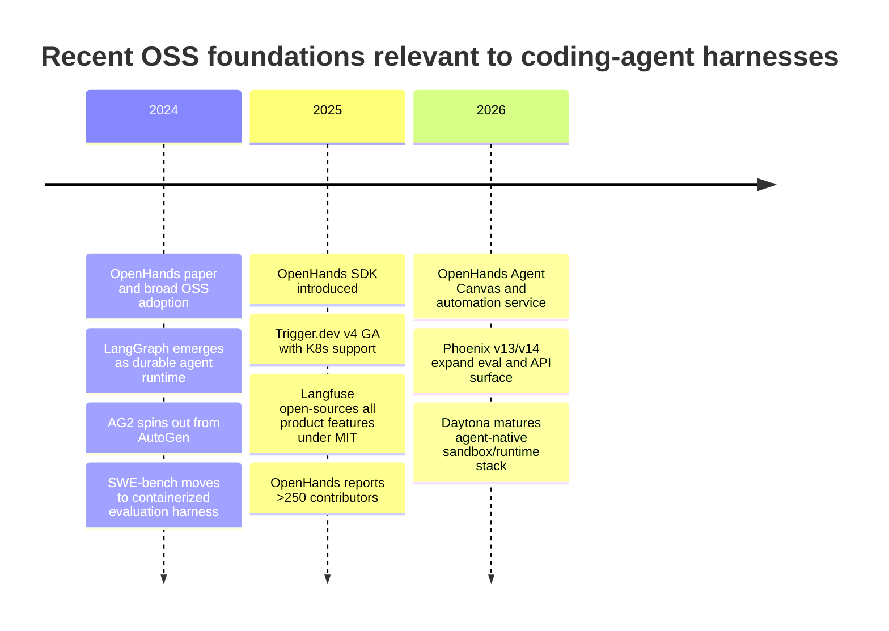
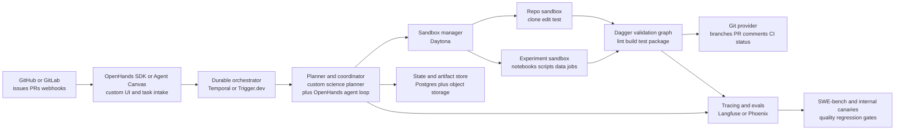

# Open-source foundations for a serious AI Co-Scientist coding-agent harness

## Executive summary

If the goal is a **serious, restart-safe, repository-native coding-agent harness** for an “AI Co-Scientist” clone, the most important finding is that **no single open-source project already gives you the whole stack**. The mature ecosystem is now good enough that you should **compose**, not build from scratch: use one foundation for the coding-agent loop, another for durable orchestration, a third for sandboxed execution, a fourth for repository testing/CI, and a fifth for tracing and evaluation. The best current composition is: **OpenHands** for the agent-facing coding shell and GitHub automation patterns, **Temporal** for durable long-running control flow, **Daytona** for isolated persistent sandboxes, **Dagger** for hermetic build/test/CI execution, and **Langfuse** or **Phoenix** for observability and evaluation. **SWE-agent** is the best project to mine for repository-level agent tactics and benchmark discipline, even if it is not the best full production backbone by itself. citeturn35view0turn31view0turn20search15turn39view0turn23search4turn24search1turn25search3turn14search2

Among coding-agent projects, **OpenHands is the best overall starting point** because it now spans a mature OSS ecosystem: the legacy monorepo remains very active, the newer **Software Agent SDK** exposes Python and REST APIs, agents can run locally or in ephemeral Docker/Kubernetes workspaces, the SDK has examples for GitHub workflows, and the broader OpenHands stack now includes **Agent Canvas**, **plugins/skills/hooks/MCP packaging**, PR review workflows, and schedule/event-driven automations. The main trade-off is that OpenHands is also **in transition**: the architecture is being reorganized around V1 SDK + Agent Canvas, so it is strong, but still moving. citeturn35view0turn31view0turn13search8turn13search9turn13search17turn27search4turn27search9turn27search15turn36search1turn27search11

For long tasks, the clearest gap in most agent frameworks is **durability**. **Temporal** is still the strongest OSS answer when you need work to survive crashes, worker restarts, long pauses, human approvals, and multi-hour or multi-day research loops. **Trigger.dev** is the best lighter-weight alternative if you are TypeScript-first and want “durable-enough” background workflows, human-in-the-loop waitpoints, replay, GitHub-connected deployments, and less platform overhead than Temporal. citeturn20search5turn20search15turn20search10turn21search9turn21search4turn21search5turn21search1turn21search12

For safe execution, existing agent frameworks remain weaker than they should be. **Daytona** is the best open-source agent-native sandbox/runtime foundation I found: isolated sandboxes, snapshots, volumes, network limits, OTEL, Git operations, LSP, and multi-language SDKs. That is exactly the shape a serious repository-wide coding agent needs. But Daytona is **AGPL-3.0**, which matters if you plan to embed or heavily modify and redistribute the platform. citeturn39view0turn22search1turn22search15turn22search8turn22search2

For evaluation and code-quality impact measurement, treat **SWE-bench** as the external benchmark harness, and **Langfuse** or **Phoenix** as the internal observability/evals system. Langfuse is the better default if you want a **permissive MIT-licensed** platform with strong OSS self-hosting, OTEL support, prompt/eval/dataset features, and explicit tooling for coding agents via CLI and MCP. Phoenix is a serious alternative if you prefer **evaluation-first** workflows, OpenTelemetry/OpenInference-native traces, datasets, and experiments, and you are comfortable with **Elastic License 2.0** rather than a permissive OSS license. citeturn26search0turn26search5turn29view2turn29view3turn24search8turn25search3turn25search6turn25search1turn25search15

## Landscape and comparison

The market has converged around five layers. First, **coding-agent shells** that know how to work inside repositories and edit code. Second, **orchestration runtimes** for long-running, stateful work. Third, **sandbox/runtime infrastructure** for safe code execution. Fourth, **repo-integrated build/test/CI tools**. Fifth, **observability, replay, evaluation, and benchmark harnesses**. The strongest contemporary OSS projects each dominate one or two layers, but none cleanly dominates all five. citeturn31view0turn14search2turn15search18turn20search15turn39view0turn23search4turn24search1turn25search3turn26search0

The timeline above reflects official project milestones documented in the reviewed sources: OpenHands’ ICLR/OpenReview paper and later SDK/Agent Canvas work; LangGraph’s durable-state positioning; AG2’s post-AutoGen move; SWE-bench’s Docker harness; Trigger.dev v4; Langfuse’s MIT-licensed product surface; Phoenix’s v13/v14 releases; and Daytona’s current sandbox/runtime feature set. citeturn36search0turn36search7turn15search18turn17search5turn26search15turn21search2turn29view1turn25search2turn25search5turn39view0

### Comparison table

| Project | Category | Maturity and activity | Language(s) | Long-running and state | Safety, repo integration, CI hooks | Observability and replay | License | Bottom-line fit |
|---|---|---|---|---|---|---|---|---|
| **OpenHands ecosystem** | Coding-agent platform | 77.5k stars; 103 releases; latest visible release Jun 10 2026; OpenHands reported **250+ unique contributors** in Mar 2025. citeturn35view0turn36search1 | Main repo is Python + TypeScript; V1 SDK is Python-first with REST APIs. citeturn35view0turn31view0 | SDK supports conversations, pauses/resumes, agent server, and automations; paper and docs emphasize sandboxed execution and persistence. citeturn27search5turn13search9turn27search15 | Strong: Docker/K8s workspaces, GitHub review workflow, GitHub workflow examples, plugins/skills/hooks/MCP bundles, scheduled/event-driven automations. citeturn13search9turn27search9turn31view0turn13search17turn27search4 | Good event/callback model; external tracing integration exists, but first-class deterministic replay still looks less mature than its orchestration ambitions. citeturn27search5turn13search3turn13search14 | MIT. citeturn31view0turn36search7 | **Best OSS starting point for a repo-native coding-agent product**, but you should harden and compose it rather than use it alone. |
| **SWE-agent** | Coding-agent framework | 19.5k stars; active docs/issues; strong research reputation. citeturn9view3turn28view1 | Python. citeturn28view1 | Supports batch runs, trajectory files, and replay; excellent for repeated repo-task execution. citeturn14search2turn14search12 | Strong repo support: GitHub repos, local repos, pre-existing repos; Docker by default; SWE-ReX adds remote/local/runtime abstraction. Safety depends mainly on the runtime boundary. citeturn11search7turn14search6turn14search18turn14search3 | Good for debugging through trajectories/replay; less of a full ops/telemetry platform. citeturn14search2turn14search12 | MIT. citeturn14search10turn28view1 | **Best project to mine or fork for repo-level agent loops and benchmark discipline.** |
| **Aider** | Repo-local coding agent | 46.4k stars; 93 releases visible on GitHub. citeturn37view0 | Python. citeturn28view3 | Session-oriented rather than strongly durable service-oriented; no serious built-in long-task control plane. Repo map is excellent. citeturn19search1turn19search9 | Very strong git integration plus auto-lint/test; good for local workflows; weak built-in sandbox story, with sandboxing still discussed as a gap. citeturn19search16turn19search12turn19search0turn19search2 | Useful benchmarking culture and harness; observability is much lighter than Langfuse/Phoenix. citeturn19search3turn19search15 | Apache-2.0. citeturn28view3 | **Excellent source of ideas for repo map, edit loops, and test/lint repair; weaker as the backbone of a multi-tenant harness.** |
| **Continue** | IDE/CLI coding agent | 33.9k stars, but docs state the repo is **no longer actively maintained** and read-only; final extension releases remain documented. citeturn9view0turn18search3turn11search11 | TypeScript-heavy IDE/CLI ecosystem. citeturn28view2 | Limited story for durable background orchestration. citeturn18search3 | Good ideas around configurable rules, context providers, and a GitHub Actions PR review bot. citeturn18search1turn18search2turn18search0 | Lighter-weight than the dedicated observability stacks. citeturn18search3 | Apache-2.0. citeturn28view2 | **Mine for ideas only; not a good greenfield foundation now.** |
| **LangGraph** | Agent orchestration runtime | 35.1k stars; 548 releases visible; latest Jun 16 2026; public references name Klarna, Replit, Elastic. citeturn37view1turn33search10 | Python OSS package; JS docs/runtime concepts also exist. citeturn37view1turn15search3 | Best OSS framework-level support for persistence/checkpoints, long-running stateful agents, stores, interrupts, and deep-agent subagents. citeturn15search18turn15search0turn15search20turn15search4 | Weak by itself on sandboxing and repo/PR automation; you must supply those layers. citeturn15search3turn15search4 | Strong conceptual support for time travel/debugging via checkpoints; best operational experience leans toward LangSmith, which is not the same as fully OSS observability. citeturn15search9turn15search2turn15search11 | MIT. citeturn28view4 | **Best if you want to own orchestration logic yourself.** |
| **AG2** | Multi-agent framework | 4.7k stars; 74 releases; latest Jun 12 2026. AG2 is the active evolution of AutoGen, while Microsoft’s AutoGen repo is now in maintenance mode. citeturn35view2turn16search0 | Python. citeturn35view2 | Context variables provide shared memory; A2A support adds long-running tasks and push notifications, but repo-native durability is not its strongest story. citeturn38search2turn38search0turn17search2 | Built-in multi-agent patterns, human-in-the-loop, and Docker/local code execution; still less repo-native than OpenHands or SWE-agent. citeturn30view0turn17search6turn38search18 | Better for experimentation and multi-agent patterns than for production repo harnesses. AutoGen’s original maintainers reported 559 contributors and 98 releases as of Oct 2025. citeturn16search2 | Apache-2.0 for AG2; AutoGen code/docs split between MIT and CC-BY. citeturn30view0turn35view3 | **Useful research/design source; not my first choice for a serious coding-agent harness.** |
| **Temporal** | Durable workflow engine | 21k stars; 169 releases; latest Jun 10 2026. Many enterprises use it, including Snap, Netflix, HashiCorp, Box, and Datadog. citeturn37view2turn33search6 | Server is Go; SDKs support multiple languages. citeturn20search2turn20search15 | Best-in-class durable execution, schedules, event history, signals/queries, retries, and self-hosting. citeturn20search5turn20search15turn20search13 | Not agent-specific, but can orchestrate GitHub Actions and any other external step reliably. Safety comes from how you implement activities and execution workers. citeturn20search10turn20search9 | Temporal Web UI and metrics ecosystem are strong; great audit trail for long tasks. citeturn20search2turn20search11 | MIT. citeturn28view5 | **Best orchestration backbone for multi-hour or multi-day AI Co-Scientist work.** |
| **Trigger.dev** | Background jobs and AI workflow platform | 15.4k stars; 626 releases; latest visible release May 12 2026. citeturn37view3 | TypeScript. citeturn21search3 | Strong no-timeout tasks, retries, queues, replay, idempotency, and human approval waitpoints with checkpoint/resume. citeturn21search9turn21search4turn21search14turn21search1 | GitHub repo/deployment integration is first-class; less repo-aware than OpenHands/SWE-agent but better than generic queue systems. citeturn21search5 | Real-time monitoring and queryable run data are built in. citeturn21search15turn21search23 | Apache-2.0. citeturn28view6 | **Best lighter-weight alternative to Temporal for TS-first teams.** |
| **Daytona** | Sandbox/runtime infrastructure | 72.4k stars; 203 releases; latest Jun 16 2026. Official customer stories are public. citeturn39view0turn33search23 | TypeScript, Go, Python, Ruby, Java SDK support. citeturn39view0 | Strong: snapshots, persistent sandboxes, volumes, hybrid deployment, isolated full-computer model. citeturn39view0turn22search1turn22search8 | Best-in-class repo execution surface: Git ops, LSP, process execution, network limits, audit logs, SSH/VNC, OTEL. citeturn39view0turn22search15 | OTEL and log streaming are built in; good substrate for replayable execution history. citeturn39view0 | AGPL-3.0. citeturn39view0 | **Best OSS execution substrate for untrusted or long-lived code work.** |
| **Dagger** | Repo-integrated CI/build/test engine | 16k stars; 935 releases; latest Jun 17 2026. Official site shows broad enterprise/community use. citeturn28view8turn37view5turn34search5 | Go core with SDKs across several languages. citeturn23search4turn37view5 | Not a durable task scheduler; good state via content-addressed cache volumes. citeturn23search9 | Excellent for repeatable build/test/ship flows; strong GitHub Actions support; modules via Daggerverse. citeturn23search0turn23search21 | Strong OTEL traces and interactive failure debugging. citeturn23search3turn23search6 | Apache-2.0. citeturn28view8 | **Best CI/test harness layer to pair with a coding-agent system.** |
| **Langfuse** | Observability/evals platform | 29.3k stars; 579 releases; latest Jun 17 2026; official site says weekly releases and MIT-licensed product features. citeturn37view6turn29view2turn29view3 | TypeScript-heavy server; SDKs/integrations across stacks. citeturn37view6turn24search8 | Not a task runtime; strong persistent telemetry, datasets, prompts, evals, metrics, and APIs. citeturn24search1turn29view3 | Great fit for coding-agent platforms through OTEL, CLI, and MCP; self-hosting is production-oriented. citeturn24search8turn29view2turn24search12 | Excellent for tracing, evaluations, metrics, and dashboards; explicit coding-agent tooling is a differentiator. citeturn24search5turn29view2 | MIT for OSS core/product features outside EE folders. citeturn29view0turn29view3 | **Best default observability/evals pick if permissive licensing matters.** |
| **Phoenix** | Observability/evals platform | 10.2k stars; 719 releases; latest Jun 16 2026; recent major eval/API releases in 2026. citeturn37view7turn25search2turn25search5 | Python + TypeScript. citeturn37view7 | Not a scheduler; strong datasets, experiments, evaluations, and trace-based analysis. citeturn25search6turn25search8turn25search17 | Excellent self-host story with no feature gates; good compatibility via OTEL/OpenInference. citeturn25search1turn25search3turn25search14 | Strong evaluation-first workflow and trace-native analysis. citeturn25search0turn25search6 | Elastic License 2.0. citeturn25search15turn28view10 | **Great eval stack if ELv2 is acceptable and you want evaluation-first workflows.** |
| **SWE-bench** | Benchmark harness | 5.2k stars; 42 tags visible; ICLR benchmark with official harness/docs. citeturn37view8turn26search2 | Python + Docker-centric harness. citeturn26search0turn26search5 | Containerized evaluation; external benchmark rather than persistent runtime. citeturn26search0turn26search8 | Essential for measuring real-repo issue resolution; official docs require Docker for reproducibility. citeturn26search5turn26search9 | Evaluation harness, not trace platform. citeturn26search0 | MIT. citeturn28view11 | **Mandatory external benchmark, but not a harness foundation by itself.** |

## What the leading projects actually give you

### Coding-agent frameworks and shells

**OpenHands** is the most complete OSS starting point because it combines several things that are usually scattered across projects: a coding-agent interface, a remote agent server, ephemeral workspaces, a plugin/skill model, GitHub workflow examples, PR review automation, and now scheduled/event-driven automations. The V1 SDK also matters structurally: it makes OpenHands usable as a **programmable primitive**, not just an app. That makes it much more attractive for a serious “AI Co-Scientist” harness, because you can wrap OpenHands agents inside your own planner, persistence, safety, and evaluation layers instead of accepting the stock UX. Its main weakness is not lack of capability, but **architectural churn**: the older monolith, the SDK, Agent Canvas, and automation service are all active, so you should expect to **pin versions and fork selectively**. citeturn31view0turn13search8turn13search9turn13search17turn27search4turn27search9turn27search15turn27search11turn35view0

**SWE-agent** is the strongest open-source reference implementation of a repository-scale issue-to-patch loop. It already handles GitHub repositories, local repositories, batch execution, trajectory capture, and replay; and its SWE-ReX runtime abstraction neatly separates agent logic from where commands actually run. For a scientific-coding harness, that makes SWE-agent especially valuable as a **source of tactics**: how to structure repo reasoning, how to define trajectories, how to benchmark across many tasks, and how to keep the environment contract narrow. The reason I would not use it as the only backbone is that its strongest abstractions are still **task loop and evaluation**, not full product-grade durability, observability, or tenant-safe orchestration. citeturn11search7turn14search2turn14search3turn14search12turn14search18turn14search6

**Aider** remains one of the best projects to study if your clone must work well on real repositories with minimal overhead. Its **repo map**, git-native workflow, and automatic lint/test repair are all unusually practical. But Aider is still fundamentally a **developer-side pair programmer**; it is not yet a serious control plane for long-running, many-session, many-repository autonomous work. Its own community’s sandboxing discussion is a good signal here: the repo interaction is mature, but the safety/orchestration substrate is not its focus. citeturn19search1turn19search16turn19search12turn19search0turn19search2

**Continue** is now more important as historical evidence than as a foundation. It proved that configurable rules, pluggable context providers, and GitHub PR review bots are valuable, but the official docs now explicitly say the repository is read-only and no longer actively maintained. That pushes it out of the “adopt” column and into the “mine for ideas” column. citeturn18search3turn18search0turn18search1turn18search2

### Orchestration and durable execution

**LangGraph** is the strongest open-source framework if you want a **programmable, stateful agent runtime** and you are willing to build the repo-native shell yourself. Checkpointers, stores, interrupts, time-travel semantics, and the newer **Deep Agents** ideas around planning, subagents, background work, and filesystem tools all make it intellectually close to what a serious “AI Co-Scientist” system needs. The catch is that LangGraph by itself does **not** solve repository automation, sandboxing, or safe execution policy. It is a very good runtime core, but you still need to wrap it with execution and operational infrastructure. citeturn15search18turn15search0turn15search20turn15search4turn15search3

**AG2** is worth tracking mainly because it keeps the AutoGen lineage alive in open governance while Microsoft’s **AutoGen** repository is now in maintenance mode. AG2’s strength is flexible **multi-agent interaction patterns**, shared context variables, human-in-the-loop, A2A support for long-running tasks, and code execution in local or Docker environments. Its weakness for your use case is that it still feels more like a **general multi-agent framework** than a hardened repo-native coding harness. I would mine it for multi-agent coordination ideas, not anchor the whole product on it. citeturn16search0turn30view0turn38search2turn38search0turn17search2turn17search6

**Temporal** is the most credible long-task orchestrator in this entire landscape. If your “AI Co-Scientist” clone needs to preserve state across restarts, sleep while humans review results, fan out experiment branches, retry flaky external systems, or run chain-of-tasks workflows for hours or days, Temporal is the best foundation. It is not coding-agent-specific, which is precisely why it is strong: it is a neutral durable execution substrate. The trade-off is development friction. Temporal asks you to structure work as workflows and activities, to reason about determinism, and to operate a real workflow engine. But if reliability matters more than convenience, this is the right trade. citeturn20search5turn20search15turn20search13turn20search10turn33search6

**Trigger.dev** is the most appealing alternative when you want many of Temporal’s practical benefits without Temporal’s mental model. It gives you very strong primitives for AI workflows—no timeouts, retries, run history, replay, idempotency, waitpoint tokens for human approval, and GitHub-connected deployment. The main limits are that it is **TypeScript-first** and more opinionated as a platform. For a TS-native stack, that is often a feature, not a bug. For a language-agnostic research platform, Temporal is still the safer long-term bet. citeturn21search9turn21search4turn21search14turn21search5turn21search1turn21search18

### Execution, CI, and measurement

For safe execution, **Daytona** stands out. Most frameworks tell you *that* an agent may run code; Daytona tells you **where**, **with what persistence model**, **with what network policy**, and **with what repo/runtime affordances**. Snapshots, volumes, network limits, webhooks, OTEL, Git operations, LSP, and multi-language SDKs make it feel much closer to the substrate you would want if the agent is going to clone repos, run tests, compile code, execute notebooks, and preserve intermediate artifacts. The AGPL license and the speed of product evolution are the two things to watch. citeturn39view0turn22search1turn22search15turn22search8turn22search0

**Dagger** fills a different but equally important gap: it makes repository build/test/release steps **programmable, repeatable, and observable** in a way that GitHub Actions YAML rarely is. That makes it a strong harness layer for “agent changed the code, now run the exact validation workflow locally and in CI with the same graph.” Dagger is not a scheduler and not an agent framework, but that is fine: it excels as the **validation execution layer** behind your agent. citeturn23search4turn23search0turn23search9turn23search3turn23search21

On observability and evaluation, **Langfuse** and **Phoenix** are the two most relevant open-ish/open-source platforms in this set. Langfuse is the easier default recommendation because its OSS product surface is MIT-licensed, its self-hosting story is production-centric, it is OTel-native, and the project explicitly ships CLI/MCP workflows that fit coding agents well. Phoenix is extremely strong when you want **trace-native evaluation**, dataset and experiment management, and self-hosting with no feature gates, but the ELv2 license is materially less permissive. If your goal is broad adoption and easy forking, pick Langfuse first. If your internal focus is evaluation science and you are comfortable with ELv2, Phoenix is competitive. citeturn29view2turn29view3turn24search8turn24search12turn25search3turn25search6turn25search1turn25search15

Finally, **SWE-bench** is not optional if you want to know whether your coding-agent harness is genuinely improving. Its harness uses Docker to create reproducible repo environments, the official docs require Docker for consistent evaluation, and the benchmark remains the standard external reference point for real-repository issue resolution. For an AI Co-Scientist clone, that should be supplemented with internal repo-specific canaries and experiment tasks, but not replaced. citeturn26search0turn26search5turn26search9turn26search2

## Recommended stack and integration pattern

My prioritized recommendation is to **adopt, not reinvent**, in six layers.

**First, adopt or fork the OpenHands SDK ecosystem** for the coding-agent shell. It is the best OSS foundation for repository-aware coding work, tool abstraction, GitHub workflows, and extensibility through skills/plugins/hooks. Fork only the pieces that are unstable or opinionated for your environment—typically the agent policy layer, workspace bootstrap, and task schema—rather than forking the whole project on day one. citeturn31view0turn13search17turn27search9

**Second, adopt Daytona as the execution substrate.** This is the most credible current OSS base for isolated coding-agent workspaces that need to preserve state between steps while still constraining the blast radius of tool execution. citeturn39view0turn22search1

**Third, adopt Temporal as the durable control plane**, unless your organization is already deeply TypeScript-oriented; in that case, use Trigger.dev. Temporal is the stronger long-horizon choice for a scientific agent that must pause, resume, branch, retry, and survive infrastructure faults. Trigger.dev is the faster path if you want to ship sooner with less orchestration complexity. citeturn20search15turn20search5turn21search9turn21search4

**Fourth, mine SWE-agent aggressively.** Even if you do not deploy it directly, it is one of the best OSS sources for repository task loops, trajectory capture, replay thinking, and benchmark culture. Those are exactly the kinds of ideas that improve a real coding agent more than yet another abstract multi-agent pattern. citeturn14search2turn14search12turn11search7

**Fifth, adopt Langfuse for telemetry and evals**, with Phoenix as the main alternative if evaluation-first workflows matter more than permissive licensing. Either way, you want every agent step, tool call, diff, test run, and human approval decision captured in one queryable system. citeturn24search1turn29view2turn25search3turn25search6

**Sixth, adopt Dagger for validation and CI/CD hooks.** Let the agent propose changes, but let Dagger run the canonical build, lint, test, packaging, and artifact generation flows in a reproducible graph, locally and in CI, before anything reaches a PR merge decision. citeturn23search0turn23search3turn23search9

This architecture deliberately separates concerns. OpenHands gives you the coding-agent ergonomics and repo-facing tool abstractions; Temporal or Trigger.dev gives you restart-safe orchestration; Daytona gives you the workspace boundary; Dagger gives you deterministic validation; Langfuse or Phoenix gives you measurement; SWE-bench gives you an external scorecard. That split is the main reason this design is safer than trying to stretch one framework across every layer. citeturn31view0turn20search15turn21search9turn39view0turn23search4turn24search1turn25search3turn26search0

## Gap analysis

The biggest common gap across the current OSS landscape is **policy-grade safe tool use**. Many platforms have “run code in Docker” or “use a sandbox,” but far fewer provide a robust, first-class system for egress control, secret scoping, path allowlists, syscall/process constraints, approval checkpoints, and audit-grade explanations for tool denials. In practice, agent safety still depends too much on ad hoc runtime setup. For a serious harness, add a **policy enforcement layer** in front of every filesystem, shell, network, and VCS action, and run sandboxes on stronger isolation than plain containers where possible—gVisor-class isolation is the right direction if you want defense in depth. citeturn13search9turn14search6turn17search6turn39view0turn32search3turn32search9

The next gap is **durable, provenance-rich memory for repository and experiment work**. Frameworks now support short-term state reasonably well, but an AI Co-Scientist clone needs more: hypotheses, attempted fixes, benchmark outcomes, failed branches, linked artifacts, reviewer comments, and experimental results that survive across sessions and inform the next attempt. Existing memory mechanisms are still too conversation-centric. A pragmatic fix is an **event-sourced task ledger** in Postgres plus object storage, keyed to repo commit SHAs, branch names, evaluation runs, and sandbox snapshots. Temporal histories or Trigger run records can anchor workflow state; Langfuse or Phoenix can anchor trace state; but you still need your own domain model for scientific work products. citeturn15search0turn15search20turn20search5turn21search10turn25search17turn29view3

Another widespread gap is **impact measurement beyond pass/fail**. Most systems can tell you whether tests passed. Much fewer can tell you whether the agent reduced review burden, improved maintainability, introduced flaky behavior, increased revert rate, or produced low-value churn. The pragmatic answer is to combine three signal families: external benchmark signal from SWE-bench; repo validation signal from Dagger and project tests; and longitudinal engineering signal from code-review outcomes, post-merge failures, reverts, diff churn, and human-edit distance. Langfuse or Phoenix should ingest these as scores and annotations, not just traces. citeturn26search5turn23search3turn24search1turn25search17

Finally, most current systems are still optimized for **software tasks**, not **scientific tasks**. An AI Co-Scientist clone needs first-class support for experiment planning, notebooks, datasets, long-running compute jobs, artifact lineage, and literature-grounded progress reports. None of the reviewed coding-agent frameworks ships that as a mature, domain-ready feature set. The simplest response is not to wait for a perfect framework; it is to implement a **thin domain layer** above the recommended stack: hypothesis objects, experiment manifests, artifact lineage, and “claim-evidence-result” records tied to code changes and evaluation outcomes. citeturn31view0turn20search15turn39view0turn25search8

## Migration and implementation plan

A realistic implementation path is to stage the system in four milestones.

**Milestone one** should build a **single-repository pilot**: OpenHands SDK driving a Daytona sandbox, with Langfuse tracing every tool call and Dagger running the canonical validation graph. This is medium effort because the pieces already exist; the main work is wiring repo bootstrap, secret handling, and a first policy layer. The main risk is that early success can hide durability problems because everything is still single-session. citeturn31view0turn39view0turn23search4turn24search1

**Milestone two** should add the durable orchestration layer with Temporal or Trigger.dev. This is high effort because it changes the shape of the system: task schemas, pause/resume semantics, retries, human approvals, and branching all need to be explicit. The risk is over-design. Keep the workflow model narrow: intake, plan, allocate sandbox, execute, validate, open PR, await review, resume or close. citeturn20search15turn21search9turn21search4

**Milestone three** should industrialize repository operations: GitHub App integration, branch/PR automation, Dagger-based validation in CI, and a replay/debugging loop informed by SWE-agent trajectories and your own traces. This is medium effort. The main risk is permission sprawl, so scope tokens and secret mounts tightly. citeturn27search9turn23search0turn14search2turn14search12

**Milestone four** should harden evaluation and governance: external SWE-bench slices, internal repo canaries, scorecards in Langfuse or Phoenix, and policy enforcement around dangerous tools and networked operations. This is medium-to-high effort, mostly because the metrics and approval policies are domain-specific rather than framework-specific. The risk is metric theater—collect only the scores that clearly change routing or release decisions. citeturn26search0turn26search5turn29view2turn25search6

A compact effort/risk view is below.

| Milestone | Scope | Effort | Main risks |
|---|---|---:|---|
| Pilot harness | OpenHands SDK + Daytona + Dagger + Langfuse on one repo | Medium | Hidden durability gaps; weak safety defaults |
| Durable control plane | Temporal or Trigger.dev integration, pause/resume, approvals | High | Workflow over-complexity; state-model redesign |
| Repo automation | GitHub App, PR automation, CI gating, replay/debug loop | Medium | Token scope, secret leakage, flaky CI |
| Governance and evals | SWE-bench slices, internal canaries, scorecards, policy engine | Medium to High | Wrong metrics; too much manual review overhead |

## Open questions and limitations

A few details were not uniformly exposed by official GitHub HTML, especially **exact contributor counts** for every project. Where projects published official community numbers—such as OpenHands and Microsoft AutoGen—I included them; where they did not, I relied more on stars, visible release cadence, docs freshness, and public product activity. citeturn36search1turn16search2

Some ecosystems are also **in motion**. OpenHands is reorganizing around V1 SDK and Agent Canvas; AG2 is moving toward v1 while Microsoft AutoGen is in maintenance mode; Continue has effectively sunset its main repository; Phoenix and Langfuse are shipping quickly enough that exact UI and API surfaces may continue to shift. That does not change the architectural recommendation, but it does reinforce one implementation rule: **pin versions aggressively and fork surgically where contracts matter**. citeturn27search8turn31view0turn16search0turn17search1turn18search3turn25search2turn29view2