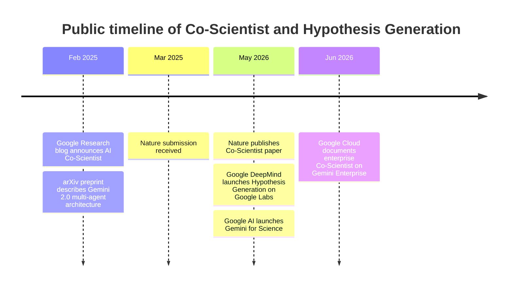
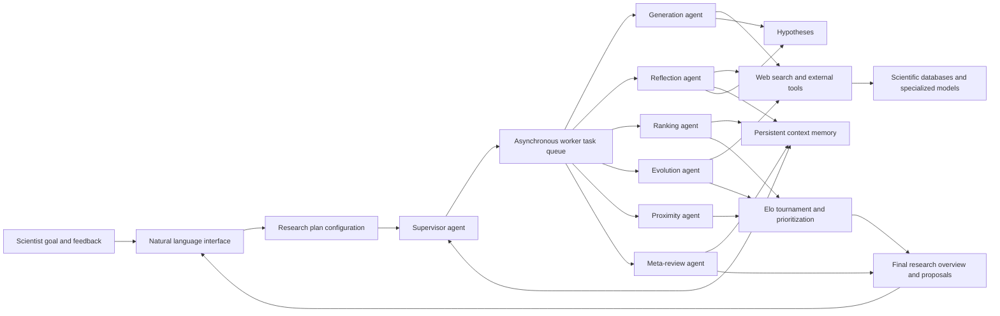

# Original Implementation Stack Map for Google DeepMind Co-Scientist

## Executive summary

The publicly documented **research prototype** behind Google DeepMind’s Co‑Scientist is best understood as a **custom Google multi-agent system built on Gemini 2.0**, with a **Supervisor-led asynchronous task execution framework**, **worker task queues**, **persistent context memory**, **web-search-centric retrieval**, and **iterative generate–debate–evolve loops**. The strongest directly confirmed stack elements are therefore architectural abstractions, not vendor-specific implementation details: Google publicly names the agent roles, the queue-based runtime, persistent state, web search, specialized scientific tools, and safety reviews, but it does **not** publicly name the underlying source-code languages, web framework, backend framework, queue product, storage engine, or original deployment substrate for the research prototype. citeturn3view0turn5view1turn4view1turn4view5turn6view1

By mid-2026, Google had also **productized access paths** around the research system. Co‑Scientist became available to individual researchers through **Hypothesis Generation** on **Google Labs**, and an **enterprise-grade** Co‑Scientist offering appeared as a **Google-developed agent on Gemini Enterprise / Google Cloud**. Those product surfaces confirm additional delivery components such as Google Labs, Gemini for Science, Gemini Enterprise, and Google Cloud observability features, but they still do not fully disclose the original implementation stack of the underlying research system. citeturn1view2turn21view0turn21view1turn9view1turn23view4

The most important rigor point is therefore simple: a careful stack map has many entries marked **custom Google/internal** or **unknown**, because the primary sources stop at the system-architecture layer. Where the evidence is weaker, this report labels conclusions as **strong inference** rather than fact. citeturn5view1turn27view2

## Methodology

The search scope prioritized **primary and first-party sources** in this order: the 2025 arXiv preprint and 2026 Nature paper plus supplementary material; official Google Research and Google DeepMind blog posts; official Google Labs and Google AI pages for Hypothesis Generation / Gemini for Science; and official Google Cloud / Gemini Enterprise documentation for the productized enterprise surface. These sources were used to separate the **research prototype** from the later **delivery surfaces** exposed on Google Labs and Gemini Enterprise. citeturn3view0turn12view0turn14view0turn1view1turn1view2turn21view0turn21view1turn9view1

Inference rules were strict. A detail was treated as **confirmed** only when a primary source explicitly named it. A detail was treated as a **strong inference** only when multiple official sources described the same capability boundary but omitted the concrete product name. If a source described only an abstraction such as “task queue,” “context memory,” or “designated user interface,” the exact product or framework remained **unknown**. That rule matters here because Google’s public disclosures are rich on architecture, but sparse on implementation plumbing. citeturn5view1turn4view1turn27view2

## Timeline

The timeline below synthesizes the public record from the research reveal to the official product surfaces. It is drawn from the 2025 research announcement and arXiv paper, the 2026 Nature publication, the 2026 Google DeepMind / Google AI / Google Labs launches for Hypothesis Generation, and the Gemini Enterprise / Google Cloud documentation. citeturn1view1turn3view0turn12view0turn1view2turn21view0turn21view1turn9view1

## Architecture synthesis

The public architecture is unusually clear at the logical level. Scientists provide a natural-language goal; a **Supervisor agent** converts that into a research plan, allocates compute, and dispatches work to specialized agents through a **task queue**. The system maintains **persistent context memory**, continuously gathers **summary statistics**, and iterates through generation, review, ranking, evolution, and meta-review. Agents call **external tools and APIs**, especially **web search**, and in some collaborations they can incorporate **specialized scientific models** such as AlphaFold. citeturn5view1turn4view1turn4view5turn23view2turn22view3

## Technical stack map

The table below is structured to be as close to machine-readable as possible while preserving citation fidelity.

| stack_key | confirmed_facts | confirmed_confidence | strong_inferences_with_rationale | inference_confidence | unknowns |
|---|---|---:|---|---:|---|
| `programming_languages` | Public primary sources describe the system at the level of agents, queues, prompts, context memory, APIs, and UI surfaces, but they do **not** name the implementation language(s). citeturn5view1turn27view2 | High | The research prototype was likely implemented in a language ecosystem suited to LLM orchestration and scientific tooling, but the evidence is not strong enough to rigorously name Python, Go, Java, or C++ from official sources alone. | Low | Backend language(s), orchestration language(s), scientific tooling language(s), and UI language(s). |
| `frontend_framework` | The research system exposes a **natural-language interface** and a **designated user interface** for scientists; the public user-facing launch for individual researchers is **Hypothesis Generation** on **Google Labs**; the enterprise surface is through **Gemini Enterprise** with Agent Gallery and mobile access. citeturn5view1turn3view0turn21view1turn27view1 | High | The original delivery surface was almost certainly **web-first chat/run UI**, because both Google Labs Hypothesis Generation and Gemini Enterprise center the experience on chat-style interaction and research runs. That said, the exact frontend framework is undisclosed. citeturn21view1turn27view1 | Medium | Specific frontend framework or library, component model, state-management approach, and whether the original prototype UI matched the later Labs UI. |
| `backend_framework` | Co‑Scientist is explicitly described as a **multi-agent architecture built on Gemini 2.0**, integrated within an **asynchronous task execution framework**. Specialized agents run as **worker processes** coordinated by a **Supervisor agent**. citeturn3view0turn5view1turn4view1 | High | The backend framework appears to be **custom Google application logic**, not a publicly named external framework. Rationale: all official descriptions name internal roles and runtime behaviors, but none name LangChain, AutoGen, CrewAI, or another third-party framework. citeturn5view1turn27view2 | Medium | Specific backend web framework, RPC stack, service framework, and whether the prototype ran on one or multiple internal services. |
| `agent_orchestration_framework` | The orchestration layer is a **Supervisor agent** that manages a **worker task queue**, assigns specialized agents, allocates resources, computes summary statistics, writes state to context memory, and adaptively weights subsequent operations. Google’s enterprise docs repeat the same architecture. citeturn4view1turn5view1turn27view2 | High | The orchestration framework is best classified as a **custom internal Google multi-agent orchestrator**. The evidence is strong because the paper and docs define bespoke responsibilities—weighted scheduling, tournament-state feedback, and prompt-appended meta-review learning—that are more specific than a generic agent wrapper. citeturn4view1turn5view4turn27view2 | High | Concrete orchestration product name, if any; whether later enterprise delivery re-hosted the same orchestrator or wrapped it as a managed service. |
| `model_apis_and_versions` | The original system is **built on Gemini 2.0**. Agents can interact with external tools and specialized AI models through **APIs**. Public evaluation materials also name **Gemini 2.0 Flash Thinking Experimental 12-19**, **Gemini 2.0 Flash Thinking Experimental 01-21**, and **Gemini 2.0 Pro Experimental** as baseline/judge models; the 2026 supplement additionally discusses Co‑Scientist performance on **Gemini Flash 2.0 and 2.5**. AlphaFold is confirmed as a specialized model used in select collaborations / examples. citeturn3view0turn4view1turn17view0turn17view1turn16view1 | High | The most defensible reading is that the **original launch stack** was Gemini 2.0-based, while later ablations or revisions explored newer Gemini variants. The official launch language consistently centers Gemini 2.0, but the later supplement shows at least some post-launch evaluation portability to Flash 2.5. citeturn1view1turn3view0turn17view1 | Medium | Exact production API endpoint names, exact Gemini sub-variant powering each agent at launch, and whether different agents used different Gemini variants in the original deployment. |
| `databases_and_data_stores` | The system uses **persistent context memory** to store and retrieve system/agent state across long-running computation; the Supervisor periodically writes state for reuse and failure recovery. The system can also **index and search a private repository of publications** specified by the scientist, and all system activities are **logged and stored** for later audit. citeturn5view1turn5view0turn6view1 | High | A persistent backing store for context state and a separate log store almost certainly exist, because the paper describes periodic state writes, restarts after failure, long-horizon computation, and comprehensive audit logging. But the concrete products—relational DB, document store, blob store, or internal Google storage service—are not disclosed. citeturn4view1turn6view1 | Medium | Concrete database engines, schema, vector-store choice, cache layer, artifact storage, and separation between prototype storage and enterprise storage. |
| `message_queues_and_event_buses` | The paper explicitly states that specialized agents operate as worker processes within an asynchronous framework and that the Supervisor manages a **worker task queue**. Google Cloud’s enterprise docs repeat that the Supervisor “manages the worker queue.” citeturn4view1turn27view2 | High | The runtime clearly has **queue semantics** and likely message-passing between workers and orchestrator, but no public source names Pub/Sub, Kafka, RabbitMQ, Celery, or any internal alternative. citeturn4view1turn27view2 | Medium | Concrete queue product, event bus, delivery semantics, retry policy, and scheduling substrate. |
| `workflow_runtime_system` | The runtime is an **asynchronous, continuous, and configurable task execution framework** designed to scale test-time compute. It runs specialized worker processes, operates continuously and asynchronously, computes periodic statistics, supports restart after failures, and implements an iterative **generate–debate–evolve** loop plus Elo-based tournament evolution. citeturn3view0turn5view1turn5view4 | High | This is effectively a **custom workflow/runtime system for long-horizon agentic reasoning**, rather than a conventional DAG workflow product disclosed by name. The evidence supports custom runtime semantics but not the concrete scheduler/container substrate. citeturn5view1turn4view1 | High | Concrete workflow engine, scheduler, container runtime, autoscaling policy, and whether productionized Co‑Scientist reuses the same runtime unmodified. |
| `retrieval_search_infrastructure` | **Web search and retrieval are primary tools**. The Generation agent iteratively searches the web, retrieves and reads research articles, and summarizes prior work. The Reflection agent performs full review using external tools and web search, and can search a scientist-provided repository. The Hypothesis Generation product adds a **grounded knowledge base of verified scientific references**, and Google Labs describes traceable citation links back to source text. Ablation results show external search materially improved novelty and correctness assessment. citeturn4view5turn5view2turn5view3turn5view0turn24view2turn16view0 | High | A document indexing / retrieval layer almost certainly sits behind the scientist-specified repository and knowledge base, and may include ranking plus citation anchoring. But no official source names the exact retrieval product, vector index, or search engine. citeturn5view0turn24view2 | Medium | Search engine brand/product, ranking model, indexing format, whether retrieval uses vector search, lexical search, or hybrid search, and whether enterprise Co‑Scientist uses Discovery Engine under the hood. |
| `scientific_database_integrations` | The 2026 DeepMind blog states that Co‑Scientist “currently integrates web search and specialized databases like **ChEMBL** and **UniProt**.” The paper also says that for constrained domains the agents use **open databases**, and the supplement gives a concrete example in which Co‑Scientist verifies a proposed protein sequence against **UniProt** before AlphaFold-based structural assessment. citeturn18search0turn5view0turn22view3 | High | **PubMed** and **arXiv** are plausible literature sources reached through the web-search layer, but they are **not** explicitly named as first-class integrations in the reviewed primary sources. The later **Science Skills** bundle in Google Antigravity clearly integrates 30+ life-science resources such as UniProt, AlphaFold Database, AlphaGenome API, and InterPro, but that is adjacent to Co‑Scientist rather than a confirmed part of the original prototype. citeturn21view0 | Medium | PubMed API, arXiv API, Europe PMC, Crossref, Semantic Scholar, or any other scholarly-source integration not explicitly named by Google for Co‑Scientist itself. |
| `citation_verification_tooling` | Co‑Scientist outputs are grounded by citing relevant literature and explaining reasoning. The Reflection agent performs novelty/correctness reviews using web search and external tools; external search was shown to reduce false novelty judgments. The Google AI launch for Hypothesis Generation says claims are **deeply verified and supported by clickable citations**, and Google Labs says generated ideas are linked to a **verified scientific reference** base. citeturn3view0turn5view3turn16view0turn24view3turn24view2 | High | The citation-verification layer appears to be a **custom combination** of literature retrieval, article reading, reflection/review prompts, and source-linking rather than a named citation-checking library. Rationale: Google names the behaviors, not any external package or verification service. citeturn5view2turn5view3turn24view3 | High | Exact citation anchoring implementation, PDF parsing pipeline, article deduplication logic, freshness controls, and any formal novelty-detection subsystem beyond reviewed search/tool use. |
| `safety_classifier_stack` | Safety is a first-class stack element. The Reflection agent’s initial review includes a preliminary safety/ethics assessment; research goals undergo automated safety evaluation; generated hypotheses undergo safety review; unsafe hypotheses are excluded from the tournament and not shown to the user; system activities are comprehensively logged; and the prototype passed a preliminary adversarial test on **1,200 adversarial research goals**. The 2026 DeepMind blog adds that Google conducted **independent CBRN misuse evaluations** and developed **custom safety classifiers** to flag unethical research goals and mitigate unsafe information surfacing. The paper also states the system relies on established public **Gemini 2.0** models that already include safeguards. citeturn5view3turn6view1turn7view0turn15view3turn18search0 | High | The safety stack is best viewed as **layered**: upstream Gemini safeguards, application-level goal screening, hypothesis-level safety review, meta-review monitoring, logging/audit, and custom domain classifiers for misuse. That layered interpretation is a direct synthesis of multiple official descriptions. citeturn6view1turn18search0turn29view0 | High | Exact classifier architectures, thresholds, taxonomy, red-team tooling, and whether the same safety components power Labs Hypothesis Generation and Gemini Enterprise Co‑Scientist identically. |
| `cloud_deployment_environment` | The original research involved **Google Cloud AI Research**, **Google DeepMind**, and **Google Research** authors and contributors. The productized surface was later exposed through **Google Labs** and, for enterprise, through **Google Cloud / Gemini Enterprise**, where Co‑Scientist is documented as an **Agentic AI Service on Gemini Enterprise** and subject to Google Cloud data location terms. citeturn12view0turn1view2turn21view0turn23view2turn23view3 | High | The **original research prototype deployment substrate** remains undisclosed; however, the later enterprise deployment is strongly tied to managed Google Cloud/Gemini Enterprise infrastructure. It is therefore reasonable to separate **prototype environment unknown** from **enterprise surface confirmed on Google Cloud**. citeturn23view2turn27view2 | Medium | Original prototype runtime substrate, cluster manager, region layout, GPU/TPU topology, container platform, and whether the research system originally ran on Google-internal infra distinct from later Gemini Enterprise hosting. |
| `observability_monitoring_logging` | The paper confirms **comprehensive logging** of all system activities for analysis and auditing, plus continuous monitoring of research directions through the meta-review process. In the enterprise surface, **Core Assistant** on Gemini Enterprise provides **Traces** and **Metrics**, with **OpenTelemetry traces/logs** and Google Cloud trace permissions documented. citeturn6view1turn23view4 | High | The research prototype almost certainly had internal monitoring beyond raw logs, because the Supervisor computes periodic statistics and writes state for orchestration decisions. But the only publicly named observability stack appears on the enterprise surface, not the original research deployment. citeturn4view1turn23view4 | Medium | Original prototype metrics backend, alerting system, log store, dashboarding stack, and whether Cloud Trace/OpenTelemetry were used before enterprise productization. |
| `internal_google_gemini_cloud_components` | Confirmed Google components directly tied to Co‑Scientist include **Gemini 2.0**, **Google DeepMind**, **Google Research**, **Google Cloud AI Research**, **Google Labs Hypothesis Generation**, **Gemini for Science**, and the later **Gemini Enterprise / Google Cloud** enterprise surface. Confirmed Google-adjacent specialized model/tool integrations include **AlphaFold**, and the later broader science workbench adds **NotebookLM** for Literature Insights and **Google Antigravity Science Skills** with many life-science resources—though those latter components are adjacent to, not the same as, the original Co‑Scientist prototype. citeturn3view0turn12view0turn1view2turn21view0turn21view1turn9view1turn16view1 | High | The cleanest interpretation is that the original Co‑Scientist stack was a **custom Google internal research system on Gemini**, later wrapped by **Google Labs** for individual researchers and by **Gemini Enterprise / Google Cloud** for enterprise delivery. citeturn1view2turn21view0turn9view1 | High | Exact boundary between “core Co‑Scientist” and adjacent Gemini for Science components, plus any additional internal Google services not named publicly. |

## Key uncertainty register

The largest unresolved implementation questions are the ones most engineers would normally expect in a stack diagram: **source-code languages**, **frontend framework**, **backend service framework**, **storage engines**, **queue/bus product**, **retrieval/index product**, and the **original prototype’s deployment substrate**. None of those are named in the reviewed Nature paper, supplement, arXiv preprint, DeepMind / Google Research blogs, Google Labs product pages, or Gemini Enterprise documentation; the public record stays at the layer of agents, queues, memory, tools, citations, and safety controls. citeturn5view1turn4view1turn21view1turn27view2

For practical engineering interpretation, the safest conclusion is therefore this: **the original Co‑Scientist stack is publicly confirmable as a custom Gemini-based multi-agent runtime with queueed workers, persistent state, retrieval, tool APIs, and layered safety**, but **not** as a vendor-by-vendor or framework-by-framework implementation bill of materials. The later official delivery surfaces add confirmed Google components—Google Labs for Hypothesis Generation and Gemini Enterprise / Google Cloud for enterprise access—but they still leave much of the underlying implementation undisclosed. citeturn3view0turn1view2turn21view0turn9view1