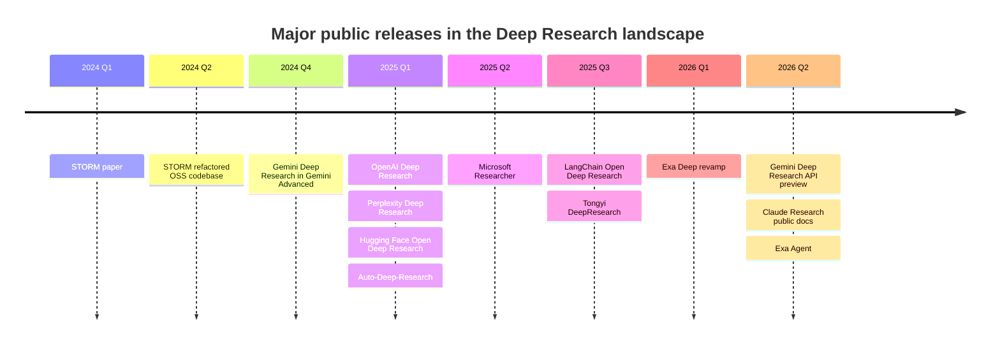
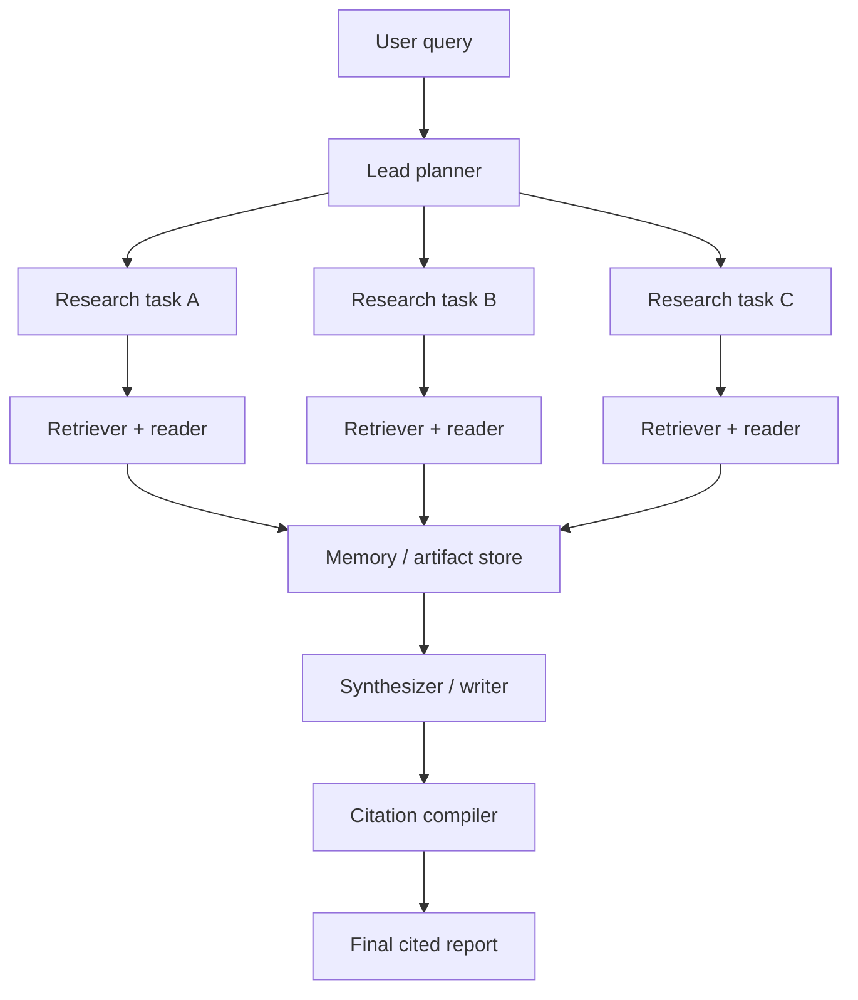
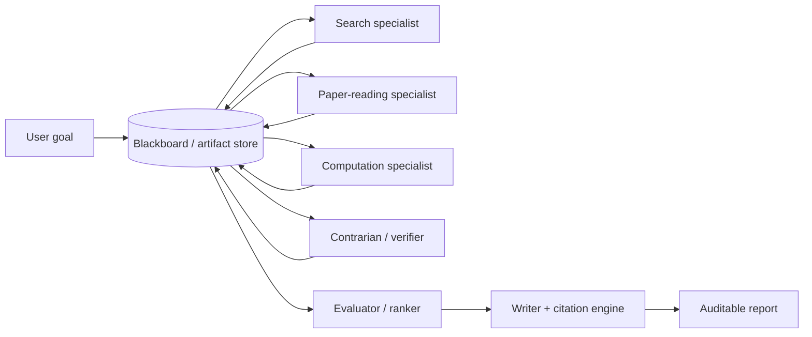

# The Deep Research Landscape

## Executive Summary

“Deep Research” has rapidly become a distinct product and system category: agentic AI that plans, browses, reads, reasons over many sources, and returns long-form, citation-backed results rather than a short answer. The commercial frontier is now led by OpenAI, Google, Anthropic, Perplexity, Microsoft, xAI, You.com, and Exa; the open-source frontier is led by GPT Researcher, STORM/Co-STORM, Hugging Face’s Open Deep Research example, LangChain’s Open Deep Research, Tongyi DeepResearch, Local Deep Research, and Auto-Deep-Research. The category has already split into three submarkets: end-user research products, enterprise/developer research APIs, and open-source orchestration stacks. citeturn5view0turn5view1turn5view3turn10search0turn5view6turn21search8turn5view8turn5view9turn5view10turn13view0

Across these systems, the most stable architectural pattern is not “one super-model with search,” but a loop of planning, targeted retrieval, source reading, compression/memory management, synthesis, and citation assembly. Stronger systems add parallel subagents, explicit context compaction, schema-constrained outputs, artifact stores, and citation-specific post-processing. Anthropic’s production write-up is especially revealing here: it publicly describes an orchestrator-worker design, saved memory for long contexts, specialized subagents, and a final CitationAgent. You.com, Exa, and LangChain similarly expose planning budgets, structured outputs, source-control knobs, or explicit multi-model pipelines. citeturn6view0turn6view4turn24view3turn22view0turn22view3turn30view0turn30view1turn19view3turn19view5

For an open-source **multi-agent scientific reasoning system**, the practical conclusion is clear: you do not need to invent everything from scratch. The best near-term strategy is to compose a system from existing open orchestration layers, multi-agent planning patterns, citation/provenance compilers, and evaluation suites. The largest unresolved gaps are not basic browsing anymore; they are provenance fidelity, reproducibility, scientific-source handling, robust evaluation, and safe/legal operation at web scale. Benchmarks such as BrowseComp, DeepResearch Bench, DeepSearchQA, DRACO, GAIA, FRAMES, and ResearchRubrics make it possible to evaluate much more rigorously than was possible a year ago, but no single benchmark yet captures the full scientific workflow from literature survey to evidence-grounded reasoning and reproducible synthesis. citeturn5view12turn5view13turn4search0turn26search2turn26search1turn27search2turn26search3turn28search3

My bottom-line recommendation is to build a **hybrid system**: centralized planner plus parallel specialist subagents, a blackboard-style artifact store, explicit citation objects down to quote/span level, and a separate evaluation-and-critique stage before final report emission. Reuse LangGraph or a comparable durable workflow layer, mine GPT Researcher and STORM for decomposition/report patterns, borrow context-compaction ideas from You.com and Anthropic, and treat Tongyi DeepResearch and OpenPipe’s training stack as the most relevant signals for future model specialization or RL fine-tuning. citeturn20view5turn17search2turn22view0turn6view4turn12search12turn13view0

## Market Inventory

I use “Deep Research” descriptively here to include branded **Deep Research / DeepSearch / Researcher / Research API / Agentic Search** systems that autonomously browse, retrieve, synthesize, and ground outputs in sources.

### Major commercial implementations

| System | Org | Official source | License / openness | Initial public release | Maturity | Distinguishing features | Important limitations | Primary use cases | Sources |
|---|---|---|---|---|---|---|---|---|---|
| ChatGPT Deep Research | OpenAI | Product + Help Center | Proprietary hosted product | 2025-02-02 | Production | Multi-step internet research; uploaded files; Python/data analysis; graphs/images; sentence/passage citations; connectors/apps for internal sources; PDF export. | OpenAI says it can still hallucinate, mis-rank authority, and miscalibrate uncertainty; earlier reports/citations could have formatting issues. | Analyst reports, literature reviews, due diligence, shopping/market scans. | citeturn5view0turn7view0turn7view3turn7view4turn23search0turn23search5turn23search12 |
| Gemini Deep Research | Google | Gemini app + Gemini API | Proprietary hosted product/API | 2024-12-11 in Gemini app; developer API documented by 2026-04 preview | Production in app; API preview | Autonomous plan-search-read-write loop; collaborative planning; MCP support; URL context; code execution; visualizations; docs as input; async background execution. | API is preview-only; requires background execution; no structured outputs yet; max research time currently 60 minutes. | Competitive intelligence, literature review, due diligence, developer integrations. | citeturn25search0turn8view0 |
| Claude Research | Anthropic | Claude Help + engineering post | Proprietary hosted product | Publicly documented by 2026-06; architecture write-up 2025-06 | Production feature, architecture publicly described | Agentic multi-search loop; web + connected Google apps; orchestrator-worker multi-agent system; explicit CitationAgent; parallel subagents and parallel tools. | Requires web search to be enabled; paid plans; Anthropic notes current synchronous orchestration creates bottlenecks. | Knowledge work, internal + web research, enterprise assistants. | citeturn24view2turn6view0turn6view5turn24view3 |
| Perplexity Deep Research | Perplexity | Help Center | Proprietary hosted product | Early 2025 public launch | Production | In-depth research mode with source citations; recent “Advanced Deep Research” redesign; strong document and asset-creation pipeline across docs/slides/spreadsheets. | Primary technical details remain less open than Anthropic/Google/You/Exa APIs; architectural transparency is limited. | Consumer research, reports, comparison shopping, academic-style summaries. | citeturn5view2turn31search2turn31search6turn31search7turn34search10 |
| Researcher in Microsoft 365 Copilot | Microsoft | Support + blog | Proprietary hosted enterprise product | 2025-04-04 | Production enterprise feature | Pulls from web and work data; structured cited reports; clarifying questions; model choice across GPT and Claude; Critique adds second-pass review emphasizing reputable sources and citation grounding. | Strongest value depends on Microsoft 365 data access and tenant setup; primarily enterprise/workflow oriented rather than open web developer tooling. | Enterprise research, project briefs, status reports, document synthesis. | citeturn5view5turn10search0turn10search6turn10search8turn10search18 |
| ARI / Research API | You.com | ARI post + docs | Proprietary hosted product/API | ARI announced 2025; Research API current | Production API/product | Research API returns Markdown or JSON with inline citations and source arrays; source-control filters; search/contents/live-news tool routing; context compaction beyond one context window; compute-budget planning. | Hosted stack rather than open system; relies on You search primitives. | Enterprise research apps, internal knowledge assistants, finance/market analysis. | citeturn5view6turn22view0turn22view1turn22view2turn22view3 |
| Grok DeepSearch / multi-agent research | xAI | xAI news + Grok/xAI docs | Proprietary hosted product/API | 2025-02-19 | Production consumer feature; API/tooling expanding | Real-time web and X search; DeepSearch report summaries; explicit multi-agent mode with parallel agents and visible work; native tool-use direction in product/docs. | Product details are less open than Anthropic/Google/You; enterprise/API availability has lagged product messaging. | News, social/web research, fast broad scans, scientific and current-event research. | citeturn36view1turn36view0turn36view2turn36view3 |
| Exa Deep / Exa Agent / Deep Max | Exa | Blog + API docs | Proprietary hosted API | Exa Deep revamped 2026-03-04; Exa Agent 2026-06-16 | Production developer/enterprise API | Async agent runs; structured outputs; field-level grounding; parallel search agents; model fusion; latency/cost-conscious agentic search optimized for developers. | Primarily a developer platform, not a polished end-user report product; full closed stack. | Building custom research agents, list building, enrichment, structured web research. | citeturn30view1turn30view0turn21search8turn21search11turn30view2 |

The timeline above captures the main public releases and turning points visible in official announcements, official repos, or directly linked product documentation. citeturn17search0turn25search0turn5view0turn34search10turn16search2turn13view1turn5view5turn16search3turn16search0turn30view1turn8view0turn24view2turn30view0

### Major open-source implementations

| System | Org / maintainer | Official repo / paper | License | Initial public release | Maturity | Distinguishing features | Important limitations | Best use cases | Sources |
|---|---|---|---|---|---|---|---|---|---|
| GPT Researcher | Assaf Elovic et al. | Repo + docs + site | Apache-2.0 | Public package by 2024-05; deeper recursive “Deep Research” announced 2025-02 | Mature OSS | Planner + execution agents + publisher; local and web research; MCP integration; multiple frontends; export; domain filtering; recursive deep-research tree search. | Explicitly marked experimental and “not a recommendation” for academic papers; quality depends heavily on retriever/model configuration. | Fast path to a customizable open research agent. | citeturn20view4turn20view5turn11view0turn20view2turn35search4turn35search5 |
| STORM / Co-STORM | Stanford OVAL | Repo + project page + paper | MIT | STORM paper 2024-02; refactored codebase 2024-04; Co-STORM integrated 2024-09 | Research prototype with active OSS | Multi-perspective question asking; outline-first report generation; FreshWiki evaluation; Co-STORM adds human collaboration and dynamic mind-map style curation. | Goal is Wikipedia-like article generation, not general-purpose enterprise orchestration; public research preview notes limited safety measures. | Structured literature/report drafting and knowledge curation. | citeturn17search2turn17search0turn17search4turn5view9turn11view1turn17search1 |
| Open Deep Research example | Hugging Face / smolagents | Blog + smolagents repo/examples | Apache-2.0 | 2025-02-04 | Active OSS example | Clear proof-of-concept reproduction of Deep Research using code agents, a text browser, and text inspector; strong educational value. | HF explicitly frames it as a first proof-of-concept; text-only browser is below “full browser” capability. | Learning, experimentation, lightweight open reproduction. | citeturn18view4turn18view1turn11view3 |
| Open Deep Research | LangChain | Repo + blog | MIT | 2025-07-16 | Mature/active OSS | Current implementation plus legacy workflow and supervisor-researcher multi-agent variants; MCP compatibility; multiple model roles; LangGraph durability and Studio UI. | More of a framework/template than a polished turn-key end-user product; no formal releases published. | Production-ish open stacks, extensible multi-agent research workflows. | citeturn19view3turn19view4turn19view5turn11view2turn16search3 |
| Tongyi DeepResearch | Alibaba Tongyi Lab | Repo + blog | Apache-2.0 | 2025-09-16 | Frontier open model/system | Open agentic model specifically for long-horizon information seeking; strong benchmark results; demos plus local deployment path. | Demo may be unstable due to model latency/tool QPS; stable use recommends local deployment or hosted service. | High-end open research agent development and model study. | citeturn13view0turn14view0turn16search0 |
| Local Deep Research | LearningCircuit | Repo + PyPI | MIT | 2025-05-05 | Rapidly growing OSS | Self-hosted privacy-first stack; local/cloud LLM support; many search engines including academic sources and private docs; encrypted/local-first emphasis. | Benchmark claims in repo are largely self-reported and community-linked; setup complexity is non-trivial. | Privacy-sensitive or self-hosted scientific research workflows. | citeturn13view2turn14view2turn12search14 |
| Auto-Deep-Research | HKUDS | Repo | MIT | 2025-02-16 | Early active OSS | Based on AutoAgent; one-click CLI; broad model/provider support; file support; low-friction experimentation. | Docs are still maturing; web GUI listed as in development; smaller codebase and ecosystem maturity than GPT Researcher or LangChain. | Fast experimentation with agent-app patterns and cheaper/custom deployments. | citeturn13view1turn15search0turn15search1 |

### Comparison table

The table below is a synthesis, not a verbatim vendor self-description. “Citation fidelity” means how explicitly the system exposes machine-usable claim-to-source links. “Reproducibility” means whether another team can realistically rebuild, audit, and rerun the same workflow with similar behavior. Ratings are my assessment from the cited sources.

| System | License / openness | Scalability pattern | Citation fidelity | Reproducibility | Extensibility | Data sources supported | Overall take | Sources |
|---|---|---|---|---|---|---|---|---|
| OpenAI Deep Research | Closed product | High compute, long-running, hosted | High: passage/sentence cites, connectors | Low outside OpenAI | Medium via apps/connectors, but not open orchestration | Web, files, connected apps | Best polished end-user experience, weak for open replication | citeturn7view0turn23search0turn23search12 |
| Gemini Deep Research | Closed product/API preview | Async/background, tiered compute | High | Low-Medium for API users; low for full product replication | High in API preview via MCP/tools/planning controls | Web, URLs, docs, code execution, MCP tools | Strongest officially documented developer-facing deep-research API | citeturn8view0 |
| Claude Research | Closed product | Multi-agent parallel orchestrator-worker | High | Low | Medium-High through Claude tooling ecosystem | Web + connected Google apps | Best public explanation of a production research architecture | citeturn6view0turn24view2turn24view3 |
| You Research API | Closed API | Budgeted long-horizon agentic loop | High: inline cites + source arrays | Medium for API consumers, low for full stack | High: schemas, source control, MCP | Search, contents, live news, internal enterprise data | Most explicit API-level control over source routing and output schema | citeturn22view0turn22view3 |
| Exa Agent / Deep | Closed API | Async runs, parallel search agents, model fusion | Very high: field-level grounding | Medium for API consumers | High for builders | Exa search stack + structured outputs + input data | Excellent substrate if you want to build your own research UI | citeturn30view0turn30view1turn21search11 |
| GPT Researcher | Apache-2.0 | Planner-executor, recursive tree search, parallel work | Medium-High | High | High | Web, local docs, MCP sources | Best all-around open starting point today | citeturn20view5turn20view4turn11view0 |
| STORM / Co-STORM | MIT | Structured pre-writing and collaborative curation | Medium | High for paper/repo workflows | Medium | Internet retrieval, local vector-store variants | Best template for outline quality and perspective coverage | citeturn17search2turn17search4turn11view1 |
| LangChain Open Deep Research | MIT | Durable graphs; workflow and multi-agent variants | Medium-High | High | Very high | Many models, search tools, MCP servers | Best open orchestration substrate for production engineering | citeturn19view3turn19view5turn11view2 |
| Tongyi DeepResearch | Apache-2.0 | Agentic model + search pipeline | Medium-High | Medium-High | Medium | Web agent/search tasks; local deployment | Most important open frontier-model signal in this category | citeturn13view0turn14view0 |
| Local Deep Research | MIT | Parallel local/self-hosted processing | Medium | High | High | Web, academic sources, private docs | Best privacy-first self-hosted option, but less standardized | citeturn13view2turn14view2 |

## Shared Architectural Patterns

The commercial and open-source systems are converging on a small set of recurring components.

The first is a **decomposition layer**. GPT Researcher openly uses planner and execution agents. Anthropic’s production Research system uses a lead agent that decomposes queries and spawns specialized subagents. LangChain’s legacy workflow implementation is explicitly “plan-and-execute,” and its multi-agent version uses a supervisor-researcher architecture. Google’s Deep Research agent exposes collaborative planning directly in the API. This is now the default pattern for non-trivial research tasks. citeturn20view5turn6view0turn6view5turn19view5turn19view2turn8view0

The second is **tool specialization rather than undifferentiated search**. You.com is especially explicit: its Research API routes across Search, Contents, and Live News as distinct retrieval primitives, and it adds source controls such as domain includes/excludes and geography/recency steering. Google’s API similarly separates Google Search, URL Context, Code Execution, and remote MCP tools. xAI separates web search and X search. OpenAI’s product documentation also positions Deep Research as distinct from generic chat or simple web search because it can browse, analyze files, and use Python. citeturn22view0turn22view3turn8view0turn36view2turn9search5turn23search0turn7view0

The third is **memory and context engineering**. This is one of the biggest shared engineering concerns. Anthropic says it persists the plan to memory because very long contexts will otherwise be truncated, and it recommends artifact systems so subagents can write outputs to a filesystem rather than passing everything through the coordinator. You.com says research uses context masking and compaction to operate far beyond a single context window, with higher effort tiers capable of more than 1,000 reasoning turns and up to 10 million tokens processed. LangChain’s “deep agents” and “context engineering” materials point in the same direction: write, select, compress, and isolate context rather than stuffing everything into one giant prompt. citeturn6view4turn6view5turn22view0turn16search14turn16search16

The fourth is **model role separation**. LangChain’s open implementation already makes this concrete with separate defaults for summarization, research, compression, and final report writing. Exa describes model fusion, mixing frontier and cheaper models depending on the subtask. Anthropic’s public architecture uses a stronger lead agent and cheaper/faster subagents. This is a major practical lesson for your own system: deep research systems are already less like “one model plus tools” and more like a coordinated heterogeneous model ensemble. citeturn19view4turn30view0turn6view0

The fifth is **grounding and citation assembly as a first-class subsystem**. This has become a differentiator. OpenAI says Deep Research can cite specific sentences or passages. Anthropic exposes citations as typed API objects and in production uses a CitationAgent after research is complete. You.com returns inline citations plus a `sources` array. Exa supports explicit field-level grounding for structured outputs. These are qualitatively different from older “append a source list” patterns and point toward the design your scientific system should adopt: citations as structured data objects, not mere text decorations. citeturn7view0turn24view0turn24view3turn22view0turn22view3turn30view1turn21search11

The sixth is **evaluation as a distinct layer**. Anthropic says it used LLM-judge rubrics that explicitly scored factual accuracy, citation accuracy, completeness, source quality, and tool efficiency. OpenAI released BrowseComp for hard-to-find browsing tasks. DeepResearch Bench adds evaluation of both report quality and citation trustworthiness. Perplexity’s DRACO and Scale’s ResearchRubrics both move closer to evaluating long-form research outputs rather than just fact retrieval. In short: the field now understands that research agents need report-level, citation-level, and trajectory-level evaluation, not just benchmark QA accuracy. citeturn6view2turn5view12turn5view13turn26search2turn26search3

## Orchestration Models and Workflows

Three orchestration families dominate the field.

### Centralized planner-executor

This is the simplest robust design: one coordinator plans, delegates, aggregates, then hands off to a writer/citation stage. GPT Researcher’s architecture is the clearest open example. Many systems that appear “single-agent” to users are probably variants of this internally. It is easier to evaluate and debug because responsibility is legible at each step. citeturn20view5

### Orchestrator-worker with parallel subagents

Anthropic, Exa, xAI, and LangChain’s multi-agent implementation all explicitly describe some form of parallel specialist subagents. Anthropic reports clear gains from breadth-first decomposition, and says parallelization cut research time by up to 90% for complex queries. Exa says its agents divide tasks into subtasks and assign subagents to different domains. xAI markets multi-agent mode as multiple agents working in parallel for deeper answers. The advantage is breadth coverage and latency reduction; the cost is coordination complexity and harder debugging. citeturn6view0turn6view1turn30view0turn36view0turn19view2

### Blackboard or artifact-store collaboration

This is not always named explicitly, but it is emerging as the next architectural step. Anthropic argues that subagent outputs should be written into a filesystem or external artifact system to avoid “game of telephone” loss. STORM and Co-STORM embody a closely related pattern: they accumulate perspectives, conversations, evidence, outlines, and mind maps as intermediate shared artifacts before final writing. For a scientific reasoning system, this pattern is more attractive than raw message passing because it supports provenance, replay, and human inspection. citeturn6view5turn17search2turn17search4

### Scheduling, concurrency, and fault tolerance

The practical engineering choices now matter as much as the abstract architecture. Google requires background execution for Deep Research API calls and expects polling/stream reconnect logic for long tasks. Anthropic’s web-search tool exposes structured errors and a `pause_turn` behavior, but its own engineering post also admits that synchronous subagent execution is currently a bottleneck and that asynchrony raises coordination and consistency problems. Exa’s APIs are explicitly async. These details matter because the production challenge is no longer “can an agent search?” but “can a long-running agent manage retries, reconnection, partial failure, and budget allocation without silently degrading quality?” citeturn8view0turn24view0turn6view5turn21search8turn21search11

For your system, the most useful orchestration lesson is this: **centralize planning, decentralize reading, centralize judgment**. Fully decentralized peer-to-peer systems remain attractive conceptually, but the highest-confidence production evidence still favors explicit coordinator(s), bounded subagents, and durable artifacts. citeturn6view0turn20view5turn19view5

## UX and Interface Patterns

The UX layer is now one of the clearest differentiators across systems.

Commercial consumer systems mostly optimize for **one prompt, one long report**. OpenAI, Gemini, Claude, Perplexity, Grok, and Copilot all expose research mode as a user-facing toggle or agent selection inside an existing chat interface. The dominant UX expectations are: a long-running job, visible progress or thinking summaries, source-linked outputs, and the ability to attach files or draw on connected apps. OpenAI adds step summaries/sources and PDF export; Google adds collaborative planning, visualizations, and async polling in the API; Claude focuses on trusted citations; Microsoft frames Researcher as a structured, source-cited report generator inside work flows. citeturn23search0turn23search5turn8view0turn24view2turn10search0

Developer-facing systems optimize instead for **machine-consumable provenance**. You.com returns Markdown or JSON plus an explicit sources array. Exa returns structured outputs and field-level grounding. Anthropic’s citations are typed API objects with URL/title/cited text. Google’s Interactions API exposes steps and long-running status. These are the most relevant patterns for your project, because scientific tooling needs citations and evidence objects that can be re-rendered, scored, filtered, or replayed later. citeturn22view0turn22view3turn21search11turn30view1turn24view0turn8view0

Open-source systems span a broader UI range. GPT Researcher ships multiple frontends plus pip/package usage and MCP integration. LangChain’s stack is oriented around LangGraph Studio and Open Agent Platform. STORM has a public demo and a research-preview UX. Auto-Deep-Research exposes a one-command CLI. This is a useful reminder that “deep research” is not a single interface pattern; it can be chat-native, report-native, API-native, or CLI-native. citeturn20view1turn20view3turn19view3turn5view9turn13view1

The strongest explainability pattern is moving from generic “sources” to **claim-local citations plus process visibility**. OpenAI emphasizes clear citations and visible high-level process summaries. Google exposes `thinking_summaries` and collaborative plans. Anthropic separates research and citation assignment. Perplexity and You.com emphasize numbered inline references. Exa goes further for structured tasks with field-level grounding. For scientific use, that progression matters: end users rarely trust a source list at the bottom, but they do trust a local citation, a quote/span, and a visible provenance trail. citeturn7view3turn8view0turn24view3turn5view2turn22view0turn30view1

## Reusable Components, Libraries, and Benchmarks Worth Mining

The most reusable **system-level** components are GPT Researcher, LangChain Open Deep Research, STORM/Co-STORM, smolagents’ Open Deep Research example, Tongyi DeepResearch, and Local Deep Research. Their licenses are permissive enough for broad reuse: Apache-2.0 or MIT across the board in the major open projects surveyed here. That is strategically important: the open ecosystem already gives you legal room to fork, benchmark, and recombine most of the orchestration layer. citeturn11view0turn11view1turn11view2turn11view3turn14view0turn14view2

The most reusable **architectural ideas** are not the repos themselves but the patterns inside them. From GPT Researcher: planner-executor-publisher staging and recursive deep-research branching. From STORM: perspective generation, question-driven information gathering, outline-first composition, and collaborative mind-map curation. From LangChain: durable graphs, model-role separation, and interchangeable search/MCP connectors. From Anthropic and You.com: saved plan memory, context compaction, and a separate citation pass. From Exa: field-level grounding, async research runs, and model fusion. citeturn20view5turn17search2turn17search4turn19view4turn19view5turn6view4turn24view3turn22view0turn30view0turn30view1

For **training and post-training**, the most interesting reusable assets are OpenPipe’s ART framework and its `open_deep_research_training` setup, plus Alibaba’s Tongyi DeepResearch work and the broader WebDancer/SciResearcher research direction. ART exists specifically to improve agent reliability through RL/GRPO-style training, and OpenPipe explicitly positions its training stack as a way to specialize models for LangChain’s Open Deep Research pipeline. Tongyi DeepResearch is a stronger signal still: it treats deep research as a model specialization target rather than just a prompt-and-tools recipe. SciResearcher extends that trajectory into frontier scientific reasoning by constructing data through academic-evidence-centered agentic exploration. citeturn12search12turn12search1turn13view0turn4search1turn28search3

For **evaluation and benchmarking**, the highest-value assets are BrowseComp, GAIA, DeepResearch Bench, DeepSearchQA, DRACO, FRAMES, and ResearchRubrics. These cover different layers of the stack: browsing persistence, general tool use, deep-report quality, exhaustive search, research-output judgement, retrieval/reasoning integration, and fine-grained rubric-based scoring. If you are building a scientific reasoner, you should not rely on just one of them. Use them as a matrix: browsing, retrieval, synthesis, citation accuracy, and report quality should all be measured separately. citeturn5view12turn26search1turn5view13turn4search0turn26search2turn27search2turn26search3

## Gaps, Risks, and Research Opportunities

The biggest technical gap is still **provenance fidelity**. Many systems now show citations, but not all citations are equally useful. A number in brackets is far weaker than a machine-readable claim-to-source-span object with quote text, parser version, retrieval path, and timestamp. Anthropic’s explicit citation object model and Exa’s field-level grounding are a step in the right direction, but this remains an open research and product problem. For scientific reasoning, provenance should be treated as a data model, not a rendering choice. citeturn24view0turn24view1turn30view1turn21search11

The second major gap is **reproducibility**. Hosted systems are powerful but hard to reproduce exactly because their search stacks, ranking systems, models, and policies are closed or change over time. Open systems are reproducible at the orchestration layer, but often not at the retrieval or browsing layer because they still depend on third-party search APIs and mutable live web content. This is why your scientific system should persist raw retrieval artifacts and not just final summaries. citeturn22view0turn30view1turn23search0turn19view3turn20view5

The third gap is **benchmark realism**. BrowseComp captures hard-to-find browsing. DeepResearch Bench and DRACO evaluate more realistic long-form research. FRAMES tests retrieval-plus-reasoning. GAIA is broad and tool-heavy. ResearchRubrics brings detailed human-authored rubric criteria. Yet none is a complete benchmark for scientific agent work involving literature coverage, evidence ranking, uncertainty communication, quantitative reasoning, and reproducible synthesis in one pipeline. SciResearcher and FrontierScience show where the next wave is going, but the benchmark ecosystem is still fragmented. citeturn5view12turn5view13turn26search2turn27search2turn26search1turn26search3turn28search3turn28search11

The fourth gap is **hallucination mitigation under synthesis pressure**. OpenAI still notes hallucinations and uncertainty-calibration weaknesses in its own Deep Research. Microsoft’s privacy FAQ reminds users that citations should still be reviewed because Copilot may misrepresent or incompletely reflect sources. This is the core danger of the category: the more coherent and analyst-like the output becomes, the more dangerous unsupported synthesis becomes. Citation density alone is not enough; systems also need unsupported-claim detection and contradiction checking. citeturn7view3turn10search16

The fifth gap is **legal and ethical operation at web scale**. Anthropic’s docs explicitly tell developers that when they modify API outputs, citations should still be displayed appropriately and legal teams should be consulted. OpenAI, Microsoft, and Anthropic all emphasize permissions and connector scoping for internal data. On the public-web side, legal tension is not hypothetical: Reuters reported that CNN sued Perplexity in May 2026, alleging unlawful copyrighted-content distribution. Whether or not individual claims succeed, the direction of travel is obvious: deep research systems need rigorous policies around crawling, quoting, caching, attribution, enterprise permissions, and user-owned data. citeturn24view0turn23search12turn10search0turn34search2

## Recommendations and Prioritized Roadmap

For your open-source **multi-agent scientific reasoning system**, I would build for auditability first and raw benchmark score second. The right target is not “best chat answer.” It is “best reproducible evidence-to-report pipeline.”

### Recommended target architecture

Start with a **hybrid architecture**:

1. A **Lead Scientist** planner that decomposes the user goal into research threads, assigns budgets, and maintains the task graph.
2. Parallel **specialist workers** for web discovery, paper reading, source verification, data extraction, and computational analysis.
3. A **blackboard / artifact store** where every intermediate artifact is immutable and addressable: search query, result set, page snapshot, extracted spans, notes, tables, code outputs, contradictions, and draft claims.
4. A **citation compiler** that converts supported claims into structured provenance objects.
5. A **critical reviewer** that scores unsupported claims, weak citations, source diversity, and contradictory evidence before final writing.
6. A **report composer** that emits both human-readable Markdown/PDF and machine-readable JSON. This recommendation follows the strongest evidence from Anthropic’s orchestrator-worker architecture, You.com’s source-aware API design, Exa’s grounding, GPT Researcher’s staged flow, and STORM’s outline-first synthesis. citeturn6view0turn24view3turn22view0turn30view1turn20view5turn17search2

### Components I would reuse first

| Need | Best reuse candidate | Why |
|---|---|---|
| Durable orchestration | LangChain Open Deep Research / LangGraph | Best open production-oriented workflow substrate with workflow and multi-agent variants, model-role separation, and MCP/search compatibility. citeturn19view3turn19view5 |
| Research decomposition and report writing | GPT Researcher | The cleanest OSS planner-executor-publisher pattern and already battle-tested across web/local/MCP research. citeturn20view5turn20view4 |
| Outline quality and perspective coverage | STORM / Co-STORM | Best source for perspective generation, question-led evidence collection, outline-first synthesis, and human collaborative curation. citeturn17search2turn17search4 |
| Lightweight agent implementation ideas | Hugging Face Open Deep Research / smolagents | Excellent proof-of-concept code-agent baseline; good for minimal prototypes and rapid experimentation. citeturn18view4turn11view3 |
| Future model specialization | Tongyi DeepResearch + OpenPipe ART | Strongest signal that deep research should become a post-trained capability, not just prompting. citeturn13view0turn12search12 |
| Privacy-first self-hosting option | Local Deep Research | Useful if you want a local-first mode or private-lab deployment path. citeturn13view2turn14view2 |

### Integration plan

I would split the build into four milestones.

| Phase | Goal | Deliverable |
|---|---|---|
| Foundation | Single-domain scientific deep research with strong provenance | Planner, academic/web retrieval, artifact store, citation compiler, Markdown+JSON report output |
| Parallelism | Add specialist subagents and budgeted concurrency | Lead planner, worker pools, retry/polling, asynchronous orchestration, contradiction checker |
| Scientific reasoning | Add computation and structured extraction | Code execution, table extraction, evidence ranking, claim graph, uncertainty annotations |
| Learning and optimization | Specialize models and prompts with eval-driven training | SFT/RL loop, benchmark harness, regression suite, domain adapters |

A concrete development sequence would be:

- **Foundation build**: start narrow. Support only scientific tasks requiring literature discovery, evidence extraction, and structured synthesis. Emit a report only when every non-trivial claim has at least one attached provenance object.
- **Parallelism build**: add bounded worker pools and budget rules. Anthropic’s experience suggests that explicit effort budgets and clearly scoped subagent instructions matter more than fancy autonomy. citeturn6view0turn6view5
- **Scientific reasoning build**: add a computation worker and a verifier worker. The verifier should actively seek contradictions, not just corroboration.
- **Learning build**: once the orchestration is stable, use OpenPipe/ART-style post-training or at least offline policy improvement on your own trajectories. citeturn12search12turn12search1

### Evaluation strategy

Your evaluation stack should be layered.

| Layer | What to measure | Suggested assets |
|---|---|---|
| Browsing persistence | Can the agent find obscure, multi-hop facts? | BrowseComp citeturn5view12 |
| General tool use | Can it solve heterogeneous agent tasks? | GAIA citeturn26search1 |
| Deep report quality | Coverage, depth, instruction following, readability | DeepResearch Bench / ResearchRubrics / DRACO citeturn5view13turn26search3turn26search2 |
| Retrieval + reasoning | Can it integrate evidence from multiple sources? | FRAMES / DeepSearchQA citeturn27search2turn4search0 |
| Scientific frontier reasoning | Can it handle research-grade science tasks? | SciResearcher / FrontierScience style tasks citeturn28search3turn28search11 |

I would add three custom metrics that are still under-served in public benchmarks:

- **Unsupported-claim rate**: percentage of atomic claims in the final report with no valid provenance object.
- **Citation usefulness**: not whether a source appears, but whether it actually contains the local evidence needed for the exact claim.
- **Replay reproducibility**: rerun the same task with cached retrieved artifacts and measure report stability.

### Design choices I would insist on

You asked for a rigorous, open scientific system. These are the non-negotiables I would adopt:

- **Immutable evidence objects**. Store raw snippets, quote hashes, parse metadata, retrieval query, timestamp, and source URL/title.
- **Claim graph before prose**. Write claims first; write the narrative only after support has been checked.
- **Separate report writer from report judge**. Never let the same agent both invent and approve the final synthesis.
- **Explicit uncertainty language**. If evidence is weak, contradictory, or sparse, the report should say so in a structured way rather than burying uncertainty in prose.
- **Source-quality ranking**. Weight primary/lab/regulatory/authoritative sources above tertiary web summaries whenever the task allows.
- **Configurable human checkpoints**. Borrow Google’s collaborative planning and STORM’s collaborative curation where appropriate. citeturn8view0turn17search4

### Prioritized roadmap

If I were sequencing this project for maximum leverage, I would do it in this order:

| Priority | Milestone | Why it comes first |
|---|---|---|
| Highest | Artifact store + structured citations | Provenance is the hardest thing to retrofit later. |
| High | Planner + bounded specialist workers | Gives most of the quality gain over a monolithic agent. |
| High | Evaluation harness from day one | Prevents “demo drift” and prompt overfitting. |
| Medium | Scientific-source adapters + computation worker | Turns a generic research agent into a scientific reasoner. |
| Medium | Human-in-the-loop planning / review | Valuable, but only after the evidence plumbing works. |
| Later | Post-training / RL specialization | High upside, but should follow stable trajectories and evals. |

### Open questions and limitations

A few areas remain materially unresolved in the public evidence base.

First, product vendors differ sharply in how much architectural detail they publish. Anthropic, Google, You.com, and Exa are relatively transparent; OpenAI and Perplexity publish less about internals. Second, some open-source project maturity signals are strong but still partly self-reported, especially benchmark claims in newer repos such as Local Deep Research. Third, the benchmark ecosystem is improving quickly, so specific leaderboard standings can change faster than durable design lessons. Finally, release dates for some products are better documented than others; where official publication dates were not clearly available, I used the earliest reliable public documentation or clearly labeled the maturity as a current-state assessment rather than a precise historical claim. citeturn6view0turn8view0turn22view0turn30view0turn13view2turn5view13